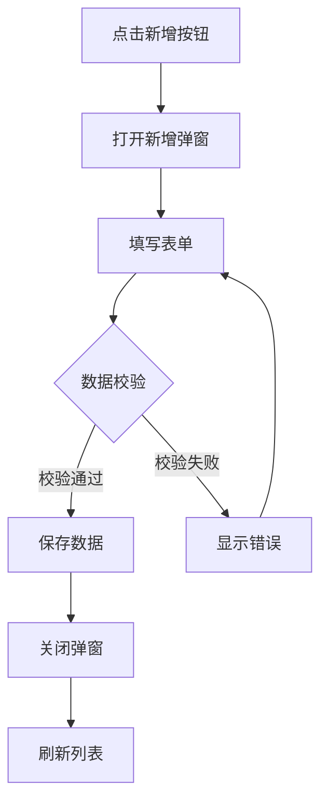
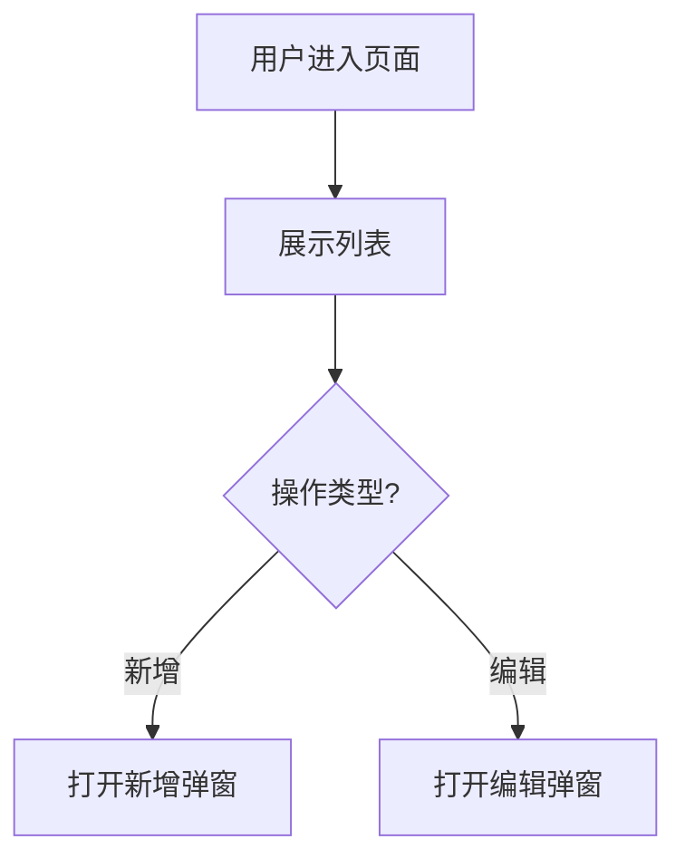

# PRD 智能生成器 - 使用指南

## 📖 简介

PRD 智能生成器是一个自动化文档生成工具，采用**"深度代码分析 + AI 生成"**的双阶段模式：

1. **第一阶段**：深度分析项目 `src` 目录代码，生成功能清单
2. **第二阶段**：AI 基于功能清单和模板，生成详细 PRD 文档
3. **第三阶段**：校验 PRD 完整性

---

## 🚀 快速开始

### 方式一：在当前项目中使用

```bash
# 进入项目根目录
cd /path/to/your/project

# 生成功能清单
node .trae/skills/prd-generator/generate-prd.js

# AI 基于功能清单生成 PRD 文档
# （AI 会自动读取模板并生成 PRD）

# 校验 PRD 完整性
node .trae/skills/prd-generator/generate-prd.js validate
```

### 方式二：为指定项目生成

```bash
# 使用 --root 参数指定项目路径
node .trae/skills/prd-generator/generate-prd.js --root /path/to/target-project

# 或使用 -r 简写
node .trae/skills/prd-generator/generate-prd.js -r /path/to/target-project
```

### 方式三：使用环境变量

```bash
# Windows PowerShell
$env:PROJECT_ROOT="D:\Projects\MyProject"; node .trae/skills/prd-generator/generate-prd.js

# Windows CMD
set PROJECT_ROOT=D:\Projects\MyProject && node .trae/skills/prd-generator/generate-prd.js

# Linux/Mac
PROJECT_ROOT=/path/to/project node .trae/skills/prd-generator/generate-prd.js
```

---

## 📂 目录结构

```
.tr ae/skills/prd-generator/
├── SKILL.md              # 技能定义文件（AI 读取）
├── README.md             # 本使用指南
├── generate-prd.js       # PRD 生成脚本（主入口）
├── generate-prd.ts       # TypeScript 源码
├── code-analyzer.js      # 代码分析引擎
└── 模板/
    └── 17-size.md        # PRD 模板示例
```

---

## 📝 完整工作流程

### 第一步：生成功能清单

运行脚本分析项目代码：

```bash
node .trae/skills/prd-generator/generate-prd.js --root /path/to/project
```

**输出文件**：`docs/功能清单.md`

**功能清单包含**：
- 模块概览表（序号、模块名称、文件路径、功能数量等）
- 每个模块的详细信息：
  - 基本信息（模块名称、英文标识、业务描述）
  - 数据模型（实体定义、数据关系）
  - 列表展示（列表字段表格、筛选功能）
  - 新增功能（弹窗字段表格、逻辑说明、校验规则）
  - 编辑功能（弹窗字段表格、逻辑说明）
  - 删除功能（逻辑说明、校验规则）
  - 业务规则
  - 异常场景（5 列表格格式）

### 第二步：AI 生成 PRD

**AI 会自动执行以下操作**：

1. **读取模板文件**
   - 读取 `.trae/skills/prd-generator/模板/` 目录下的所有模板
   - 理解模板的框架结构和格式规范

2. **读取功能清单**
   - 读取 `docs/功能清单.md`
   - 理解所有模块的功能需求
   - 识别模块和子功能清单

3. **逐个功能生成 PRD**
   - 按照功能清单中的功能顺序生成
   - **每个模块创建独立目录**：`docs/{中文模块名}/`
   - **为每个功能生成独立文档**：`docs/{中文模块名}/{功能名}.md`
   - **功能内部子功能不拆分**：一个功能下的所有子功能（如新增的表单填写、数据校验、自动填充等）放在同一份PRD内，通过章节组织

**生成的目录结构示例**：

```
docs/
├── 功能清单.md
├── PRD校验报告.md
├── 用户管理/                    # 模块文件夹
│   ├── 列表展示.md              # 功能1：列表展示PRD（包含搜索、筛选、分页等子功能）
│   ├── 新增用户.md              # 功能2：新增用户PRD（包含表单、校验、自动填充等子功能）
│   ├── 编辑用户.md              # 功能3：编辑用户PRD（包含回显、编辑、校验等子功能）
│   ├── 删除用户.md              # 功能4：删除用户PRD（包含确认、检查、级联等子功能）
│   └── 导入导出.md              # 功能5：导入导出PRD（包含导入、导出、模板等子功能）
├── 政策详情/                    # 模块文件夹
│   ├── 列表展示.md              # 功能1：列表展示PRD
│   ├── 政策查询.md              # 功能2：政策查询PRD（包含搜索、筛选、排序等子功能）
│   └── 政策申请.md              # 功能3：政策申请PRD（包含表单、审批、状态等子功能）
└── ...
```

**说明**：
- 每个 `.md` 文件是一个完整的功能PRD
- 功能内部的子功能通过章节（如 3.1、3.2、3.3）组织，不拆分成独立文件
- 例如 "新增用户.md" 包含：表单填写、数据校验、自动填充、联动逻辑、保存提交等所有子功能

**PRD 文档结构**（依据模板）：

#### 功能PRD文档结构（以"新增用户.md"为例）：

```markdown
# 新增用户

> 所属模块：用户管理

## 1. 功能概述
### 1.1 功能描述
### 1.2 业务价值
### 1.3 使用场景

## 2. 业务流程图


## 3. 界面元素
### 3.1 弹窗标题
- 格式：`New User`

### 3.2 字段列表
| 字段名称 | 是否必填 | 字段类型 | 说明 |
| :--- | :--- | :--- | :--- |
| realName | 是 | 文本输入框 | 真实姓名 |
| email | 是 | 邮箱输入框 | 业务邮箱 |
| password | 是 | 密码输入框 | 登录密码 |
| role | 是 | 下拉选择 | 系统角色 |

### 3.3 按钮及操作
- 保存按钮：提交表单
- 取消按钮：关闭弹窗

## 4. 子功能详细说明

### 4.1 表单填写
- 字段顺序：realName → email → password → role
- 默认值：role 默认为 Developer
- 占位符提示

### 4.2 数据校验
- **字段级校验**：
  - realName：必填，长度2-50字符
  - email：必填，邮箱格式，唯一性校验
  - password：必填，长度8-20字符，需包含字母和数字
- **表单级校验**：
  - 邮箱唯一性校验（异步）

### 4.3 自动填充
- 无

### 4.4 联动逻辑
- 无

### 4.5 保存提交
- 提交方式：POST /api/users
- 成功处理：关闭弹窗，刷新列表，Toast提示"User created successfully"
- 失败处理：显示错误信息，保持弹窗状态

## 5. 异常场景处理
| 异常场景 | 系统行为 | 用户提示 |
| :--- | :--- | :--- |
| 邮箱已存在 | 阻止提交，高亮邮箱字段 | "Email already exists" |
| 网络错误 | 捕获异常 | "Network error, please retry" |
| 服务器错误 | 捕获异常 | "Server error, please contact admin" |

## 6. 关联功能
- [列表展示](./列表展示.md)
- [编辑用户](./编辑用户.md)
```

### 第三步：校验 PRD 完整性

```bash
node .trae/skills/prd-generator/generate-prd.js validate --root /path/to/project
```

**输出文件**：`docs/PRD校验报告.md`

**校验内容**：
- PRD 文件是否存在
- 章节是否完整
- 功能点是否全部覆盖
- 生成完整度统计

---

## 🛠️ 脚本命令参考

| 命令 | 说明 |
| :--- | :--- |
| `node generate-prd.js` | 生成功能清单（使用当前目录） |
| `node generate-prd.js --root /path` | 为指定项目生成功能清单 |
| `node generate-prd.js -r /path` | `--root` 的简写形式 |
| `node generate-prd.js validate` | 校验 PRD 完整性 |
| `node generate-prd.js --help` | 显示帮助信息 |

---

## 🧩 代码分析能力

脚本能够自动识别和分析：

### 页面组件识别
- **页面目录**：`pages/`、`views/`、`routes/`、`screens/`、`modules/`
- **排除目录**：`components/`、`hooks/`、`utils/`、`services/`、`config/` 等
- **页面特征**：`useParams`、`useNavigate`、`<Route`、`PageHeader` 等

### 数据模型提取
- TypeScript 接口定义（`interface`）
- useState 状态定义
- Props 类型定义

### UI 组件识别
- 表格（table）结构及表头
- 表单（form）字段及类型
- 弹窗/对话框（modal/dialog）
- 卡片（card）布局

### 业务功能分析
- 列表展示功能
- 新增/编辑表单
- 删除操作
- 搜索查询
- 条件筛选
- 状态切换
- 分页功能
- 导入/导出功能

### 中文模块名称获取
脚本会优先从菜单配置文件中提取准确的中文模块名称：
- `src/config/menuConfig.tsx`
- `src/config/menu.ts`
- `src/router/menu.ts`
- `src/routes.ts`

---

## 📋 模板使用说明

### 模板位置
模板文件存放在 `.trae/skills/prd-generator/模板/` 目录下。

### 模板作用
- 定义 PRD 文档的标准章节结构
- 规范表格格式（列表字段、弹窗字段、异常场景）
- 定义流程图风格（Mermaid 语法）

### 自定义模板
你可以：
1. **修改现有模板**：编辑 `模板/17-size.md` 文件
2. **添加新模板**：在 `模板/` 目录下创建新的 `.md` 文件
3. **AI 会自动适应**：AI 生成 PRD 时会读取最新的模板文件

### 模板关键要素

**列表字段表格格式**：
```markdown
| 字段名称 | 字段说明 | 是否可编辑 | 字段类型 | 说明 |
| :--- | :--- | :--- | :--- | :--- |
| Size | 尺寸值 | 否 | 文本 | 唯一标识 |
```

**弹窗字段表格格式**：
```markdown
| 字段名称 | 是否必填 | 字段类型 | 说明 |
| :--- | :--- | :--- | :--- |
| Size | 是 | 文本输入框 | 尺寸值 |
```

**异常场景表格格式**：
```markdown
| 异常场景 | 场景说明 | 系统行为 | 提醒方式 | 操作选项 |
| :--- | :--- | :--- | :--- | :--- |
| 必填为空 | 必填字段未填写 | 阻止提交 | 红色错误提示 | 填写或取消 |
```

**流程图格式**（Mermaid）：
```markdown

```

---

## ⚠️ 注意事项

1. **项目路径优先级**
   - 环境变量 `PROJECT_ROOT` > 命令行参数 `--root` > 当前工作目录

2. **扫描目录**
   - 优先扫描 `src/` 目录
   - 如果不存在则扫描项目根目录

3. **文件识别**
   - 自动识别页面组件，排除测试文件、Storybook 文件等
   - 排除 `index.tsx`、`types.ts`、`utils.ts` 等配置文件

4. **输出目录结构**
   - 所有生成的文件保存在项目的 `docs/` 目录下
   - 功能清单：`docs/功能清单.md`
   - PRD 文档：按模块组织，每个模块一个文件夹
     ```
     docs/
     ├── {模块名1}/
     │   ├── README.md          # 模块主文档
     │   ├── {子功能1}.md      # 子功能PRD
     │   └── {子功能2}.md      # 子功能PRD
     ├── {模块名2}/
     │   ├── README.md
     │   └── ...
     ```
   - 校验报告：`docs/PRD校验报告.md`

5. **AI 生成要求**
   - 必须基于功能清单生成，不能凭空捏造功能
   - **必须按模块组织目录结构**：`docs/{模块名}/`
   - **必须生成模块主文档**：`docs/{模块名}/README.md`
   - **必须为每个子功能生成独立文档**：`docs/{模块名}/{子功能名}.md`
   - 必须依据模板格式生成 PRD

---

## 🔧 故障排除

### 问题：未找到 TSX 文件
**原因**：项目不包含 React/TypeScript 组件文件  
**解决**：确保项目包含 `.tsx` 文件，或在正确的项目目录下运行

### 问题：菜单配置未找到
**原因**：项目没有标准的菜单配置文件  
**解决**：脚本会自动使用文件路径生成模块名称，无需手动配置

### 问题：PRD 生成不完整
**原因**：功能清单中的信息不完整  
**解决**：检查 `docs/功能清单.md` 是否包含完整的字段和规则描述

### 问题：模板格式不匹配
**原因**：修改模板后格式错误  
**解决**：参考 `模板/17-size.md` 中的标准格式进行修改

---

## 📚 版本历史

### v3.0（当前版本）
- 支持模板自定义，AI 依据模板生成 PRD
- 功能清单格式与模板框架对齐
- 增强的代码分析能力
- 支持递归扫描 src 目录结构
- 智能识别页面组件

### v2.0
- 新增深度代码分析引擎
- 自动提取 TypeScript 接口和 useState
- 识别表格、表单、弹窗等 UI 结构

### v1.0
- 基础功能实现
- 简单的代码扫描

---

## 🤝 使用示例

### 示例 1：为现有项目生成完整 PRD（推荐）

```bash
# 1. 生成功能清单
node .trae/skills/prd-generator/generate-prd.js --root ./my-project

# 2. AI 生成 PRD（AI 自动执行）
# - 读取模板
# - 读取功能清单
# - 为每个模块创建目录：docs/{模块名}/
# - 为每个功能生成独立文档：{功能名}.md
# - 功能内部的子功能通过章节组织，不拆分文件

# 生成的目录结构示例：
# docs/
# ├── 功能清单.md
# ├── PRD校验报告.md
# ├── 用户管理/                    # 模块文件夹
# │   ├── 列表展示.md              # 功能1：列表展示（含搜索、筛选、分页等子功能）
# │   ├── 新增用户.md              # 功能2：新增用户（含表单、校验、自动填充等子功能）
# │   ├── 编辑用户.md              # 功能3：编辑用户（含回显、编辑、校验等子功能）
# │   ├── 删除用户.md              # 功能4：删除用户（含确认、检查、级联等子功能）
# │   └── 导入导出.md              # 功能5：导入导出（含导入、导出、模板等子功能）
# ├── 政策详情/                    # 模块文件夹
# │   ├── 列表展示.md              # 功能1：列表展示
# │   ├── 政策查询.md              # 功能2：政策查询（含搜索、筛选、排序等子功能）
# │   └── 政策申请.md              # 功能3：政策申请（含表单、审批、状态等子功能）
# └── ...

# 3. 校验完整性
node .trae/skills/prd-generator/generate-prd.js validate --root ./my-project
```

### 示例 2：查看生成的 PRD 文档

```bash
# 查看生成的目录结构（Linux/Mac）
tree docs/

# 或（Windows）
dir docs\ /s /b

# 查看特定功能的PRD（每个.md文件是一个完整的功能PRD）
cat docs/用户管理/新增用户.md
cat docs/用户管理/导入导出.md
```

### 示例 3：自定义模板后重新生成

```bash
# 1. 修改模板文件
# 编辑 .trae/skills/prd-generator/模板/17-size.md

# 2. 重新生成功能清单
node .trae/skills/prd-generator/generate-prd.js

# 3. AI 会根据最新模板生成 PRD
```

### 示例 4：CI/CD 集成

```bash
# 在 CI/CD 流水线中使用
export PROJECT_ROOT=/path/to/project
node .trae/skills/prd-generator/generate-prd.js
node .trae/skills/prd-generator/generate-prd.js validate
```

---

## 📞 支持

如有问题，请检查：
1. 项目路径是否正确
2. 是否包含 TSX 文件
3. 模板文件是否存在
4. 功能清单是否完整
