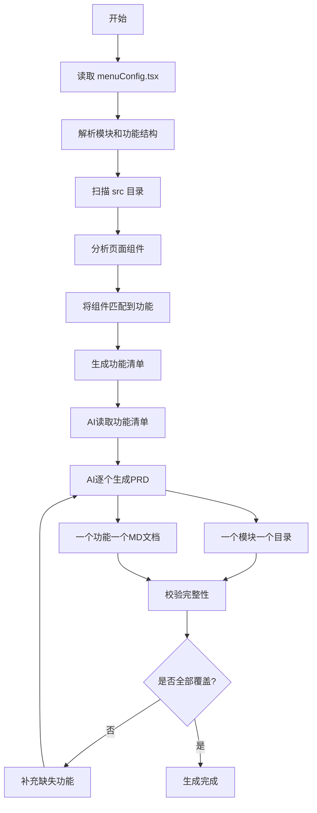

# PRD智能生成器 v4.0

## 功能描述

本技能采用**"菜单配置解析 + 深度代码分析 + AI生成"**的三阶段模式：

1. **第一阶段**：从 `menuConfig.tsx` **严格读取**模块和功能层级结构
   - 解析菜单配置中的一级菜单（模块）和二级菜单（功能）
   - 建立模块-功能的层级关系

2. **第二阶段**：深度分析项目 `src` 目录下的 TSX 代码
   - 递归扫描 `src` 目录，智能识别页面组件
   - 将页面组件匹配到对应的功能下
   - 提取数据模型、UI组件、业务功能

3. **第三阶段**：AI基于功能清单，为每个功能生成详细的PRD文档
   - **一个模块一个目录**
   - **一个功能一个MD文档**
   - 功能归属在模块下面

## 工作流程



## 脚本使用说明

本技能脚本位于 `.trae/skills/prd-generator/` 目录下，支持在任何项目中使用。

### 指定项目路径的三种方式

脚本会按以下优先级确定要分析的项目路径：

#### 方式1：环境变量（优先级最高）
```bash
# Windows PowerShell
$env:PROJECT_ROOT="D:\\Projects\\MyProject"; node .trae/skills/prd-generator/generate-prd.js

# Windows CMD
set PROJECT_ROOT=D:\Projects\MyProject && node .trae/skills/prd-generator/generate-prd.js

# Linux/Mac
PROJECT_ROOT=/path/to/project node .trae/skills/prd-generator/generate-prd.js
```

#### 方式2：命令行参数
```bash
# 使用 --root 或 -r 参数
node .trae/skills/prd-generator/generate-prd.js --root /path/to/project

# 或简写
node .trae/skills/prd-generator/generate-prd.js -r /path/to/project
```

#### 方式3：当前工作目录（默认）
```bash
# 先切换到项目目录
cd /path/to/project

# 然后直接运行脚本（使用当前目录作为项目根目录）
node .trae/skills/prd-generator/generate-prd.js
```

### 脚本命令

```bash
# 生成功能清单（深度分析 src 目录代码）
node .trae/skills/prd-generator/generate-prd.js --root /path/to/project

# 校验PRD完整性
node .trae/skills/prd-generator/generate-prd.js validate --root /path/to/project

# 显示帮助信息
node .trae/skills/prd-generator/generate-prd.js --help
```

## 第一阶段：菜单配置解析

### 读取菜单配置

脚本会严格从 `src/config/menuConfig.tsx` 文件中提取模块和功能结构：

```typescript
// 示例菜单结构
{
  key: "/policy-center",
  icon: <BookOutlined />,
  label: "政策中心",      // ← 模块名称
  children: [
    {
      key: "/policy-center/main",
      icon: <BookOutlined />,
      label: "智慧政策",  // ← 功能名称
    },
    {
      key: "/application?view=list",
      icon: <FormOutlined />,
      label: "申报管理",  // ← 功能名称
    },
  ],
}
```

### 模块-功能层级关系

根据菜单配置，系统会建立如下层级关系：

```
政策中心（模块）
├── 智慧政策（功能）
├── 申报管理（功能）
└── 我的申报（功能）

法律护航（模块）
├── AI 问答（功能）
├── 法规查询（功能）
└── 法规详情（功能）
```

## 第二阶段：深度代码分析

### 页面组件识别

脚本会递归扫描 `src` 目录，识别页面组件：

#### 识别的页面目录
- `pages/` - 页面目录
- `views/` - 视图目录
- `routes/` - 路由目录
- `screens/` - 屏幕目录
- `modules/` - 模块目录

#### 排除的非页面目录
- `components/` - 可复用组件
- `common/` - 公共组件
- `hooks/` - Hook函数
- `utils/` - 工具函数
- `services/` - 服务层
- `config/` - 配置文件

### 组件与功能匹配

脚本会根据文件路径和名称，将页面组件匹配到对应的功能下：

| 文件名 | 匹配模块 | 匹配功能 |
| :--- | :--- | :--- |
| PolicySearch.tsx | 政策中心 | 智慧政策 |
| Application.tsx | 政策中心 | 申报管理 |
| MyApplications.tsx | 政策中心 | 我的申报 |
| AILawyer.tsx | 法律护航 | AI 问答 |
| ProcurementHall.tsx | 产业管理 | 采购大厅 |

### 分析能力

改进后的分析引擎能够：

1. **提取数据模型**
   - TypeScript 接口定义（interface）
   - useState 状态定义
   - Props 类型定义

2. **识别 UI 组件结构**
   - 表格（table）结构及表头
   - 表单（form）字段及类型
   - 弹窗/对话框（modal/dialog）
   - 卡片（card）布局

3. **分析业务功能**
   - 列表展示功能
   - 新增/编辑表单
   - 删除操作
   - 搜索查询
   - 条件筛选
   - 状态切换
   - 分页功能
   - 导入/导出功能

## 第三阶段：AI生成PRD

### 功能清单格式

生成的功能清单文件：`docs/功能清单.md`

```markdown
# 项目功能清单

## 模块概览

| 序号 | 模块名称 | 模块路由 | 功能数量 | 组件数量 | PRD输出目录 |
| :--- | :--- | :--- | :--- | :--- | :--- |
| 1 | 政策中心 | /policy-center | 3 | 5 | docs/政策中心/ |
| 2 | 法律护航 | /legal-support | 3 | 3 | docs/法律护航/ |

## 模块1：政策中心

### 模块信息
- **模块名称**：政策中心
- **模块路由**：/policy-center
- **功能数量**：3
- **PRD输出目录**：`docs/政策中心/`

### 功能1：智慧政策

#### 基本信息
- **功能名称**：智慧政策
- **功能路由**：/policy-center/main
- **所属模块**：政策中心
- **PRD输出文件**：`docs/政策中心/智慧政策.md`

#### 关联组件
| 序号 | 组件名称 | 文件路径 |
| :--- | :--- | :--- |
| 1 | PolicySearch | src/pages/policy/PolicySearch.tsx |

#### 数据模型
**实体：Policy**

| 字段名 | 类型 | 必填 | 说明 |
| :--- | :--- | :--- | :--- |
| id | string | 是 | 政策ID |
| title | string | 是 | 政策标题 |

#### 功能清单
- **FUNC-001：列表展示**
  - 功能类型：列表展示
  - 功能描述：以表格形式展示政策列表

#### 业务规则
1. 政策标题不能为空
2. 政策ID唯一

#### 异常场景

| 异常场景 | 系统行为 |
| :--- | :--- |
| 接口异常 | 捕获异常并提示错误信息 |
```

### PRD输出结构

生成PRD时，严格按照以下目录结构：

```
docs/
├── 功能清单.md              # 功能清单
├── PRD校验报告.md           # 校验报告
├── 首页/
│   └── 首页.md
├── 政策中心/                # ← 模块目录
│   ├── 智慧政策.md          # ← 功能PRD
│   ├── 申报管理.md          # ← 功能PRD
│   └── 我的申报.md          # ← 功能PRD
├── 法律护航/                # ← 模块目录
│   ├── AI 问答.md           # ← 功能PRD
│   ├── 法规查询.md          # ← 功能PRD
│   └── 法规详情.md          # ← 功能PRD
├── 产业管理/                # ← 模块目录
│   ├── 业务大厅.md          # ← 功能PRD
│   ├── 采购大厅.md          # ← 功能PRD
│   └── 我的业务管理.md      # ← 功能PRD
├── 金融服务/                # ← 模块目录
│   ├── 融资诊断.md          # ← 功能PRD
│   └── 诊断分析报告.md      # ← 功能PRD
└── 系统管理/                # ← 模块目录
    ├── 用户管理.md          # ← 功能PRD
    ├── 个人中心.md          # ← 功能PRD
    ├── 我的收藏.md          # ← 功能PRD
    └── 企业管理.md          # ← 功能PRD
```

### AI生成流程

1. **读取模板文件**
   - AI首先阅读 `.trae/skills/prd-generator/模板/` 目录下的所有模板文件
   - 理解模板的框架结构和格式规范
   - 掌握模板中的标准章节和表格格式

2. **读取功能清单**
   - AI阅读 `docs/功能清单.md`
   - 理解所有模块的功能需求
   - 确认模块-功能的层级关系

3. **逐个功能生成PRD**
   - 按照功能清单中的功能顺序，为每个功能生成详细PRD
   - **重要**：PRD 中的功能名称必须使用**中文名**（来自功能清单中的"功能名称"列）
   - **输出位置规则**：
     - **模块目录**：`docs/{中文模块名}/`
     - **功能PRD**：`docs/{中文模块名}/{功能名}.md`
   - **禁止**在 PRD 中使用英文模块名或功能名

### PRD文档结构要求

**⚠️ 重要：AI必须依据模板生成PRD，不在技能中定义固定模板结构**

每个PRD文档的**章节结构、表格格式、流程图风格**必须与模板保持一致：

#### 模板参考路径
- 模板目录：`.trae/skills/prd-generator/模板/`
- 示例模板：`17-size.md`

#### 模板框架规范（从模板中提取）

根据模板文件，PRD应包含以下标准章节：

```markdown
# {功能名称}

#### 1. 功能描述
##### 1.1 业务功能流程图
##### 1.2 子功能流程图（如有）

#### 2. 列表展示
##### 2.1 TAB切换（如有）
##### 2.2 列表字段（表格格式）
##### 2.3 筛选功能

#### 3. 新增功能
##### 3.1 新增操作流程图
##### 3.2 新增弹窗标题
##### 3.3 新增弹窗字段（表格格式）
##### 3.4 新增逻辑
##### 3.5 数据校验

#### 4. 编辑功能
##### 4.1 编辑操作流程图
##### 4.2 编辑弹窗标题
##### 4.3 编辑弹窗字段（表格格式）
##### 4.4 编辑逻辑
##### 4.5 数据校验

#### 5. 其他功能（如Where Used等）

#### 6. 删除功能
##### 6.1 删除操作流程图
##### 6.2 操作说明
##### 6.3 删除逻辑
##### 6.4 数据校验

#### 7. 搜索功能

#### 8. 数据关联

#### 9. 字段自动填充规则（如有）

#### 10. 导入导出功能（如有）
##### 10.1 导入导出操作流程图
##### 10.2 导入功能
##### 10.3 导出功能

#### 11. 异常场景处理（表格格式）
```

#### 表格格式规范

**列表字段表格**：
```markdown
| 字段名称 | 字段说明 | 是否可编辑 | 字段类型 | 说明 |
| :--- | :--- | :--- | :--- | :--- |
```

**弹窗字段表格**：
```markdown
| 字段名称 | 是否必填 | 字段类型 | 说明 |
| :--- | :--- | :--- | :--- |
```

**异常场景表格**：
```markdown
| 异常场景 | 场景说明 | 系统行为 | 提醒方式 | 操作选项 |
| :--- | :--- | :--- | :--- | :--- |
```

### ⚠️ AI生成要求（重要）

1. **必须依据模板生成**
   - **禁止**在技能中定义固定的PRD模板结构
   - AI必须读取 `.trae/skills/prd-generator/模板/` 目录下的模板文件
   - 严格按照模板的**章节结构、表格格式、流程图风格**生成PRD
   - 模板可修改和自定义，AI根据最新的模板进行生成

2. **基于功能清单生成**
   - PRD内容必须**严格基于** `docs/功能清单.md` 生成
   - **不能凭空捏造**功能，所有功能点必须在清单中有对应
   - 功能清单中的字段、规则、异常场景必须完整映射到PRD

3. **使用中文模块名称和功能名称**
   - **必须**使用功能清单中的"模块名称"（中文）作为文件夹名称
   - **必须**使用功能清单中的"功能名称"（中文）作为PRD文件名
   - **禁止**使用英文标识作为模块或功能名称
   - **目录结构示例**：
     ```
     docs/
     ├── 政策中心/                    # 模块文件夹
     │   ├── 智慧政策.md              # 功能PRD
     │   ├── 申报管理.md              # 功能PRD
     │   └── 我的申报.md              # 功能PRD
     ├── 法律护航/                    # 模块文件夹
     │   ├── AI 问答.md               # 功能PRD
     │   ├── 法规查询.md              # 功能PRD
     │   └── 法规详情.md              # 功能PRD
     ```

4. **一个功能一个PRD文档**
   - **严禁**将多个功能合并到一个PRD文档中
   - 每个功能必须生成独立的 `.md` 文件
   - 功能内部的子功能（如新增的表单填写、数据校验等）通过章节组织

5. **完美还原业务功能**
   - 功能交互流程必须与代码逻辑一致
   - 数据模型字段必须与代码定义一致
   - 业务规则必须准确反映代码中的校验逻辑

6. **严格遵循模板格式**
   - 列表字段表格必须使用 `| 字段名称 | 字段说明 | 是否可编辑 | 字段类型 | 说明 |` 格式
   - 弹窗字段表格必须使用 `| 字段名称 | 是否必填 | 字段类型 | 说明 |` 格式
   - 异常场景表格必须使用 `| 异常场景 | 场景说明 | 系统行为 | 提醒方式 | 操作选项 |` 格式
   - 所有流程图使用 Mermaid 语法，风格与模板一致

## 第四阶段：PRD校验

### 校验命令

```bash
node .trae/skills/prd-generator/generate-prd.js validate --root /path/to/project
```

### 校验内容

1. **检查PRD文件是否存在**
   - 检查 `docs/{模块名}/{功能名}.md` 是否存在

2. **检查PRD内容完整性**
   - 是否包含功能描述
   - 是否包含数据模型
   - 是否包含流程图表
   - 是否包含功能详细说明
   - 是否包含业务规则

3. **生成校验报告**
   - 输出 `docs/PRD校验报告.md`
   - 显示通过率统计
   - 列出缺失的PRD文档

### 校验报告示例

```markdown
# PRD完整性校验报告

> 校验时间：2026/03/16 10:00:00
> 项目路径：/path/to/project

## 模块：政策中心

### ✅ 智慧政策
- 状态：通过
- PRD文件：存在
- 完整度：100%
  - 功能描述：✓
  - 数据模型：✓
  - 流程图表：✓
  - 功能详细说明：✓
  - 业务规则：✓

### ❌ 申报管理
- 状态：未通过
- PRD文件：不存在
- 缺失文件：docs/政策中心/申报管理.md

## 校验汇总

| 指标 | 数值 |
| :--- | :--- |
| 总模块数 | 6 |
| 总功能数 | 18 |
| 通过 | 15 |
| 未通过 | 3 |
| 通过率 | 83% |

**⚠️ 有 3 个功能未通过校验，请补充生成。**
```

## 版本历史

### v4.0（当前版本）
- 从 `menuConfig.tsx` 严格读取模块和功能结构
- 功能归属在模块下面
- 生成PRD时，一个模块一个目录，一个功能一个MD文档
- 优化组件与功能的匹配逻辑

### v3.0
- 支持递归扫描 src 目录结构
- 智能识别页面组件
- 从菜单配置中读取准确的中文模块名称

### v2.0
- 增强的代码分析能力
- 提取 TypeScript 接口和 useState
- 识别表格、表单、弹窗等UI结构

### v1.0
- 基础代码扫描功能
- 简单的功能识别
