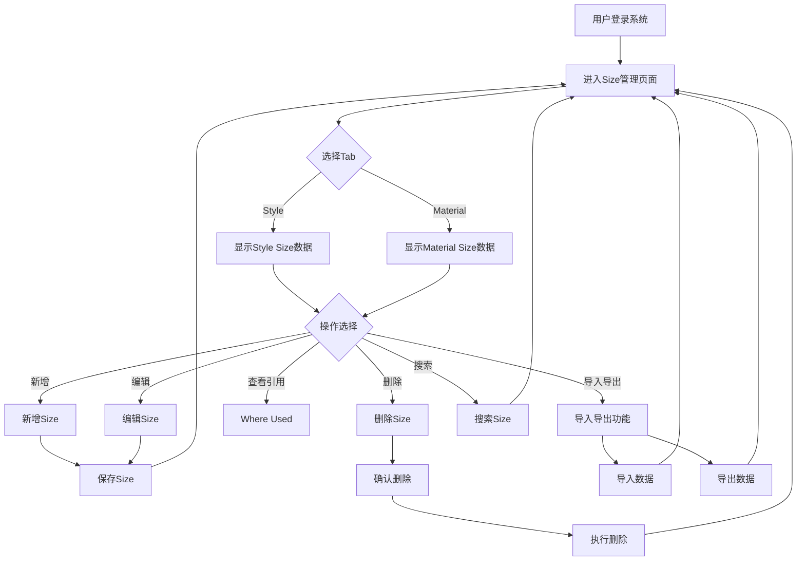
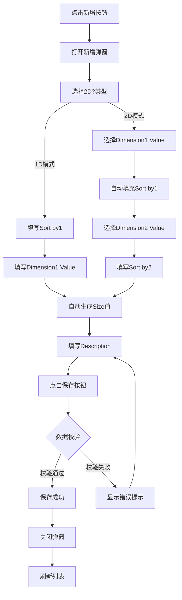
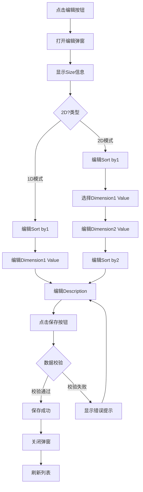
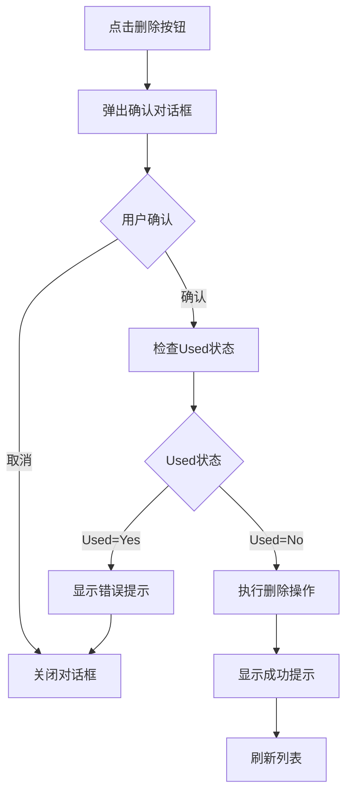
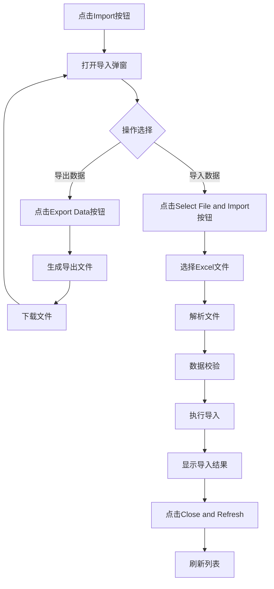

#### 1. 功能描述
提供Size（尺寸）管理功能，支持一维码和二维码两种类型的尺寸配置，支持尺寸的增改查、排序、导入导出等操作。

#### 2. 业务规则

##### 2.1 数据唯一性规则
| 规则编号 | 规则名称 | 规则描述 | 适用范围 |
| :--- | :--- | :--- | :--- |
| BR-001 | Size唯一性 | Size值在系统中必须唯一，不允许重复 | 全局 |
| BR-002 | Sort by1唯一性 | 在同一维度类型（1D/2D）内，Sort by1值必须唯一 | 按维度类型 |
| BR-003 | Sort by2唯一性 | 在相同Sort by1的2D尺寸内，Sort by2值必须唯一 | 2D尺寸 |
| BR-004 | 2D组合唯一性 | 2D模式下，Dimension1 Value + Dimension2 Value组合必须唯一 | 2D尺寸 |

##### 2.2 数据关联规则
| 规则编号 | 规则名称 | 规则描述 |
| :--- | :--- | :--- |
| BR-005 | 2D依赖1D | 创建2D Size前，必须先存在对应的1D Size作为Dimension1 Value |
| BR-006 | Sort by1继承 | 2D Size的Sort by1自动继承所选1D Size的Sort by1值，且不可修改 |
| BR-007 | 引用保护 | Used为Yes的Size不允许删除，防止数据完整性被破坏 |
| BR-008 | Size自动生成 | Size值由系统根据Dimension值自动生成，不可手动编辑 |

##### 2.3 数据状态规则
| 规则编号 | 规则名称 | 规则描述 |
| :--- | :--- | :--- |
| BR-009 | 状态管理 | Size具有Active/Inactive两种状态，控制数据可用性 |
| BR-010 | 引用标识 | Used字段自动标识Size是否被其他业务数据引用 |
| BR-011 | 类型不可变更 | 创建后2D?字段不可修改，1D和2D类型固定 |

##### 2.4 排序规则
| 规则编号 | 规则名称 | 规则描述 |
| :--- | :--- | :--- |
| BR-012 | 列表排序 | 列表默认按Sort by1升序，相同Sort by1按Sort by2升序排列 |
| BR-013 | 排序范围 | Sort by1和Sort by2取值范围为1-9999的正整数 |
| BR-014 | 导入排序 | 导入时仅更新Sort by1和Sort by2字段，其他字段只读 |

##### 2.5 权限规则
| 规则编号 | 规则名称 | 规则描述 |
| :--- | :--- | :--- |
| BR-015 | 查看权限 | 用户需有Size管理权限才能查看Size列表 |
| BR-016 | 编辑权限 | 用户需有Size编辑权限才能新增、修改、删除Size |
| BR-017 | 导入权限 | 用户需有Size导入权限才能执行批量导入操作 |

#### 3. 功能逻辑

##### 3.1 核心功能模块
| 功能模块 | 功能说明 | 优先级 |
| :--- | :--- | :--- |
| **Size列表管理** | 展示Style/Material类型的Size数据，支持Tab切换、筛选、搜索、分页 | P0 |
| **新增Size** | 支持1D和2D两种模式的Size创建，自动生成Size值 | P0 |
| **编辑Size** | 支持修改Size的排序号、描述等信息 | P0 |
| **删除Size** | 支持删除未被引用的Size数据 | P0 |
| **Where Used查询** | 查看Size被引用的情况，包括IT 2D Size和Brand引用 | P0 |
| **导入导出** | 支持批量导入导出Sort by1和Sort by2排序值 | P1 |

##### 3.2 系统交互逻辑
- **前端与后端交互**：
  - 列表数据分页加载，支持服务端排序和筛选
  - 新增/编辑/删除操作成功后刷新列表当前页
  - 导入操作采用异步处理，实时显示进度
- **数据联动**：
  - 2D模式下Dimension1 Value选择后自动填充Sort by1
  - Size值根据Dimension1 Value和Dimension2 Value自动生成
- **状态管理**：
  - 列表筛选状态保存在URL参数中，支持刷新后保持
  - 弹窗表单数据在关闭时重置

##### 3.3 数据流向
```
用户操作 → 前端校验 → API请求 → 后端校验 → 数据库操作 → 返回结果 → 前端更新
```

##### 3.4 业务功能流程图



#### 4. 用例详述

##### 4.1 用例列表
| 用例编号 | 用例名称 | 用例描述 | 参与者 | 优先级 |
| :--- | :--- | :--- | :--- | :--- |
| UC-001 | 查看Size列表 | 用户查看Style或Material类型的Size列表数据 | 系统用户 | P0 |
| UC-002 | 筛选Size数据 | 用户按2D?类型筛选Size数据 | 系统用户 | P0 |
| UC-003 | 搜索Size | 用户按Size字段模糊搜索 | 系统用户 | P0 |
| UC-004 | 新增1D Size | 用户创建一维码类型的Size | 系统用户 | P0 |
| UC-005 | 新增2D Size | 用户创建二维码类型的Size | 系统用户 | P0 |
| UC-006 | 编辑Size | 用户修改已有Size的信息 | 系统用户 | P0 |
| UC-007 | 删除Size | 用户删除未被引用的Size | 系统用户 | P0 |
| UC-008 | 查看Where Used | 用户查看Size的引用情况 | 系统用户 | P0 |
| UC-009 | 导入Sort顺序 | 用户批量导入Sort by1和Sort by2 | 系统用户 | P1 |
| UC-010 | 导出Size数据 | 用户导出Size数据到Excel | 系统用户 | P1 |

##### 4.2 用例详述 - 查看Size列表（UC-001）

**用例名称**：查看Size列表

**参与者**：系统用户

**前置条件**：用户已登录系统且有Size管理权限

**后置条件**：展示Size列表数据

**基本流程**：
1. 用户进入Size管理页面
2. 系统默认显示Style Tab的Size列表
3. 用户可点击Material Tab切换显示Material Size
4. 系统按Sort by1和Sort by2升序排列展示数据

**扩展流程**：
- 2a. 列表数据为空时，显示空状态提示
- 2b. 数据加载失败时，显示错误提示并提供重试按钮

##### 4.3 用例详述 - 新增1D Size（UC-004）

**用例名称**：新增1D Size

**参与者**：系统用户

**前置条件**：用户已登录系统且有Size管理权限

**后置条件**：成功创建1D类型的Size记录

**基本流程**：
1. 用户点击"New"按钮
2. 系统打开新增弹窗，标题为"New [Style/Material] Size"
3. 用户选择2D?为"No"
4. 系统显示1D模式表单（隐藏Dimension2 Value和Sort by2）
5. 用户填写Sort by1（必填，正整数）
6. 用户填写Dimension1 Value（必填）
7. 系统自动生成Size值为Dimension1 Value
8. 用户填写Description（可选）
9. 用户点击"Save"按钮
10. 系统校验数据合法性
11. 系统保存数据并关闭弹窗
12. 系统刷新列表显示新数据

**扩展流程**：
- 10a. 校验失败时，在对应字段下方显示错误提示
- 10b. Size值重复时，提示"Size already exists"
- 10c. Sort by1重复时，提示"Sort by1 already exists"

##### 4.4 用例详述 - 新增2D Size（UC-005）

**用例名称**：新增2D Size

**参与者**：系统用户

**前置条件**：用户已登录系统且有Size管理权限，系统中已存在1D Size

**后置条件**：成功创建2D类型的Size记录

**基本流程**：
1. 用户点击"New"按钮
2. 系统打开新增弹窗
3. 用户选择2D?为"Yes"
4. 系统显示2D模式表单
5. 用户选择Dimension1 Value（下拉选择所有1D Size）
6. 系统自动填充Sort by1为所选1D Size的Sort by1值（只读）
7. 用户选择Dimension2 Value（从Size Config选择）
8. 用户填写Sort by2（必填，正整数）
9. 系统自动生成Size值为"Dimension1 Value-Dimension2 Value"
10. 用户填写Description（可选）
11. 用户点击"Save"按钮
12. 系统校验数据合法性
13. 系统保存数据并关闭弹窗
14. 系统刷新列表显示新数据

**扩展流程**：
- 12a. 校验失败时，在对应字段下方显示错误提示
- 12b. Dimension1 Value + Dimension2 Value组合重复时，提示"Size already exists"
- 12c. Sort by2在同一Sort by1下重复时，提示"Sort by2 already exists"

##### 4.5 用例详述 - 编辑Size（UC-006）

**用例名称**：编辑Size

**参与者**：系统用户

**前置条件**：用户已登录系统且有Size管理权限，Size记录已存在

**后置条件**：成功修改Size记录

**基本流程**：
1. 用户在列表中点击某条Size的"Edit"按钮
2. 系统打开编辑弹窗，加载该Size的当前数据
3. 用户修改可编辑字段（Sort by1、Description等）
4. 用户点击"Save"按钮
5. 系统校验数据合法性
6. 系统保存数据并关闭弹窗
7. 系统刷新列表显示更新后的数据

**扩展流程**：
- 2a. 2D Size编辑时，Dimension1 Value和Dimension2 Value可修改
- 5a. 校验失败时，在对应字段下方显示错误提示
- 5b. 修改后的Sort by1/ Sort by2重复时，显示相应错误提示

##### 4.6 用例详述 - 删除Size（UC-007）

**用例名称**：删除Size

**参与者**：系统用户

**前置条件**：用户已登录系统且有Size管理权限，Size记录的Used为No

**后置条件**：成功删除Size记录

**基本流程**：
1. 用户在列表中点击某条Size的"Delete"按钮
2. 系统弹出确认对话框，提示"Are you sure you want to delete this Size?"
3. 用户点击"Confirm"确认删除
4. 系统检查Used状态
5. 系统执行删除操作
6. 系统显示成功提示"Size deleted successfully!"
7. 系统刷新列表

**扩展流程**：
- 1a. Used为Yes的Size不显示Delete按钮
- 3b. 用户点击"Cancel"取消删除，关闭对话框
- 4a. Used状态为Yes时，阻止删除并提示"Cannot delete: This Size is being used"

##### 4.7 用例详述 - 查看Where Used（UC-008）

**用例名称**：查看Where Used

**参与者**：系统用户

**前置条件**：用户已登录系统且有Size管理权限，Size记录的Used为Yes

**后置条件**：展示Size的引用情况

**基本流程**：
1. 用户在列表中点击某条Size的"Where Used"按钮
2. 系统打开Where Used弹窗
3. 如果是1D Size，显示IT 2D Size和Brand两个Tab
4. 如果是2D Size，只显示Brand Tab
5. 系统加载并显示引用数据
6. 用户查看完成后点击关闭

**扩展流程**：
- 1a. Used为No的Size不显示Where Used按钮
- 3a. IT 2D Size Tab显示具有相同Dimension1 Value的所有2D Size
- 3b. Brand Tab以标签形式显示引用该Size的品牌列表

##### 4.8 用例详述 - 导入Sort顺序（UC-009）

**用例名称**：导入Sort顺序

**参与者**：系统用户

**前置条件**：用户已登录系统且有Size管理权限，已准备好导入的Excel文件

**后置条件**：成功更新Size的Sort by1和Sort by2值

**基本流程**：
1. 用户点击"Import"按钮
2. 系统打开导入弹窗
3. 用户点击"Export Data"导出当前数据作为模板
4. 用户在Excel中调整Sort by1和Sort by2值
5. 用户点击"Select File and Import"选择文件
6. 系统解析Excel文件
7. 系统校验数据合法性
8. 系统执行导入操作
9. 系统显示导入结果确认弹窗
10. 用户点击"Close and Refresh"关闭弹窗
11. 系统刷新列表显示更新后的数据

**扩展流程**：
- 7a. 数据校验失败时，在结果弹窗中标记错误行和错误原因
- 8a. 部分数据导入成功时，显示成功和失败数量统计

#### 5. 列表展示

##### 5.1 TAB切换
- **第一层TAB**：Style / Material
  - Style：显示Style Size类型的数据
  - Material：显示Material Size类型的数据

##### 5.2 列表字段
| 字段名称 | 字段说明 | 是否可编辑 | 字段类型 | 说明 |
| :--- | :--- | :--- | :--- | :--- |
| Size | 尺寸值 | 否 | 文本 | 尺寸的唯一标识，如"XL"、"S-M"等 |
| 2D? | 是否二维码 | 否 | 布尔 | Yes表示二维码，No表示一维码 |
| Dimension1 Value | 一维码值 | 否 | 文本 | 1D时为用户输入，2D时为下拉选择 |
| Sort by1 | 一维排序序号 | 是 | 数字 | 控制1D尺寸的显示顺序，数字越小越靠前 |
| Dimension2 Value | 二维码值 | 否 | 文本 | 二维码配置值，从Size Config中选择 |
| Sort by2 | 二维排序序号 | 是 | 数字 | 控制2D尺寸的显示顺序，数字越小越靠前 |
| Description | 描述 | 否 | 文本 | 尺寸的详细描述信息 |
| Used | 是否被引用 | 否 | 布尔 | 该尺寸是否被其他数据引用 |
| Created By | 创建人 | 否 | 文本 | 记录创建该尺寸的用户 |
| Created | 创建时间 | 否 | 日期时间 | 格式：YYYY-MM-DD HH:mm:ss |
| Modified By | 修改人 | 否 | 文本 | 最后修改该尺寸的用户 |
| Modified | 修改时间 | 否 | 日期时间 | 格式：YYYY-MM-DD HH:mm:ss |
| Status | 状态 | 否 | 枚举 | Active（激活）/Inactive（停用） |
| Actions | 操作 | - | - | 包含Where Used、编辑、删除按钮 |

##### 5.3 筛选功能
- **2D? 筛选下拉框**：
  - All 2D?：显示全部数据
  - No (1D)：只显示一维码数据（2D?=No）
  - Yes (2D)：只显示二维码数据（2D?=Yes）
- **搜索**：支持按Size字段进行模糊搜索
- **分页**：支持分页展示，可调整每页显示数量（10/20/50/100）
- **排序**：列表按Sort by1和Sort by2升序排列

#### 6. 新增功能

##### 6.1 新增操作流程图



##### 6.2 新增弹窗标题
- **标题格式**：`New [Style/Material] Size`
- **标题示例**：
  - New Style Size
  - New Material Size

##### 6.3 新增弹窗字段
| 字段名称 | 是否必填 | 字段类型 | 说明 |
| :--- | :--- | :--- | :--- |
| Size | 否 | 文本 | 尺寸值，根据2D选项自动生成，不可手动输入，始终禁用 |
| 2D? | 是 | 下拉选择 | Yes/No，控制是否为二维码，用户可手动选择 |
| Sort by1 | 是 | 数字输入框 | 1D排序序号，必填，必须为正整数 |
| Dimension1 Value | 是 | 输入框/下拉选择 | 1D模式下为输入框，2D模式下为下拉选择（包含所有1D size数据） |
| Dimension2 Value | 是（2D模式下） | 下拉选择 | 从Size Config中选择，仅2D模式下显示 |
| Sort by2 | 是（2D模式下） | 数字输入框 | 2D排序序号，仅2D模式下显示，必须为正整数 |
| Description | 否 | 多行文本 | 尺寸的详细描述 |

##### 5.4 新增逻辑
- **字段顺序**：Size → 2D? → Sort by1 → Dimension1 Value → Dimension2 Value → Sort by2 → Description
- **2D?字段**：
  - 用户可手动选择 Yes 或 No
  - 选择后会动态切换其他字段的显示/隐藏
- **1D模式（2D?=NO）**：
  - 显示Sort by1字段（必填）
  - Dimension1 Value显示为输入框，用户可直接输入
  - 隐藏Dimension2 Value和Sort by2字段
  - Size字段禁用，自动生成值为"Dimension1 Value"
- **2D模式（2D?=YES）**：
  - 显示Sort by1字段（自动继承所选1D size的Sort by1值，只读）
  - Dimension1 Value显示为下拉框，包含所有1D size数据（包括Style和Material）
  - 显示Dimension2 Value下拉框（加载Size Config数据）
  - 显示Sort by2字段（必填）
  - Size字段禁用，自动生成值为"Dimension1 Value-Dimension2 Value"
- **Sort by1自动填充**：
  - 2D模式下，当用户选择Dimension1 Value后，Sort by1自动填充为所选1D size的Sort by1值
  - Sort by1字段在2D模式下为只读状态

##### 6.5 数据校验
- Size值不能为空
- Size值必须唯一
- Sort by1必填，必须为正整数（1-9999）
- Sort by1在同一维度类型（1D/2D）内必须唯一
- 2D模式下，Dimension1 Value、Dimension2 Value、Sort by2不能为空
- Sort by2必填（2D时），必须为正整数（1-9999）
- Sort by2在相同Sort by1的2D尺寸内必须唯一
- 2D模式下，Dimension1 Value + Dimension2 Value组合必须唯一

#### 7. 编辑功能

##### 7.1 编辑操作流程图



##### 7.2 编辑弹窗标题
- **标题格式**：`Edit [Style/Material] Size`
- **标题示例**：
  - Edit Style Size
  - Edit Material Size

##### 7.3 编辑弹窗字段
| 字段名称 | 是否可编辑 | 字段类型 | 说明 |
| :--- | :--- | :--- | :--- |
| Size | 否 | 文本 | 尺寸值，只读显示，不可编辑 |
| 2D? | 否 | 下拉选择 | Yes/No，编辑时不可修改，始终禁用 |
| Sort by1 | 是 | 数字输入框 | 1D排序序号，可编辑 |
| Dimension1 Value | 是（2D时） | 输入框/下拉选择 | 1D时为输入框，2D时为下拉选择 |
| Dimension2 Value | 是（2D时） | 下拉选择 | 从Size Config中选择，仅2D时显示 |
| Sort by2 | 是（2D时） | 数字输入框 | 2D排序序号，仅2D时显示 |
| Description | 是 | 多行文本 | 尺寸的详细描述 |

##### 4.3 编辑逻辑
- **字段顺序**：Size → 2D? → Sort by1 → Dimension1 Value → Dimension2 Value → Sort by2 → Description
- **Size字段**：始终禁用，只读显示，不可编辑
- **2D?字段禁用**：编辑时不能修改2D?字段，保持原有类型，始终禁用
- **1D编辑（2D?=NO）**：
  - 显示Sort by1字段（可编辑）
  - Dimension1 Value显示为输入框（可编辑）
  - 隐藏Dimension2 Value和Sort by2字段
- **2D编辑（2D?=YES）**：
  - 显示Sort by1字段（可编辑）
  - Dimension1 Value显示为下拉框，包含所有1D size数据（包括Style和Material）
  - 显示Dimension2 Value下拉框（可编辑）
  - 显示Sort by2字段（可编辑）

##### 4.4 数据校验
- 与新增时的校验规则一致
- 修改Size值时需检查唯一性（排除自身）
- 修改Sort by1时需检查唯一性（排除自身）
- 修改Sort by2时需检查唯一性（排除自身）

#### 8. Where Used功能

##### 8.1 操作说明
- **Where Used按钮**：点击Actions列的Where Used按钮，查看Size的引用情况
- **按钮显示**：仅Used为Yes的Size显示Where Used按钮，Used为No时不显示

##### 8.2 Where Used弹窗
- **一维码（2D=NO）**：
  - 显示两个Tab：IT 2D Size 和 Brand
  - 默认显示IT 2D Size标签页
  - IT 2D Size标签页：显示与当前Size具有相同Dimension1 Value（一维）的所有二维Size数据（2D=YES）
  - Brand标签页：以标签（Tag）形式显示引用该Size的品牌列表
- **二维码（2D=YES）**：
  - 不显示Tab
  - 直接显示Brand标签页
  - 以标签（Tag）形式显示引用该Size的品牌列表
- **品牌标签样式**：蓝色背景和边框，鼠标悬停时上浮并显示阴影效果

##### 8.3 引用规则
- **IT 2D Size引用**：显示与当前Size具有相同Dimension1 Value（一维）的所有二维Size数据，无论是一维还是二维
- **Brand引用**：显示引用该Size的品牌列表，以标签形式展示

#### 9. 删除功能

##### 9.1 删除操作流程图



##### 9.2 操作说明
- **删除按钮**：点击Actions列的Delete按钮，删除Size
- **按钮显示**：仅Used为No的Size显示Delete按钮，Used为Yes时不显示

##### 9.3 删除逻辑
- **删除确认**：点击Delete按钮后，弹出确认对话框，提示"Are you sure you want to delete this Size?"
- **引用检查**：删除前再次检查Used状态，防止误删正在使用的数据
- **删除执行**：
  - 如果Used=Yes：阻止删除，显示错误提示"Cannot delete: This Size is being used"
  - 如果Used=No：执行删除操作，从列表中移除该Size
- **删除成功**：显示成功提示"Size deleted successfully!"，刷新列表
- **删除失败**：显示错误提示，保持列表状态

##### 9.4 数据校验
- 删除前检查Used状态
- Used为Yes的Size不允许删除
- 删除前再次检查Used状态，防止误删

#### 10. 搜索功能

- **搜索范围**：Size字段
- **搜索方式**：模糊匹配（不区分大小写）
- **实时搜索**：输入后自动触发搜索，无需点击搜索按钮

#### 11. 数据关联

##### 11.1 Size Config关联
- **Dimension2 Value字段**：从Size Config数据源加载
- **数据来源**：参考16-size-config.html页面的数据结构
- **筛选方式**：支持模糊搜索筛选

##### 11.2 Size自关联
- **Dimension1 Value字段**：
  - 1D模式下：为输入框，用户可直接输入
  - 2D模式下：为下拉框，从现有Size列表加载
- **数据来源**：
  - 1D模式：当前TAB的1D size数据
  - 2D模式：所有1D size数据（包括Style和Material）
- **筛选方式**：下拉框支持模糊搜索筛选
- **排序**：按Sort by1升序排列

#### 12. SIZE字段自动填充规则

##### 12.1 填充规则
- **1D模式（2D?=NO）**：
  - SIZE = Dimension1 Value
  - 直接使用Dimension1 Value输入框的值
- **2D模式（2D?=YES）**：
  - SIZE = Dimension1 Value-Dimension2 Value
  - 拼接Dimension1 Value下拉框和Dimension2 Value下拉框的值，中间用"-"连接

##### 12.2 触发时机
- 打开新增/编辑弹窗时自动初始化
- Dimension1 Value字段值变化时自动更新
- Dimension2 Value字段值变化时自动更新

#### 13. 导入导出功能

##### 13.1 导入导出操作流程图



##### 13.2 导入功能
- **导入入口**：在Size管理页面顶部提供"Import"按钮
- **弹窗展示**：
  - 点击"Import"按钮弹出统一的导入弹窗
  - 显示导入说明和注意事项
- **导入格式**：支持XLS、XLSX格式文件导入
- **导入说明**：
  - Note: Supports XLS, XLSX format files
  - Please export data first, adjust the sort order in Excel, then re-import to update.
  - Import Rules: The system will use ID to determine uniqueness.
  - 1. If the record exists, only Sort by1 and Sort by2 fields will be updated.
  - 2. If the record does not exist, this data will be ignored.
- **模板列说明**：
  - **ID** - System unique identifier (auto-generated during export, do not modify)
  - **Size** - Size name (read-only, for reference)
  - **2D?** - Whether it is a 2D size (Yes/No, read-only)
  - **Sort by1** - 1D sort order number (required, editable)
  - **Sort by2** - 2D sort order number (required for 2D sizes, editable)
- **导入流程**：
  1. 点击"Import"按钮，弹出导入弹窗
  2. 点击"Export Data"按钮导出当前数据（包含ID）
  3. 在Excel中调整Sort by1和Sort by2值
  4. 点击"Select File and Import"按钮选择文件
  5. 系统自动解析并导入
  6. 显示导入进度面板，实时显示进度
  7. 导入完成后显示结果确认弹窗
- **导入校验**：
  - **ID校验**：
    - ID不能为空
    - 记录ID必须存在（根据ID查找现有记录）
  - **2D?校验**：
    - 2D?不能为空
    - 2D?必须是Yes或No
  - **Sort by1校验**：
    - Sort by1不能为空
    - Sort by1必须是数字
    - Sort by1必须是整数
    - Sort by1必须大于等于1
    - Sort by1不能超过9999
    - Sort by1在导入文件中不能重复
    - Sort by1在同一维度类型内不能重复
  - **Sort by2校验（2D尺寸）**：
    - 2D尺寸的Sort by2不能为空
    - Sort by2必须是数字
    - Sort by2必须是整数
    - Sort by2必须大于等于1
    - Sort by2不能超过9999
    - Sort by2在导入文件中不能重复（相同Sort by1下）
    - Sort by2在相同Sort by1的2D尺寸内不能重复
- **导入策略**：
  - 仅更新Sort by1和Sort by2字段
  - 根据ID判断记录是否存在
  - 记录不存在则忽略该条数据
  - 错误数据不会中断导入，会记录错误原因
- **导入结果**：
  - 显示导入结果确认弹窗（Import Result Confirmation）
  - 统计信息：Successfully Imported / Failed to Import
  - 错误详情表格：显示行号（Row）、标识（Identifier）、错误原因（Error Reason）
  - 点击"Close and Refresh"关闭弹窗并刷新列表

##### 13.3 导出功能
- **导出入口**：在Import弹窗中提供"Export Data"按钮
- **导出格式**：XLSX格式
- **导出内容**：导出当前视图（筛选后）的所有数据
- **导出字段**：
  - ID：系统唯一标识
  - Size：尺寸值
  - 2D?：是否二维码
  - Sort by1：一维排序序号
  - Sort by2：二维排序序号
- **导出流程**：
  1. 在Import弹窗中点击"Export Data"按钮
  2. 系统自动生成文件并下载到浏览器默认下载文件夹
  3. 文件名为"[style/material]_size_export.xlsx"
- **导出用途**：
  - 用于在Excel中批量调整Sort by1和Sort by2值
  - 调整后通过导入功能更新到系统

#### 14. 异常场景处理

| 异常场景 | 场景说明 | 系统行为 | 提醒方式 | 操作选项 |
| :--- | :--- | :--- | :--- | :--- |
| **Size重复** | 新增或编辑时Size值已存在 | 阻止保存，保持编辑状态 | 字段下方显示红色错误提示 | 修改Size值或取消编辑 |
| **Sort by1重复** | Sort by1值在同一维度类型内已存在 | 阻止保存，保持编辑状态 | 字段下方显示红色错误提示 | 修改Sort by1值或取消编辑 |
| **Sort by2重复** | Sort by2值在相同Sort by1的2D尺寸内已存在 | 阻止保存，保持编辑状态 | 字段下方显示红色错误提示 | 修改Sort by2值或取消编辑 |
| **必填为空** | 必填字段未填写 | 阻止保存，保持编辑状态 | 字段下方显示红色错误提示 | 填写必填字段或取消编辑 |
| **删除限制** | Used为Yes的Size尝试删除 | 阻止删除，不显示Delete按钮 | Toast提示"Cannot delete: This Size is being used" | 取消操作 |
| **删除确认** | 点击Delete按钮 | 弹出确认对话框 | 提示"Are you sure you want to delete this Size?" | 确认删除或取消 |
| **删除前检查** | 删除前再次检查Used状态 | 防止误删正在使用的数据 | 如果Used=Yes则阻止删除 | 取消操作 |
| **导入文件格式错误** | 上传非Excel格式文件 | 阻止导入，显示错误提示 | Toast提示"Please upload Excel format file" | 重新选择文件 |
| **导入数据校验失败** | Excel文件中存在必填为空或重复数据 | 阻止导入，显示错误详情 | Import Result Confirmation弹窗中标记错误行 | 修改Excel文件后重新上传 |
| **导入部分成功** | 部分数据导入成功，部分失败 | 显示成功和失败数量 | 提供错误详情弹窗 | 查看错误详情或完成导入 |
| **导出数据为空** | 当前筛选条件下无数据可导出 | 阻止导出，显示提示 | Toast提示"No data to export under current conditions" | 调整筛选条件 |
