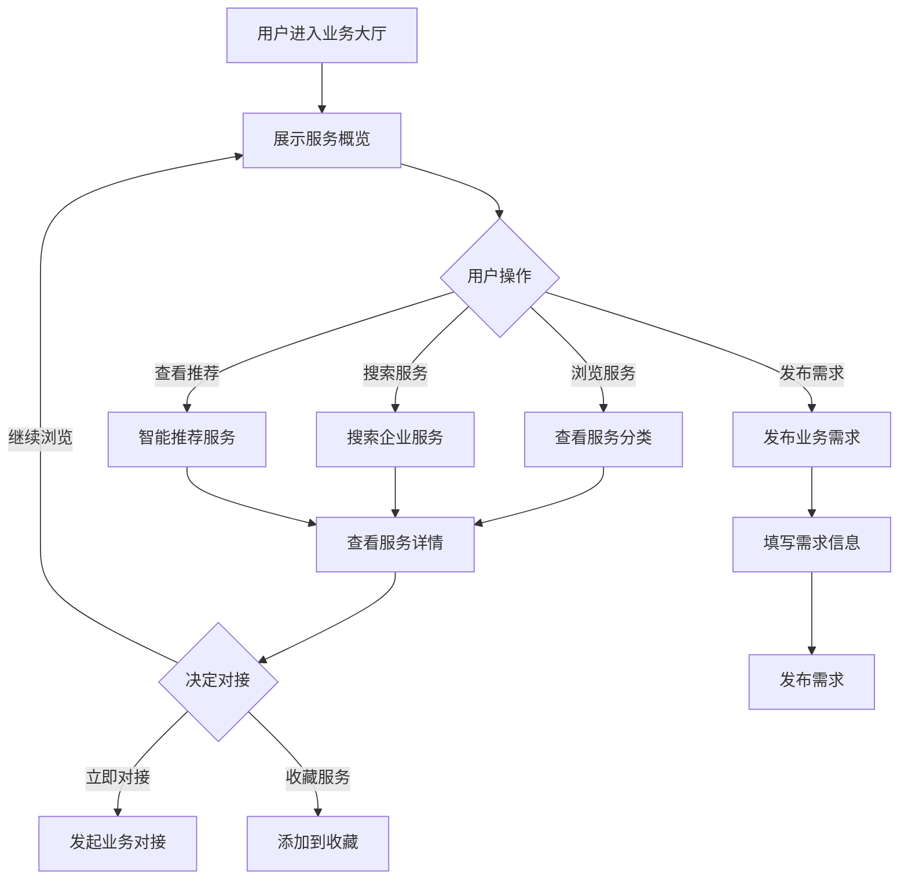

# 业务大厅

## 1. 功能描述

业务大厅是产业管理模块的入口页面，提供企业服务的展示、搜索和对接功能，支持企业发布需求、查找服务、业务对接等操作。

### 1.1 业务功能流程图



## 2. 页面展示

### 2.1 头部Banner

**欢迎区域**
- 欢迎语："企业服务中心"
- 简介文字：一站式企业服务平台
- 统计数据：入驻企业数、发布服务数、成功对接数

**快捷入口**
- 发布需求按钮
- 我的服务按钮
- 消息中心按钮

### 2.2 服务分类

**分类展示**

| 分类名称 | 图标 | 说明 |
|---------|------|------|
| 技术服务 | 🔧 | 技术开发、技术咨询、技术转让 |
| 法律服务 | ⚖️ | 法律咨询、合同审核、诉讼代理 |
| 财税服务 | 💰 | 财务代理、税务筹划、审计服务 |
| 人力资源 | 👥 | 招聘服务、培训服务、劳务派遣 |
| 知识产权 | 📚 | 专利申请、商标注册、版权登记 |
| 市场推广 | 📢 | 品牌推广、营销策划、广告投放 |
| 办公服务 | 🏢 | 办公租赁、设备采购、物业服务 |
| 金融服务 | 🏦 | 融资服务、贷款咨询、保险服务 |

**展示方式**
- 图标卡片形式
- 点击跳转到分类列表
- 显示该分类下的服务数量

### 2.3 推荐服务

**智能推荐**
- 基于企业画像推荐
- 基于浏览历史推荐
- 热门服务推荐

**展示形式**
- 服务卡片列表
- 横向滑动展示
- 显示服务名称、提供商、价格、评分

### 2.4 最新需求

**需求展示**
- 最新发布的企业需求
- 滚动展示
- 显示需求标题、预算、发布时间

## 3. 搜索功能

### 3.1 搜索框

- 占位符："搜索服务、需求、企业..."
- 支持关键词搜索
- 支持自动补全

### 3.2 筛选条件

| 筛选类别 | 选项 |
|---------|------|
| 服务类型 | 全部、技术服务、法律服务、财税服务等 |
| 服务地区 | 全部、北京市、上海市、广东省等 |
| 价格范围 | 全部、免费、1万以下、1-5万、5-10万、10万以上 |
| 服务评分 | 全部、5分、4分以上、3分以上 |

## 4. 发布需求

### 4.1 需求发布流程

**步骤1：选择需求类型**
- 技术服务需求
- 法律服务需求
- 财税服务需求
- 其他需求

**步骤2：填写需求信息**

| 字段名称 | 是否必填 | 字段类型 | 说明 |
|---------|---------|---------|------|
| 需求标题 | 是 | 文本 | 简要描述需求 |
| 需求类型 | 是 | 下拉选择 | 选择服务分类 |
| 需求描述 | 是 | 多行文本 | 详细描述需求内容 |
| 预算范围 | 是 | 金额范围 | 期望的价格区间 |
| 服务地区 | 是 | 下拉选择 | 期望服务商所在地区 |
| 期望周期 | 是 | 文本 | 期望完成时间 |
| 联系电话 | 是 | 手机号 | 联系人的电话 |
| 附件 | 否 | 文件上传 | 相关附件材料 |

**步骤3：发布确认**
- 信息预览
- 发布按钮
- 发布后展示在最新需求区

## 5. 服务详情

### 5.1 详情页面结构

**服务头部**
- 服务名称
- 服务商信息
- 服务评分
- 收藏按钮

**服务信息**
- 服务类型
- 服务地区
- 服务价格
- 服务周期

**服务内容**
- 服务介绍
- 服务流程
- 服务优势
- 成功案例

**服务商信息**
- 企业名称
- 企业资质
- 服务经验
- 联系方式

### 5.2 操作功能

| 操作 | 说明 |
|-----|------|
| 立即对接 | 发起业务对接请求 |
| 在线咨询 | 与服务商在线沟通 |
| 收藏服务 | 添加到我的收藏 |
| 分享服务 | 生成分享链接 |

## 6. 业务对接

### 6.1 对接流程

1. 点击"立即对接"
2. 填写对接信息
3. 提交对接请求
4. 等待服务商响应
5. 双方确认合作

### 6.2 对接信息

| 字段 | 说明 |
|-----|------|
| 企业名称 | 自动填充 |
| 联系人 | 自动填充 |
| 联系电话 | 自动填充 |
| 需求说明 | 补充说明具体需求 |
| 期望时间 | 期望开始时间 |

## 7. 数据模型

### 7.1 服务数据模型

```typescript
interface Service {
  id: string;                    // 服务ID
  name: string;                  // 服务名称
  category: string;              // 服务分类
  provider: Provider;            // 服务商信息
  price: string;                 // 服务价格
  region: string;                // 服务地区
  period: string;                // 服务周期
  description: string;           // 服务描述
  process: string[];             // 服务流程
  advantages: string[];          // 服务优势
  cases: Case[];                 // 成功案例
  rating: number;                // 服务评分
  reviewCount: number;           // 评价数量
}

interface Provider {
  id: string;                    // 服务商ID
  name: string;                  // 企业名称
  logo: string;                  // 企业Logo
  qualifications: string[];      // 企业资质
  experience: string;            // 服务经验
  contact: Contact;              // 联系方式
}
```

### 7.2 需求数据模型

```typescript
interface ServiceRequirement {
  id: string;                    // 需求ID
  title: string;                 // 需求标题
  category: string;              // 需求类型
  description: string;           // 需求描述
  budget: string;                // 预算范围
  region: string;                // 服务地区
  period: string;                // 期望周期
  contactPhone: string;          // 联系电话
  attachments?: string[];        // 附件列表
  publisher: User;               // 发布人
  publishTime: string;           // 发布时间
  status: string;                // 需求状态
}
```

## 8. 业务规则

### 8.1 服务展示规则

| 规则编号 | 规则名称 | 规则描述 |
|---------|---------|---------|
| BR-001 | 排序规则 | 默认按评分和热度排序 |
| BR-002 | 刷新机制 | 列表每小时刷新一次 |
| BR-003 | 推荐逻辑 | 基于企业画像和行为推荐 |

### 8.2 需求发布规则

| 规则编号 | 规则名称 | 规则描述 |
|---------|---------|---------|
| BR-004 | 发布限制 | 每天最多发布5条需求 |
| BR-005 | 审核机制 | 需求发布前需经过审核 |
| BR-006 | 有效期 | 需求有效期30天，过期自动下架 |

## 9. 异常场景处理

| 异常场景 | 场景说明 | 系统行为 | 提醒方式 | 操作选项 |
|---------|---------|---------|---------|---------|
| 搜索无结果 | 关键词无匹配 | 显示推荐服务 | 信息提示 | 修改关键词 |
| 发布失败 | 网络或服务器问题 | 保存草稿 | 错误提示 | 重新发布 |
| 对接失败 | 服务商无响应 | 推荐其他服务商 | 信息提示 | 选择其他 |

## 10. 权限控制

| 功能 | 游客 | 普通用户 | 企业用户 | 管理员 |
|-----|------|---------|---------|--------|
| 浏览服务 | ✓ | ✓ | ✓ | ✓ |
| 搜索服务 | ✓ | ✓ | ✓ | ✓ |
| 发布需求 | ✗ | ✗ | ✓ | ✓ |
| 业务对接 | ✗ | ✗ | ✓ | ✓ |
| 收藏服务 | ✗ | ✓ | ✓ | ✓ |
