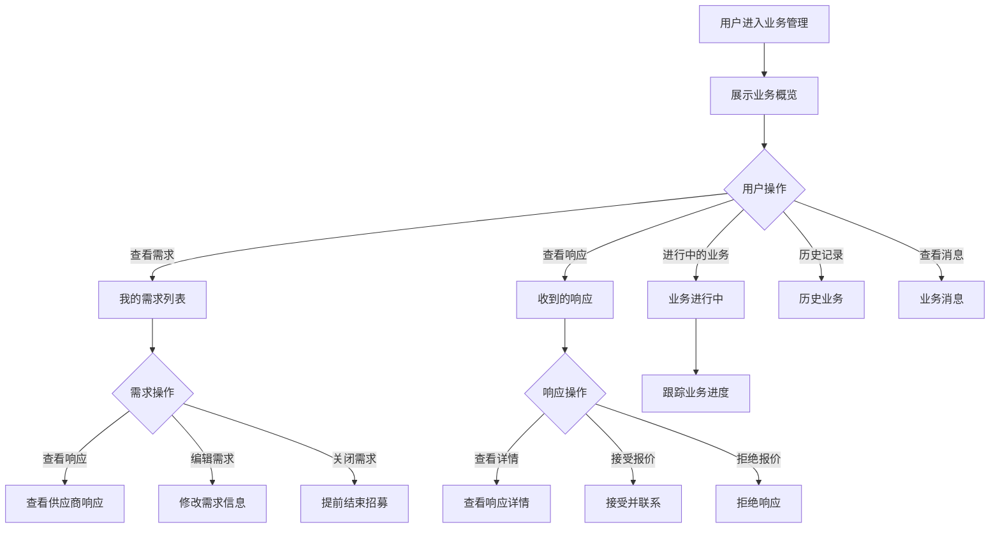

# 我的业务管理

## 1. 功能描述

我的业务管理功能提供用户管理所有业务对接记录的入口，包括我发布的需求、我收到的响应、正在进行的业务、历史业务记录等，支持全流程的业务跟踪和管理。

### 1.1 业务功能流程图



## 2. 页面概览

### 2.1 统计卡片

**数据概览**

| 统计项 | 说明 |
|-------|------|
| 发布需求数 | 累计发布的需求数量 |
| 收到响应数 | 供应商响应的总次数 |
| 进行中业务 | 当前正在对接的业务数 |
| 完成业务数 | 已完成的业务数量 |
| 收藏服务数 | 收藏的服务商数量 |

### 2.2 快捷入口

- 发布新需求
- 查看最新消息
- 继续未完成的业务
- 查看推荐服务

## 3. 我的需求

### 3.1 需求列表

**列表字段**

| 字段名称 | 字段说明 | 字段类型 | 说明 |
|---------|---------|---------|------|
| 需求标题 | 需求名称 | 文本 | 主标题 |
| 需求类型 | 服务分类 | 标签 | 如：技术服务 |
| 发布时间 | 发布时间 | 日期时间 | 相对时间 |
| 截止时间 | 招募截止时间 | 日期 | 带倒计时 |
| 响应数量 | 收到的响应数 | 数字 | 可点击查看 |
| 预算金额 | 需求预算 | 文本 | 金额区间 |
| 需求状态 | 当前状态 | 状态标签 | 招募中/已关闭/已完成 |
| 操作 | 功能按钮 | - | 查看/编辑/关闭 |

### 3.2 需求状态

| 状态 | 说明 | 可操作 |
|-----|------|--------|
| 招募中 | 正在接收供应商响应 | 查看响应、编辑、关闭 |
| 已关闭 | 提前结束招募 | 仅查看 |
| 已完成 | 已确定合作方 | 查看详情、评价 |
| 已过期 | 超过截止时间 | 重新发布、删除 |

### 3.3 需求操作

**查看响应**
- 显示所有供应商响应列表
- 查看响应详情
- 接受/拒绝响应

**编辑需求**
- 修改需求内容
- 延长截止时间
- 更新联系信息

**关闭需求**
- 提前结束招募
- 填写关闭原因
- 状态变更为已关闭

## 4. 收到的响应

### 4.1 响应列表

**列表字段**

| 字段名称 | 字段说明 | 字段类型 | 说明 |
|---------|---------|---------|------|
| 响应服务商 | 供应商名称 | 文本 | 带企业Logo |
| 响应需求 | 对应的需求 | 文本 | 需求标题 |
| 响应类型 | 响应方式 | 标签 | 报价/咨询/方案 |
| 响应内容 | 简要内容 | 文本 | 内容摘要 |
| 报价金额 | 报价价格 | 金额 | 如有报价 |
| 响应时间 | 提交时间 | 日期时间 | 相对时间 |
| 响应状态 | 处理状态 | 状态标签 | 待处理/已接受/已拒绝 |
| 操作 | 功能按钮 | - | 查看/接受/拒绝 |

### 4.2 响应详情

**服务商信息**
- 企业名称
- 企业资质
- 联系方式
- 历史评价

**响应内容**
- 响应类型
- 详细内容
- 报价信息
- 附件材料
- 有效期

**操作按钮**
- 接受响应
- 拒绝响应
- 在线沟通
- 电话联系

### 4.3 响应处理

**接受响应**
1. 查看响应详情
2. 点击"接受响应"
3. 确认接受
4. 系统通知服务商
5. 建立业务联系

**拒绝响应**
1. 查看响应详情
2. 点击"拒绝响应"
3. 选择拒绝原因（可选）
4. 确认拒绝
5. 系统通知服务商

## 5. 进行中的业务

### 5.1 业务列表

**列表字段**

| 字段名称 | 字段说明 | 字段类型 | 说明 |
|---------|---------|---------|------|
| 业务标题 | 业务名称 | 文本 | 需求标题 |
| 合作方 | 服务商名称 | 文本 | 企业名称 |
| 业务类型 | 服务分类 | 标签 | 服务类型 |
| 合作金额 | 成交金额 | 金额 | 最终价格 |
| 开始时间 | 合作开始时间 | 日期 | 建立合作日期 |
| 预计完成 | 预计完成时间 | 日期 | 约定完成日期 |
| 业务进度 | 当前进度 | 进度条 | 百分比 |
| 业务状态 | 当前状态 | 状态标签 | 进行中/待验收/待付款 |
| 操作 | 功能按钮 | - | 查看/沟通/确认完成 |

### 5.2 业务状态

| 状态 | 说明 | 可操作 |
|-----|------|--------|
| 待启动 | 已确定合作，待正式开始 | 确认启动 |
| 进行中 | 服务正在执行中 | 查看进度、沟通、申请变更 |
| 待验收 | 服务已完成，待验收 | 验收确认、申请修改 |
| 待付款 | 验收通过，待支付 | 确认付款、申请分期 |
| 已完成 | 业务全部完成 | 评价、申请售后 |

### 5.3 业务跟踪

**进度跟踪**
- 里程碑节点
- 完成百分比
- 剩余时间

**沟通记录**
- 聊天记录
- 文件传输
- 变更记录

**变更管理**
- 需求变更申请
- 价格变更协商
- 时间延期申请

## 6. 历史业务

### 6.1 历史列表

**筛选条件**
- 时间范围
- 业务类型
- 合作方
- 金额范围

**列表字段**

| 字段名称 | 字段说明 |
|---------|---------|
| 业务标题 | 需求名称 |
| 合作方 | 服务商名称 |
| 业务类型 | 服务分类 |
| 合作金额 | 最终成交金额 |
| 完成时间 | 业务完成日期 |
| 业务评价 | 用户评分 |
| 操作 | 查看详情、再次合作 |

### 6.2 业务详情

- 完整业务信息
- 合作过程记录
- 评价内容
- 相关文件

### 6.3 再次合作

- 快速联系历史合作方
- 基于历史需求快速发布
- 查看合作方最新服务

## 7. 业务消息

### 7.1 消息类型

| 消息类型 | 说明 | 处理方式 |
|---------|------|---------|
| 响应通知 | 收到新的供应商响应 | 点击查看详情 |
| 状态变更 | 需求状态发生变化 | 查看状态详情 |
| 系统通知 | 平台系统消息 | 阅读并标记已读 |
| 沟通消息 | 与服务商的聊天消息 | 进入聊天窗口 |
| 提醒通知 | 截止提醒、进度提醒等 | 查看提醒内容 |

### 7.2 消息管理

- 全部标记已读
- 清空已读消息
- 消息搜索
- 消息设置（开启/关闭某类通知）

## 8. 数据模型

### 8.1 业务记录模型

```typescript
interface BusinessRecord {
  id: string;                    // 业务ID
  title: string;                 // 业务标题
  type: string;                  // 业务类型
  partner: Partner;              // 合作方信息
  amount: number;                // 合作金额
  startDate: string;             // 开始时间
  expectedEndDate: string;       // 预计完成时间
  actualEndDate?: string;        // 实际完成时间
  progress: number;              // 进度百分比
  status: BusinessStatus;        // 业务状态
  requirementId: string;         // 关联需求ID
  responseId: string;            // 关联响应ID
  communications: Communication[]; // 沟通记录
  milestones: Milestone[];       // 里程碑
  attachments: string[];         // 附件列表
  review?: Review;               // 评价信息
}

type BusinessStatus = 
  | 'pending_start'      // 待启动
  | 'in_progress'        // 进行中
  | 'pending_acceptance' // 待验收
  | 'pending_payment'    // 待付款
  | 'completed'          // 已完成
  | 'cancelled';         // 已取消

interface Partner {
  id: string;                    // 合作方ID
  name: string;                  // 企业名称
  logo: string;                  // 企业Logo
  contact: Contact;              // 联系方式
}

interface Communication {
  id: string;                    // 记录ID
  type: 'chat' | 'phone' | 'email'; // 沟通方式
  content: string;               // 沟通内容
  timestamp: string;             // 时间
  sender: 'user' | 'partner';    // 发送方
}

interface Milestone {
  id: string;                    // 里程碑ID
  name: string;                  // 里程碑名称
  plannedDate: string;           // 计划日期
  actualDate?: string;           // 实际日期
  status: 'pending' | 'completed'; // 状态
}

interface Review {
  rating: number;                // 评分
  content: string;               // 评价内容
  tags: string[];                // 评价标签
  createTime: string;            // 评价时间
}
```

### 8.2 响应记录模型

```typescript
interface ResponseRecord {
  id: string;                    // 响应ID
  requirementId: string;         // 需求ID
  requirementTitle: string;      // 需求标题
  supplier: Supplier;            // 供应商信息
  type: 'quote' | 'inquiry' | 'proposal'; // 响应类型
  content: string;               // 响应内容
  amount?: number;               // 报价金额
  validityPeriod?: string;       // 有效期
  attachments?: string[];        // 附件
  status: 'pending' | 'accepted' | 'rejected'; // 状态
  responseTime: string;          // 响应时间
  handleTime?: string;           // 处理时间
}
```

## 9. 业务规则

### 9.1 需求管理规则

| 规则编号 | 规则名称 | 规则描述 |
|---------|---------|---------|
| BR-001 | 编辑限制 | 招募中的需求只能修改部分信息 |
| BR-002 | 关闭限制 | 已有关闭的需求不能重新开启 |
| BR-003 | 删除限制 | 只有已过期或已关闭的需求可以删除 |
| BR-004 | 响应有效期 | 响应有效期最少3天 |

### 9.2 业务管理规则

| 规则编号 | 规则名称 | 规则描述 |
|---------|---------|---------|
| BR-005 | 进度更新 | 服务商需定期更新业务进度 |
| BR-006 | 变更协商 | 需求变更需双方协商确认 |
| BR-007 | 验收时限 | 验收申请提交后7天内需处理 |
| BR-008 | 评价时限 | 业务完成后30天内可评价 |

## 10. 异常场景处理

| 异常场景 | 场景说明 | 系统行为 | 提醒方式 | 操作选项 |
|---------|---------|---------|---------|---------|
| 服务商失联 | 无法联系到服务商 | 标记异常，推荐备选 | 系统通知 | 申请平台介入 |
| 进度延迟 | 超过预计完成时间 | 发送催办通知 | 提醒通知 | 申请延期、协商 |
| 验收不通过 | 服务质量不达标 | 退回修改，记录原因 | 系统通知 | 要求修改、协商退款 |
| 付款纠纷 | 付款金额或方式争议 | 记录争议，平台介入 | 系统通知 | 申请仲裁 |

## 11. 权限控制

| 功能 | 游客 | 普通用户 | 企业用户 | 管理员 |
|-----|------|---------|---------|--------|
| 查看概览 | ✗ | ✓ | ✓ | ✓ |
| 管理需求 | ✗ | ✗ | ✓ | ✓ |
| 处理响应 | ✗ | ✗ | ✓ | ✓ |
| 跟踪业务 | ✗ | ✗ | ✓ | ✓ |
| 查看历史 | ✗ | ✓ | ✓ | ✓ |
| 评价服务 | ✗ | ✓ | ✓ | ✓ |
