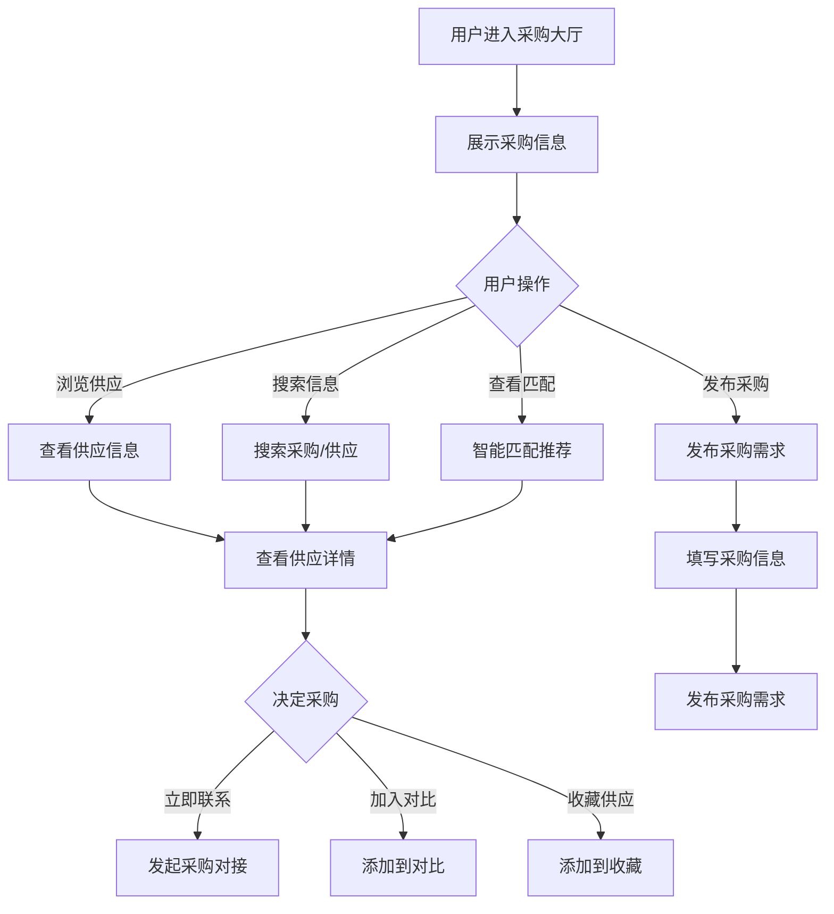

# 采购大厅

## 1. 功能描述

采购大厅提供企业采购需求的发布和对接服务，支持企业发布采购需求、浏览供应信息、进行采购对接，实现供需双方的高效匹配。

### 1.1 业务功能流程图



## 2. 列表展示

### 2.1 TAB切换

**信息类型标签**
- 采购需求（企业发布的采购需求）
- 供应信息（供应商发布的产品/服务）
- 我的采购（当前用户的采购记录）
- 我的关注（关注的需求/供应）

### 2.2 采购需求列表

| 字段名称 | 字段说明 | 字段类型 | 说明 |
|---------|---------|---------|------|
| 需求标题 | 采购需求名称 | 文本 | 带高亮 |
| 采购类型 | 产品/服务分类 | 标签 | 多层级分类 |
| 采购数量 | 需求数量 | 文本 | 如：1000件 |
| 预算金额 | 采购预算 | 文本 | 如：10-50万元 |
| 交货地点 | 收货地址 | 文本 | 省市区 |
| 交货时间 | 期望交货时间 | 日期 | YYYY-MM-DD |
| 发布时间 | 需求发布时间 | 日期时间 | 相对时间 |
| 响应数量 | 供应商响应数 | 数字 | 已报价数量 |
| 需求状态 | 当前状态 | 状态标签 | 招募中/已截止/已完成 |

### 2.3 供应信息列表

| 字段名称 | 字段说明 | 字段类型 | 说明 |
|---------|---------|---------|------|
| 产品图片 | 产品主图 | 图片 | 缩略图 |
| 产品名称 | 供应产品名称 | 文本 | 主标题 |
| 产品规格 | 规格型号 | 文本 | 简要规格 |
| 单价 | 产品单价 | 金额 | 元/单位 |
| 起订量 | 最小订购量 | 数字 | 如：100件起 |
| 供应商 | 供应企业 | 文本 | 企业名称 |
| 供应地区 | 发货地区 | 文本 | 省市区 |
| 认证信息 | 企业认证 | 标签 | 实地认证/资质认证 |
| 交易评价 | 评分信息 | 评分 | 星级+评价数 |

## 3. 筛选功能

### 3.1 采购需求筛选

| 筛选类别 | 选项内容 |
|---------|---------|
| 采购类型 | 全部、原材料、设备、办公用品、服务等 |
| 采购地区 | 全部、北京市、上海市、广东省等 |
| 预算范围 | 全部、1万以下、1-10万、10-50万、50万以上 |
| 发布时间 | 全部、今天、近3天、近7天、近30天 |
| 需求状态 | 全部、招募中、即将截止、已截止 |

### 3.2 供应信息筛选

| 筛选类别 | 选项内容 |
|---------|---------|
| 产品分类 | 全部、电子元器件、机械设备、化工原料等 |
| 供应地区 | 全部、北京市、上海市、广东省等 |
| 价格区间 | 全部、自定义范围 |
| 起订量 | 全部、100以下、100-1000、1000以上 |
| 认证类型 | 全部、实地认证、资质认证、品牌认证 |
| 排序方式 | 综合、价格升序、价格降序、销量、评分 |

## 4. 发布采购需求

### 4.1 发布流程

**步骤1：基本信息**

| 字段名称 | 是否必填 | 字段类型 | 说明 |
|---------|---------|---------|------|
| 需求标题 | 是 | 文本 | 简要描述采购需求 |
| 采购类型 | 是 | 级联选择 | 选择产品/服务分类 |
| 需求描述 | 是 | 多行文本 | 详细描述采购要求 |
| 采购数量 | 是 | 数字+单位 | 如：1000件 |

**步骤2：采购要求**

| 字段名称 | 是否必填 | 字段类型 | 说明 |
|---------|---------|---------|------|
| 规格要求 | 是 | 多行文本 | 技术规格、质量标准 |
| 预算金额 | 是 | 金额范围 | 期望的价格区间 |
| 交货地点 | 是 | 地址选择 | 收货地址 |
| 交货时间 | 是 | 日期选择 | 期望交货日期 |
| 付款方式 | 是 | 下拉选择 | 预付/货到付款/账期等 |
| 发票要求 | 是 | 下拉选择 | 增值税专用发票/普通发票 |

**步骤3：联系信息**

| 字段名称 | 是否必填 | 字段类型 | 说明 |
|---------|---------|---------|------|
| 联系人 | 是 | 文本 | 联系人姓名 |
| 联系电话 | 是 | 手机号 | 联系人电话 |
| 电子邮箱 | 否 | 邮箱 | 联系邮箱 |
| 联系地址 | 否 | 地址 | 详细联系地址 |

**步骤4：附件上传**

- 采购清单
- 技术规格书
- 其他相关文件

### 4.2 发布规则

- 需求标题最少10个字符
- 需求描述最少50个字符
- 支持上传最多5个附件
- 单个附件最大10MB

## 5. 采购详情

### 5.1 采购需求详情

**头部信息**
- 需求标题
- 需求状态
- 发布时间
- 浏览量

**采购信息**
- 采购类型
- 采购数量
- 预算金额
- 交货地点
- 交货时间
- 付款方式
- 发票要求

**需求描述**
- 详细描述
- 规格要求
- 附件列表

**联系信息**
- 联系人
- 联系电话
- 联系地址

**响应情况**
- 已响应供应商数
- 最新响应列表

### 5.2 供应信息详情

**产品信息**
- 产品图片（轮播图）
- 产品名称
- 产品规格
- 产品单价
- 起订量
- 库存量

**供应商信息**
- 企业名称
- 企业Logo
- 认证信息
- 企业简介
- 主营产品
- 联系方式

**交易信息**
- 成交数量
- 评价数量
- 好评率
- 买家评价

## 6. 采购对接

### 6.1 对接方式

**在线沟通**
- 即时聊天窗口
- 发送产品/需求信息
- 发送图片和文件

**电话联系**
- 显示供应商电话
- 一键拨打功能

**提交报价**
- 填写报价信息
- 上传报价单
- 提交报价申请

### 6.2 报价信息

| 字段名称 | 是否必填 | 字段类型 | 说明 |
|---------|---------|---------|------|
| 产品名称 | 是 | 文本 | 报价产品 |
| 产品规格 | 是 | 文本 | 规格型号 |
| 单价 | 是 | 金额 | 元/单位 |
| 数量 | 是 | 数字 | 供应数量 |
| 总价 | 是 | 金额 | 自动计算 |
| 交货期 | 是 | 文本 | 如：7天内 |
| 有效期 | 是 | 日期 | 报价有效期 |
| 备注 | 否 | 多行文本 | 其他说明 |
| 附件 | 否 | 文件 | 报价单等 |

## 7. 数据模型

### 7.1 采购需求模型

```typescript
interface ProcurementRequirement {
  id: string;                    // 需求ID
  title: string;                 // 需求标题
  category: string;              // 采购类型
  description: string;           // 需求描述
  quantity: number;              // 采购数量
  unit: string;                  // 单位
  budgetMin?: number;            // 预算下限
  budgetMax?: number;            // 预算上限
  deliveryLocation: string;      // 交货地点
  deliveryDate: string;          // 交货时间
  paymentMethod: string;         // 付款方式
  invoiceType: string;           // 发票要求
  specifications: string;        // 规格要求
  attachments?: string[];        // 附件列表
  contact: Contact;              // 联系信息
  publisher: User;               // 发布人
  publishTime: string;           // 发布时间
  deadline: string;              // 截止时间
  status: 'active' | 'closed' | 'completed'; // 状态
  viewCount: number;             // 浏览量
  responseCount: number;         // 响应数
}
```

### 7.2 供应信息模型

```typescript
interface SupplyInfo {
  id: string;                    // 供应ID
  productName: string;           // 产品名称
  productImages: string[];       // 产品图片
  category: string;              // 产品分类
  specifications: string;        // 产品规格
  unitPrice: number;             // 单价
  minOrderQuantity: number;      // 起订量
  stockQuantity?: number;        // 库存量
  supplier: Supplier;            // 供应商信息
  deliveryRegion: string;        // 供应地区
  certifications: string[];      // 认证信息
  salesVolume: number;           // 销量
  rating: number;                // 评分
  reviewCount: number;           // 评价数
  description: string;           // 产品描述
  publishTime: string;           // 发布时间
  status: string;                // 状态
}

interface Supplier {
  id: string;                    // 供应商ID
  name: string;                  // 企业名称
  logo: string;                  // 企业Logo
  certifications: string[];      // 认证信息
  mainProducts: string[];        // 主营产品
  contact: Contact;              // 联系方式
}
```

## 8. 业务规则

### 8.1 发布规则

| 规则编号 | 规则名称 | 规则描述 |
|---------|---------|---------|
| BR-001 | 发布限制 | 每天最多发布3条采购需求 |
| BR-002 | 审核机制 | 需求发布前需经过审核 |
| BR-003 | 有效期 | 需求默认有效期30天 |
| BR-004 | 刷新机制 | 可付费刷新，提升排名 |

### 8.2 对接规则

| 规则编号 | 规则名称 | 规则描述 |
|---------|---------|---------|
| BR-005 | 报价限制 | 每个需求最多接收10个报价 |
| BR-006 | 响应时限 | 报价有效期最少3天 |
| BR-007 | 沟通记录 | 所有沟通记录保存90天 |

## 9. 异常场景处理

| 异常场景 | 场景说明 | 系统行为 | 提醒方式 | 操作选项 |
|---------|---------|---------|---------|---------|
| 需求截止 | 超过截止时间 | 状态变更为已截止 | 系统通知 | 重新发布 |
| 报价过期 | 超过报价有效期 | 报价自动失效 | 信息提示 | 重新报价 |
| 供应下架 | 供应信息已下架 | 显示已下架提示 | 错误提示 | 查看其他 |

## 10. 权限控制

| 功能 | 游客 | 普通用户 | 企业用户 | 管理员 |
|-----|------|---------|---------|--------|
| 浏览信息 | ✓ | ✓ | ✓ | ✓ |
| 搜索信息 | ✓ | ✓ | ✓ | ✓ |
| 发布需求 | ✗ | ✗ | ✓ | ✓ |
| 提交报价 | ✗ | ✗ | ✓ | ✓ |
| 在线沟通 | ✗ | ✓ | ✓ | ✓ |
| 收藏信息 | ✗ | ✓ | ✓ | ✓ |
