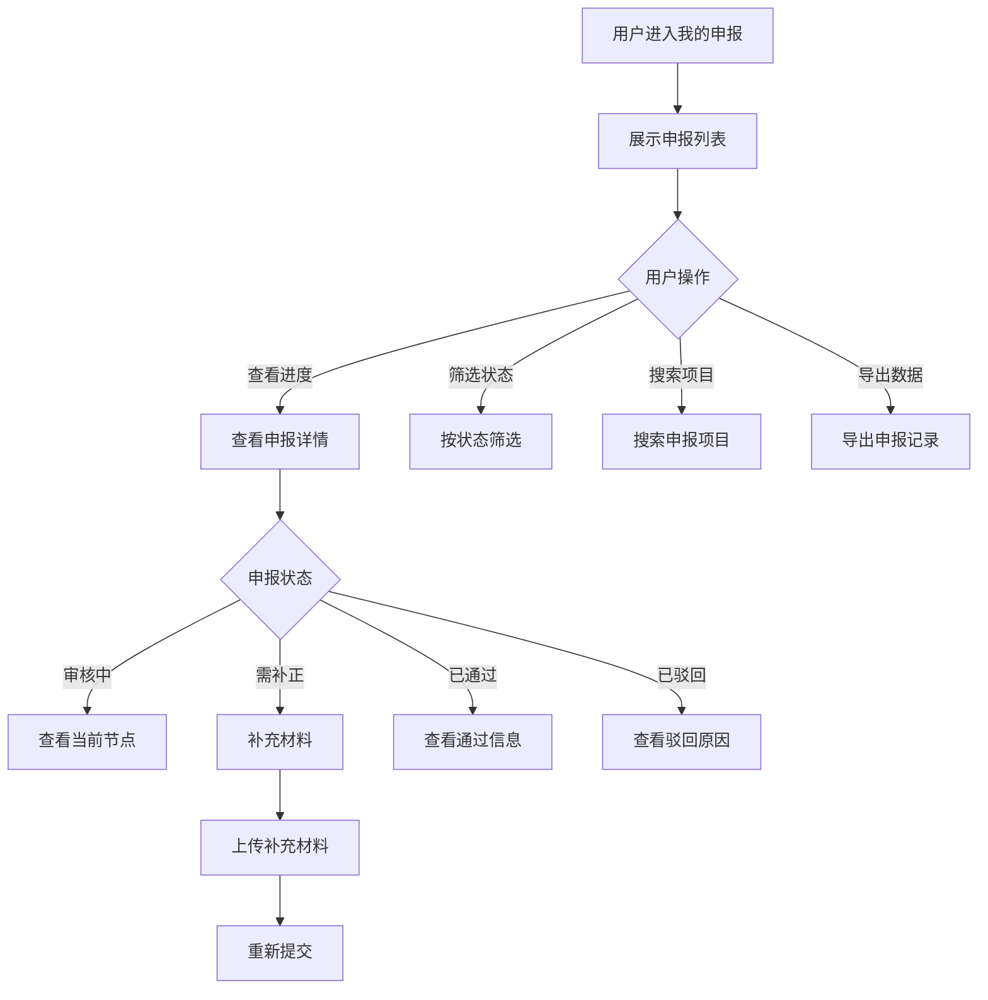

# 我的申报

## 1. 功能描述

我的申报功能提供用户查看和管理所有已提交申报项目的入口，支持查看申报进度、管理申报状态、接收审核反馈、补充材料等操作。

### 1.1 业务功能流程图



## 2. 列表展示

### 2.1 TAB切换

**状态筛选标签**
- 全部（默认）
- 草稿
- 待提交
- 审核中
- 需补正
- 已通过
- 已驳回
- 已过期

### 2.2 列表字段

| 字段名称 | 字段说明 | 是否可编辑 | 字段类型 | 说明 |
|---------|---------|-----------|---------|------|
| 项目缩略图 | 项目图片 | 否 | 图片 | 项目封面图 |
| 项目名称 | 政策项目名称 | 否 | 文本 | 主标题 |
| 政策类型 | 项目分类 | 否 | 标签 | 如：高新技术企业 |
| 申报状态 | 当前审核状态 | 否 | 状态标签 | 带颜色区分 |
| 申报批次 | 批次信息 | 否 | 文本 | 如：2026第一批 |
| 主管部门 | 负责部门 | 否 | 文本 | 审核部门 |
| 申报时间 | 提交时间 | 否 | 日期时间 | 精确到分钟 |
| 更新时间 | 最后更新时间 | 否 | 日期时间 | 状态变更时间 |
| 截止日期 | 项目截止 | 否 | 日期 | 补正截止时间 |
| 当前节点 | 审核进度 | 否 | 文本 | 如：专家评审中 |
| 进度百分比 | 审核进度 | 否 | 进度条 | 0-100% |
| 补贴金额 | 获批金额 | 否 | 文本 | 通过时显示 |
| 操作 | 功能按钮 | - | - | 查看/编辑/撤回/删除 |

### 2.3 状态标签样式

| 状态 | 标签颜色 | 说明 |
|-----|---------|------|
| 草稿 | 灰色 | 未提交的申报 |
| 待提交 | 蓝色 | 已保存待提交 |
| 审核中 | 橙色 | 正在审核中 |
| 需补正 | 红色 | 需要补充材料 |
| 已通过 | 绿色 | 审核通过 |
| 已驳回 | 深红 | 审核未通过 |
| 已过期 | 灰色 | 申报已过期 |

### 2.4 筛选功能

**筛选条件**

| 筛选类别 | 选项内容 |
|---------|---------|
| 申报状态 | 全部、草稿、待提交、审核中、需补正、已通过、已驳回、已过期 |
| 政策类型 | 全部、高新技术企业、科技型中小企业、专精特新等 |
| 申报时间 | 全部、最近一周、最近一月、最近三月、最近一年 |
| 主管部门 | 全部、科技部门、经信部门、税务部门等 |

### 2.5 搜索功能

- 支持按项目名称搜索
- 支持按项目编号搜索
- 支持模糊搜索

## 3. 申报详情

### 3.1 详情页面结构

**头部信息**
- 项目名称
- 申报状态（大标签）
- 申报编号
- 操作按钮（根据状态显示不同按钮）

**进度时间轴**
- 可视化展示申报流程节点
- 已完成的节点标记为绿色
- 当前节点标记为橙色并高亮
- 未完成的节点标记为灰色

**申报信息卡片**
- 基本信息
- 企业信息
- 项目信息
- 申报材料清单

**审核反馈区域**
- 审核意见
- 需要补充的材料
- 补正截止时间

### 3.2 审核流程节点


### 3.3 不同状态的操作

| 状态 | 可操作功能 |
|-----|-----------|
| 草稿 | 编辑、提交、删除 |
| 待提交 | 编辑、提交、删除 |
| 审核中 | 查看详情、撤回申请 |
| 需补正 | 查看详情、补充材料、撤回申请 |
| 已通过 | 查看详情、下载批复文件 |
| 已驳回 | 查看详情、查看驳回原因、重新申报 |
| 已过期 | 查看详情、删除记录 |

## 4. 补充材料功能

### 4.1 补正流程

**触发条件**
- 审核人员反馈需要补充材料
- 系统发送补正通知

**补正页面**
- 显示需要补充的材料清单
- 显示补正截止时间
- 显示审核意见

**材料上传**
- 支持拖拽上传
- 支持点击选择文件
- 显示上传进度
- 支持预览和删除

### 4.2 补正提交

- 校验是否上传了所有要求材料
- 提交后状态变更为"审核中"
- 系统通知审核人员

## 5. 撤回申请功能

### 5.1 撤回条件

- 申报状态为"审核中"或"需补正"
- 在审核结果出来前可以撤回

### 5.2 撤回流程

1. 点击"撤回申请"按钮
2. 弹出确认对话框
3. 填写撤回原因（选填）
4. 确认撤回
5. 状态变更为"已撤回"

## 6. 数据模型

### 6.1 申报记录数据模型

```typescript
interface MyApplicationItem {
  id: string;                    // 申报ID
  projectId: string;             // 项目ID
  projectName: string;           // 项目名称
  policyType: string;            // 政策类型
  status: 'draft' | 'to_submit' | 'under_review' | 'needs_revision' | 'approved' | 'rejected' | 'expired';
  submitTime?: string;           // 提交时间
  updateTime: string;            // 更新时间
  deadline: string;              // 截止日期
  department: string;            // 主管部门
  applicant: string;             // 申请人
  batch: string;                 // 申报批次
  thumbnail?: string;            // 项目缩略图
  progress?: number;             // 进度百分比
  currentNode?: string;          // 当前节点
  missingMaterials?: string[];   // 需要补充的材料
  correctionDeadline?: string;   // 补正截止时间
  isOverdue?: boolean;           // 是否逾期
  subsidyAmount?: string;        // 获批金额
  rejectionReason?: string;      // 驳回原因
  supportDescription?: string;   // 支持说明
  region?: string;               // 所属地区
  amount?: string;               // 申请金额
}
```

### 6.2 审核流程节点模型

```typescript
interface AuditNode {
  id: string;                    // 节点ID
  name: string;                  // 节点名称
  status: 'pending' | 'processing' | 'completed' | 'rejected';
  startTime?: string;            // 开始时间
  endTime?: string;              // 完成时间
  auditor?: string;              // 审核人
  comment?: string;              // 审核意见
}
```

## 7. 业务规则

### 7.1 状态流转规则

| 规则编号 | 规则名称 | 规则描述 |
|---------|---------|---------|
| BR-001 | 草稿可编辑 | 草稿状态可以任意修改 |
| BR-002 | 审核中可撤回 | 审核中状态可以撤回申请 |
| BR-003 | 需补正时限 | 必须在补正截止时间前完成补正 |
| BR-004 | 逾期处理 | 超过补正截止时间自动转为已驳回 |
| BR-005 | 通过后锁定 | 已通过状态不可修改和撤回 |

### 7.2 数据展示规则

| 规则编号 | 规则名称 | 规则描述 |
|---------|---------|---------|
| BR-006 | 默认排序 | 默认按更新时间倒序排列 |
| BR-007 | 逾期提醒 | 需补正状态且即将逾期时高亮显示 |
| BR-008 | 状态统计 | 列表顶部显示各状态数量统计 |

## 8. 异常场景处理

| 异常场景 | 场景说明 | 系统行为 | 提醒方式 | 操作选项 |
|---------|---------|---------|---------|---------|
| 补正逾期 | 超过补正截止时间 | 自动变更状态为已驳回 | 系统通知 | 查看详情 |
| 项目取消 | 政策项目被取消 | 状态变更为已取消 | 系统通知 | 查看详情、删除 |
| 材料丢失 | 上传的材料无法访问 | 提示重新上传 | 错误提示 | 重新上传 |
| 网络异常 | 提交补正时网络中断 | 保存到本地草稿 | 错误提示 | 重新提交 |

## 9. 权限控制

| 功能 | 游客 | 普通用户 | 企业用户 | 管理员 |
|-----|------|---------|---------|--------|
| 查看列表 | ✗ | ✓ | ✓ | ✓ |
| 查看详情 | ✗ | ✓ | ✓ | ✓ |
| 编辑草稿 | ✗ | ✓ | ✓ | ✓ |
| 提交申报 | ✗ | ✓ | ✓ | ✓ |
| 撤回申请 | ✗ | ✓ | ✓ | ✓ |
| 补充材料 | ✗ | ✓ | ✓ | ✓ |
| 删除记录 | ✗ | ✓ | ✓ | ✓ |

## 10. 导入导出功能

### 10.1 导出功能

**申报记录导出**
- 导出格式：Excel
- 导出内容：所有申报记录信息
- 支持按筛选条件导出
- 支持选择导出字段

### 10.2 导出内容

| 字段 | 说明 |
|-----|------|
| 申报编号 | 系统生成的唯一编号 |
| 项目名称 | 申报的项目名称 |
| 政策类型 | 项目分类 |
| 申报状态 | 当前状态 |
| 申报时间 | 提交时间 |
| 更新时间 | 最后更新时间 |
| 主管部门 | 审核部门 |
| 获批金额 | 审核通过后的金额 |

## 11. 通知提醒

### 11.1 提醒场景

| 场景 | 提醒方式 | 提醒内容 |
|-----|---------|---------|
| 状态变更 | 短信+邮件+站内信 | 申报状态已变更为XX |
| 需要补正 | 短信+邮件+站内信 | 您的申报需要补充材料，请于XX前完成 |
| 即将逾期 | 短信+邮件 | 您的补正材料即将截止，请及时提交 |
| 审核通过 | 短信+邮件+站内信 | 恭喜您的申报已通过审核 |
| 审核驳回 | 短信+邮件+站内信 | 您的申报未通过审核，原因：XX |

### 11.2 提醒设置

- 用户可设置接收提醒的方式
- 支持开启/关闭各类提醒
