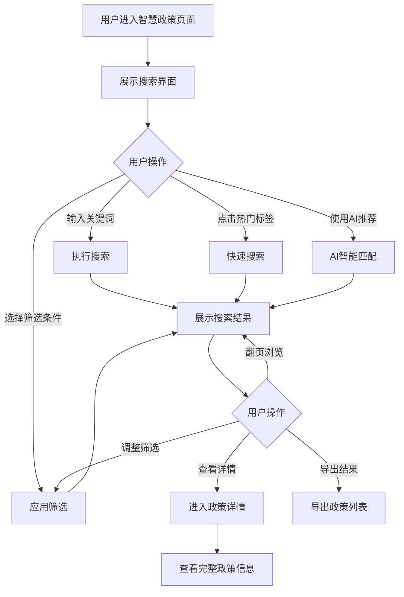

# 智慧政策

## 1. 功能描述

智慧政策功能提供全面的政策搜索、筛选、展示和推荐服务，支持用户通过关键词搜索、多维度筛选、AI智能推荐等方式快速找到符合企业需求的政策信息。

### 1.1 业务功能流程图



## 2. 列表展示

### 2.1 搜索区域

**搜索输入框**
- 占位符文本："搜索政策名称、政策文号、申报条件..."
- 支持自动补全功能
- 支持搜索历史记录
- 右侧搜索按钮带搜索图标

**热门搜索关键词**
- 默认展示8个热门关键词标签
- 包括：高新技术企业、科技创新、研发补贴、人才引进、金融科技、数字经济、绿色发展、专精特新
- 点击标签可直接执行搜索

### 2.2 高级筛选区域

**筛选条件分类**

| 筛选类别 | 选项内容 | 选择方式 |
|---------|---------|---------|
| 所属地区 | 北京市、上海市、广东省、江苏省、浙江省等12个地区 | 多选下拉框 |
| 所属行业 | 信息技术、生物医药、新能源、新材料、高端装备等10个行业 | 多选下拉框 |
| 政策级别 | 国家级、省级、市级、区县级 | 多选下拉框 |
| 政策类型 | 资金补贴、税收优惠、贷款贴息、担保支持、人才政策等 | 多选下拉框 |
| 发文单位 | 政府机构、事业单位、国有企业、民营企业、外资企业 | 多选下拉框 |
| 补贴方式 | 直接补贴、税收减免、贷款优惠、担保支持、其他优惠 | 多选下拉框 |

**金额范围筛选**
- 滑块选择器，范围0-1000万元
- 支持自定义输入最小值和最大值

**发布时间筛选**
- 日期范围选择器
- 支持快捷选项：最近一周、最近一月、最近三月、最近一年

### 2.3 列表字段

| 字段名称 | 字段说明 | 是否可编辑 | 字段类型 | 说明 |
|---------|---------|-----------|---------|------|
| 政策标题 | 政策名称 | 否 | 文本 | 主标题，带高亮显示 |
| 政策文号 | 发文编号 | 否 | 文本 | 如：国科发火〔2024〕XX号 |
| 发文单位 | 发布机构 | 否 | 文本 | 带部门图标 |
| 发布时间 | 发文日期 | 否 | 日期 | 格式：YYYY-MM-DD |
| 截止日期 | 申报截止日期 | 否 | 日期 | 带倒计时提醒 |
| 补贴金额 | 扶持资金额度 | 否 | 文本 | 如：最高50万元 |
| 适用地区 | 政策适用地域 | 否 | 标签 | 可多地区 |
| 适用行业 | 政策适用领域 | 否 | 标签 | 可多行业 |
| 匹配度 | 与企业的匹配程度 | 否 | 进度条 | 百分比显示 |
| 浏览量 | 查看次数 | 否 | 数字 | 带趋势图标 |
| 申报状态 | 当前申报阶段 | 否 | 状态标签 | 进行中/即将截止/已截止 |
| 操作 | 功能按钮 | - | - | 查看详情、立即申报、收藏 |

### 2.4 排序功能

**排序选项**
- 综合排序（默认）
- 最新发布
- 即将截止
- 补贴金额从高到低

## 3. 搜索功能

### 3.1 搜索逻辑

**关键词搜索**
- 支持政策名称、政策文号、申报条件模糊搜索
- 支持拼音首字母搜索
- 搜索结果高亮显示匹配关键词

**组合搜索**
- 关键词 + 筛选条件组合
- 支持仅使用筛选条件搜索（无需关键词）

**智能推荐**
- 根据用户企业信息智能推荐相关政策
- 基于浏览历史推荐相似政策

### 3.2 搜索建议

**自动补全**
- 输入时实时显示搜索建议
- 建议内容包括：政策名称、关键词、历史搜索记录

**无结果处理**
- 显示空状态提示
- 推荐相关热门搜索词
- 提供反馈入口

## 4. 政策详情

### 4.1 详情页面结构

**头部信息**
- 政策标题（大字号）
- 收藏按钮
- 分享按钮
- 打印按钮

**基本信息卡片**
- 政策文号
- 发文单位
- 发布时间
- 截止日期
- 补贴金额
- 申报状态

**政策内容**
- 政策原文（富文本展示）
- 政策解读
- 申报指南
- 常见问题

**相关推荐**
- 相似政策推荐
- 同地区政策推荐
- 同类型政策推荐

### 4.2 操作功能

| 操作 | 说明 |
|-----|------|
| 立即申报 | 跳转到申报页面 |
| 在线咨询 | 打开客服咨询窗口 |
| 下载原文 | 下载PDF格式的政策文件 |
| 收藏政策 | 添加到我的收藏 |
| 分享政策 | 生成分享链接或二维码 |

## 5. AI智能推荐

### 5.1 推荐逻辑

**企业画像匹配**
- 根据企业所属行业匹配相关政策
- 根据企业规模匹配适用政策
- 根据企业所在地区匹配地方政策

**行为分析推荐**
- 基于浏览历史推荐
- 基于收藏记录推荐
- 基于申报记录推荐

### 5.2 推荐展示

**智能推荐卡片**
- 展示在搜索结果顶部
- 显示推荐理由
- 显示匹配度评分
- 支持一键申报

## 6. 数据模型

### 6.1 政策数据模型

```typescript
interface PolicyData {
  id: string;                    // 政策ID
  title: string;                 // 政策标题
  docNumber: string;             // 政策文号
  publishOrg: string;            // 发文单位
  publishDate: string;           // 发布时间
  deadline: string;              // 截止日期
  subsidyAmount: string;         // 补贴金额
  regions: string[];             // 适用地区
  industries: string[];          // 适用行业
  level: string;                 // 政策级别
  category: string;              // 政策类型
  status: string;                // 申报状态
  content: string;               // 政策内容
  views: number;                 // 浏览量
  matchScore?: number;           // 匹配度
}
```

### 6.2 搜索筛选模型

```typescript
interface SearchFilters {
  regions: string[];             // 地区筛选
  industries: string[];          // 行业筛选
  levels: string[];              // 级别筛选
  categories: string[];          // 类型筛选
  orgTypes: string[];            // 发文单位筛选
  subsidyTypes: string[];        // 补贴方式筛选
  amountRange?: [number, number]; // 金额范围
  dateRange?: [string, string];  // 日期范围
}
```

## 7. 业务规则

### 7.1 搜索规则

| 规则编号 | 规则名称 | 规则描述 |
|---------|---------|---------|
| BR-001 | 关键词长度 | 关键词最少2个字符，最多50个字符 |
| BR-002 | 筛选条件限制 | 每个筛选类别最多选择10个选项 |
| BR-003 | 结果排序 | 默认按综合匹配度排序，支持手动切换 |
| BR-004 | 分页规则 | 默认每页20条，支持切换10/20/50/100 |

### 7.2 数据展示规则

| 规则编号 | 规则名称 | 规则描述 |
|---------|---------|---------|
| BR-005 | 高亮规则 | 搜索结果中的匹配关键词高亮显示 |
| BR-006 | 截断规则 | 长文本自动截断，显示省略号 |
| BR-007 | 日期格式 | 统一使用YYYY-MM-DD格式 |
| BR-008 | 金额显示 | 金额统一显示为"最高XX万元" |

## 8. 异常场景处理

| 异常场景 | 场景说明 | 系统行为 | 提醒方式 | 操作选项 |
|---------|---------|---------|---------|---------|
| 搜索超时 | 网络延迟或服务器繁忙 | 显示加载超时提示 | 警告提示 | 重试、返回首页 |
| 无搜索结果 | 关键词无匹配数据 | 显示空状态页面 | 信息提示 | 修改关键词、查看推荐 |
| 接口异常 | 服务端接口错误 | 显示错误页面 | 错误提示 | 刷新页面、联系客服 |
| 参数错误 | URL参数不合法 | 使用默认参数搜索 | 静默处理 | 无 |

## 9. 权限控制

| 功能 | 游客 | 普通用户 | 企业用户 | 管理员 |
|-----|------|---------|---------|--------|
| 政策搜索 | ✓ | ✓ | ✓ | ✓ |
| 查看详情 | ✓ | ✓ | ✓ | ✓ |
| 智能推荐 | ✗ | ✓ | ✓ | ✓ |
| 立即申报 | ✗ | ✗ | ✓ | ✓ |
| 收藏政策 | ✗ | ✓ | ✓ | ✓ |
| 下载原文 | ✗ | ✓ | ✓ | ✓ |

## 10. 导入导出功能

### 10.1 导出功能

**导出格式**
- Excel格式（.xlsx）
- PDF格式

**导出内容**
- 当前搜索结果
- 包含所有列表字段
- 支持选择导出字段

### 10.2 导出逻辑

- 导出前校验权限
- 大数据量时分页导出
- 生成导出任务，异步处理
- 完成后通知用户下载
