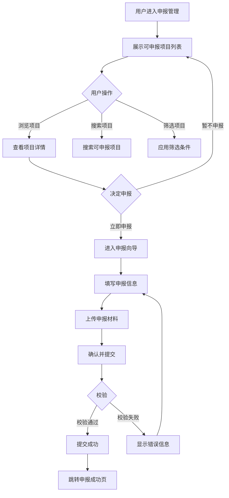
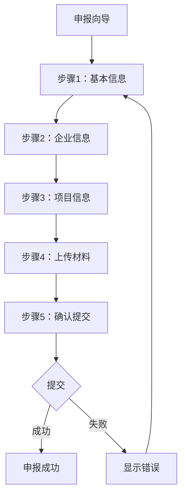

# 申报管理

## 1. 功能描述

申报管理功能提供政策项目的在线申报服务，支持用户浏览可申报项目、填写申报信息、上传申报材料、提交申报申请，并实时跟踪申报进度。

### 1.1 业务功能流程图



### 1.2 子功能流程图



## 2. 列表展示

### 2.1 列表字段

| 字段名称 | 字段说明 | 是否可编辑 | 字段类型 | 说明 |
|---------|---------|-----------|---------|------|
| 项目缩略图 | 项目图片 | 否 | 图片 | 项目封面图 |
| 项目名称 | 政策项目名称 | 否 | 文本 | 主标题 |
| 政策类型 | 项目分类 | 否 | 标签 | 如：高新技术企业、专精特新 |
| 申报批次 | 批次信息 | 否 | 文本 | 如：2026第一批 |
| 主管部门 | 负责部门 | 否 | 文本 | 如：北京市科学技术委员会 |
| 截止日期 | 申报截止时间 | 否 | 日期 | 带倒计时提醒 |
| 补贴金额 | 扶持资金 | 否 | 文本 | 如：最高50万元 |
| 申报状态 | 当前状态 | 否 | 状态标签 | 可申报/即将截止/已截止 |
| 支持说明 | 政策简介 | 否 | 文本 | 简要描述 |
| 操作 | 功能按钮 | - | - | 立即申报、查看详情 |

### 2.2 筛选功能

**筛选条件**

| 筛选类别 | 选项内容 |
|---------|---------|
| 政策类型 | 全部、高新技术企业、科技型中小企业、专精特新、税收优惠、资金补贴 |
| 申报状态 | 全部、可申报、即将截止、已截止 |
| 所属地区 | 全部、北京市、上海市、广东省等 |
| 截止时间 | 全部、本周截止、本月截止、本季度截止 |

### 2.3 排序功能

- 默认排序：按截止日期升序（即将截止的在前）
- 按补贴金额排序
- 按发布时间排序

## 3. 项目详情

### 3.1 详情页面结构

**项目头部**
- 项目名称（大字号）
- 申报状态标签
- 收藏按钮
- 分享按钮

**关键信息卡片**
- 申报批次
- 主管部门
- 截止日期（带倒计时）
- 补贴金额
- 适用地区
- 适用企业类型

**项目内容**
- 政策依据
- 支持内容
- 申报条件
- 申报材料清单
- 申报流程
- 联系方式

**操作区域**
- 立即申报按钮
- 返回列表按钮

### 3.2 申报材料清单

| 材料名称 | 是否必填 | 材料说明 |
|---------|---------|---------|
| 营业执照 | 是 | 企业法人营业执照副本 |
| 财务报表 | 是 | 近三年财务审计报告 |
| 知识产权证明 | 是 | 专利证书、软件著作权等 |
| 研发项目证明 | 是 | 研发项目立项文件 |
| 人员证明 | 是 | 研发人员学历、职称证明 |
| 其他材料 | 否 | 根据项目要求的其他材料 |

## 4. 申报向导

### 4.1 向导步骤

**步骤条展示**
- 共5个步骤
- 显示当前步骤和已完成步骤
- 支持返回上一步修改

### 4.2 步骤1：基本信息

**表单字段**

| 字段名称 | 是否必填 | 字段类型 | 说明 |
|---------|---------|---------|------|
| 申报项目 | 是 | 只读文本 | 自动填充所选项目 |
| 申报批次 | 是 | 只读文本 | 自动填充批次信息 |
| 申报日期 | 是 | 日期选择 | 默认为当前日期 |
| 申请人 | 是 | 文本 | 当前登录用户 |
| 联系电话 | 是 | 手机号 | 用于接收通知 |
| 电子邮箱 | 是 | 邮箱 | 用于接收材料 |

### 4.3 步骤2：企业信息

**表单字段**

| 字段名称 | 是否必填 | 字段类型 | 说明 |
|---------|---------|---------|------|
| 企业名称 | 是 | 只读文本 | 从企业信息自动填充 |
| 统一社会信用代码 | 是 | 只读文本 | 从企业信息自动填充 |
| 注册地址 | 是 | 文本 | 详细注册地址 |
| 所属行业 | 是 | 下拉选择 | 从预设行业选择 |
| 企业规模 | 是 | 下拉选择 | 大型/中型/小型/微型 |
| 成立时间 | 是 | 日期选择 | 企业成立日期 |
| 员工人数 | 是 | 数字输入 | 当前员工总数 |
| 年营业收入 | 是 | 金额输入 | 上年度营业收入 |
| 研发投入占比 | 是 | 百分比 | 研发投入占收入比例 |

### 4.4 步骤3：项目信息

**表单字段**

| 字段名称 | 是否必填 | 字段类型 | 说明 |
|---------|---------|---------|------|
| 项目标题 | 是 | 文本 | 申报项目标题 |
| 项目简介 | 是 | 多行文本 | 项目简要说明 |
| 技术创新点 | 是 | 多行文本 | 核心技术创新点 |
| 预期成果 | 是 | 多行文本 | 项目预期成果 |
| 实施周期 | 是 | 日期范围 | 项目起止时间 |
| 预算金额 | 是 | 金额输入 | 项目预算总额 |
| 申请补贴金额 | 是 | 金额输入 | 申请的补贴金额 |

### 4.5 步骤4：上传材料

**材料上传区域**

| 材料名称 | 是否必填 | 文件格式 | 大小限制 |
|---------|---------|---------|---------|
| 营业执照 | 是 | PDF/JPG/PNG | 最大10MB |
| 财务报表 | 是 | PDF | 最大20MB |
| 知识产权证明 | 是 | PDF/JPG/PNG | 最大20MB |
| 研发项目证明 | 是 | PDF | 最大20MB |
| 人员证明 | 是 | PDF/JPG/PNG | 最大20MB |
| 其他材料 | 否 | PDF | 最大50MB |

**上传功能**
- 支持拖拽上传
- 支持点击选择文件
- 显示上传进度
- 支持预览已上传文件
- 支持删除重新上传

### 4.6 步骤5：确认提交

**信息汇总展示**
- 基本信息汇总
- 企业信息汇总
- 项目信息汇总
- 已上传材料清单

**提交确认**
- 勾选"我确认以上信息真实有效"
- 提交按钮

## 5. 数据校验

### 5.1 前端校验规则

| 字段 | 校验规则 | 错误提示 |
|-----|---------|---------|
| 联系电话 | 11位手机号格式 | 请输入正确的手机号 |
| 电子邮箱 | 邮箱格式 | 请输入正确的邮箱地址 |
| 申请补贴金额 | 不能超过项目预算 | 申请金额不能超过预算金额 |
| 文件大小 | 不超过限制大小 | 文件大小不能超过XXMB |
| 文件格式 | 符合要求的格式 | 仅支持PDF、JPG、PNG格式 |

### 5.2 后端校验规则

- 企业资质校验
- 重复申报校验（同一项目不能重复申报）
- 截止时间校验（必须在截止日期前提交）
- 材料完整性校验

## 6. 申报成功

### 6.1 成功页面内容

- 成功图标和提示
- 申报编号（系统自动生成）
- 申报项目信息
- 预计审核时间
- 查看申报进度按钮
- 返回首页按钮

### 6.2 后续操作

- 系统自动发送确认邮件
- 短信通知申报成功
- 可在"我的申报"中查看进度

## 7. 数据模型

### 7.1 申报项目数据模型

```typescript
interface ApplicationProject {
  id: string;                    // 项目ID
  projectName: string;           // 项目名称
  policyType: string;            // 政策类型
  batch: string;                 // 申报批次
  department: string;            // 主管部门
  deadline: string;              // 截止日期
  subsidyAmount: string;         // 补贴金额
  region: string;                // 适用地区
  supportDescription: string;    // 支持说明
  thumbnail: string;             // 缩略图
  status: string;                // 申报状态
}
```

### 7.2 申报表单数据模型

```typescript
interface ApplicationForm {
  // 基本信息
  projectId: string;             // 申报项目ID
  batch: string;                 // 申报批次
  applyDate: string;             // 申报日期
  applicant: string;             // 申请人
  phone: string;                 // 联系电话
  email: string;                 // 电子邮箱
  
  // 企业信息
  companyName: string;           // 企业名称
  creditCode: string;            // 统一社会信用代码
  address: string;               // 注册地址
  industry: string;              // 所属行业
  scale: string;                 // 企业规模
  establishDate: string;         // 成立时间
  employeeCount: number;         // 员工人数
  revenue: number;               // 年营业收入
  rdRatio: number;               // 研发投入占比
  
  // 项目信息
  projectTitle: string;          // 项目标题
  projectIntro: string;          // 项目简介
  innovation: string;            // 技术创新点
  expectedResult: string;        // 预期成果
  period: [string, string];      // 实施周期
  budget: number;                // 预算金额
  applyAmount: number;           // 申请补贴金额
  
  // 材料信息
  materials: Material[];         // 上传的材料列表
}

interface Material {
  name: string;                  // 材料名称
  type: string;                  // 材料类型
  url: string;                   // 文件URL
  size: number;                  // 文件大小
}
```

## 8. 业务规则

### 8.1 申报规则

| 规则编号 | 规则名称 | 规则描述 |
|---------|---------|---------|
| BR-001 | 截止时间限制 | 必须在项目截止日期前提交申报 |
| BR-002 | 重复申报限制 | 同一企业不能重复申报同一项目 |
| BR-003 | 资质要求 | 企业必须符合项目的申报条件 |
| BR-004 | 材料完整性 | 必须上传所有必填材料 |
| BR-005 | 金额限制 | 申请补贴金额不能超过项目预算 |

### 8.2 数据规则

| 规则编号 | 规则名称 | 规则描述 |
|---------|---------|---------|
| BR-006 | 自动填充 | 企业信息自动从用户资料填充 |
| BR-007 | 草稿保存 | 支持保存草稿，下次继续填写 |
| BR-008 | 步骤限制 | 必须按顺序完成所有步骤才能提交 |

## 9. 异常场景处理

| 异常场景 | 场景说明 | 系统行为 | 提醒方式 | 操作选项 |
|---------|---------|---------|---------|---------|
| 截止时间已过 | 项目已截止申报 | 禁止提交，显示已截止提示 | 错误提示 | 查看其他项目 |
| 重复申报 | 已申报过该项目 | 禁止提交，显示已申报提示 | 错误提示 | 查看我的申报 |
| 资质不符 | 企业不符合申报条件 | 显示不符合条件的原因 | 警告提示 | 查看其他项目 |
| 材料上传失败 | 网络或服务器问题 | 显示上传失败提示 | 错误提示 | 重试上传 |
| 提交失败 | 服务器处理异常 | 保存表单数据，提示稍后重试 | 错误提示 | 重新提交 |

## 10. 权限控制

| 功能 | 游客 | 普通用户 | 企业用户 | 管理员 |
|-----|------|---------|---------|--------|
| 浏览项目 | ✓ | ✓ | ✓ | ✓ |
| 查看详情 | ✓ | ✓ | ✓ | ✓ |
| 立即申报 | ✗ | ✗ | ✓ | ✓ |
| 保存草稿 | ✗ | ✗ | ✓ | ✓ |
| 提交申报 | ✗ | ✗ | ✓ | ✓ |

## 11. 导入导出功能

### 11.1 导出功能

**可申报项目导出**
- 导出格式：Excel
- 导出内容：项目列表信息
- 支持选择导出字段

### 11.2 导入功能

**批量申报导入**
- 支持下载申报模板
- 支持Excel批量导入
- 导入后校验数据合法性
- 生成导入结果报告
