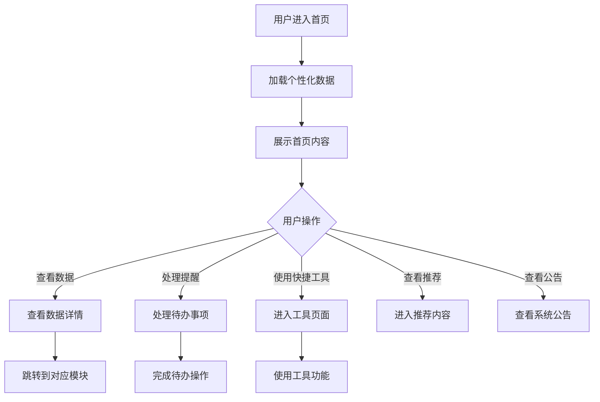

# 首页

## 1. 功能描述

首页是用户登录系统后的主入口，提供个性化的信息展示和快捷功能入口，包括数据概览、重要提醒、个性化推荐、快捷工具等模块，帮助用户快速了解平台动态和进行常用操作。

### 1.1 业务功能流程图



## 2. 页面布局

### 2.1 顶部Banner

**欢迎区域**
- 欢迎语："欢迎回来，XXX"
- 日期时间显示
- 天气信息（可选）

**快捷操作**
- 消息通知入口
- 个人中心入口
- 帮助中心入口

### 2.2 数据概览区

**统计卡片**

| 统计项 | 说明 | 趋势 |
|-------|------|------|
| 我的申报 | 进行中的申报数量 | 较上月变化 |
| 我的收藏 | 收藏内容数量 | 较上月变化 |
| 浏览历史 | 本月浏览次数 | 较上月变化 |
| 消息通知 | 未读消息数量 | 新增数量 |

**数据趋势图**
- 近7天/30天活跃度趋势
- 申报进度概览
- 收藏分类占比

## 3. 重要提醒区

### 3.1 待办事项

**申报提醒**
- 即将截止的申报项目
- 需要补正的申报
- 审核进度更新

**系统提醒**
- 新消息通知
- 系统公告
- 功能更新提示

**业务提醒**
- 业务对接进展
- 融资诊断到期
- 资质认证到期

### 3.2 提醒卡片样式

| 提醒类型 | 颜色 | 图标 | 操作 |
|---------|------|------|------|
| 紧急 | 红色 | ⚠️ | 立即处理 |
| 重要 | 橙色 | 📢 | 查看详情 |
| 普通 | 蓝色 | ℹ️ | 查看详情 |
| 成功 | 绿色 | ✅ | 查看结果 |

## 4. 快捷入口区

### 4.1 常用功能

**快捷按钮**

| 功能名称 | 图标 | 说明 |
|---------|------|------|
| 智慧政策 | 🔍 | 政策搜索 |
| 申报管理 | 📝 | 查看申报 |
| 法规查询 | ⚖️ | 查询法规 |
| AI问答 | 🤖 | 智能咨询 |
| 业务大厅 | 🏢 | 企业服务 |
| 融资诊断 | 💰 | 融资分析 |

### 4.2 最近使用

- 显示最近使用的功能
- 按使用频率排序
- 支持自定义排序

## 5. 个性化推荐区

### 5.1 政策推荐

**推荐逻辑**
- 基于企业行业推荐
- 基于浏览历史推荐
- 基于申报记录推荐

**展示内容**
- 政策标题
- 截止时间
- 补贴金额
- 匹配度

### 5.2 服务推荐

- 推荐相关企业服务
- 推荐融资产品
- 推荐业务机会

### 5.3 资讯推荐

- 行业动态
- 政策解读
- 平台公告

## 6. 数据可视化

### 6.1 申报进度

**进度展示**
- 进行中的申报数量
- 各状态申报分布
- 进度环形图

### 6.2 收藏分析

**分类占比**
- 政策收藏占比
- 法规收藏占比
- 服务收藏占比
- 饼图展示

### 6.3 活跃度趋势

**趋势图表**
- 近7天/30天活跃度
- 折线图展示
- 峰值标注

## 7. 系统公告

### 7.1 公告列表

**公告项**
- 公告标题
- 发布时间
- 公告类型
- 阅读状态

### 7.2 公告类型

| 类型 | 说明 | 颜色 |
|-----|------|------|
| 系统更新 | 功能更新公告 | 蓝色 |
| 政策通知 | 重要政策发布 | 橙色 |
| 活动通知 | 平台活动信息 | 绿色 |
| 维护通知 | 系统维护通知 | 灰色 |

## 8. 快捷工具

### 8.1 工具列表

| 工具名称 | 功能说明 |
|---------|---------|
| 政策计算器 | 计算政策补贴金额 |
| 税费计算器 | 计算税费优惠 |
| 日期计算器 | 计算工作日/倒计时 |
| 单位换算 | 常用单位换算 |
| 汇率查询 | 实时汇率查询 |

### 8.2 工具使用

- 点击工具图标
- 弹出工具窗口
- 使用工具功能
- 关闭工具窗口

## 9. 数据模型

### 9.1 首页数据模型

```typescript
interface HomePageData {
  userInfo: UserInfo;            // 用户信息
  statistics: Statistics;        // 统计数据
  reminders: Reminder[];         // 提醒列表
  quickAccess: QuickAccess[];    // 快捷入口
  recommendations: Recommendation[]; // 推荐内容
  announcements: Announcement[]; // 公告列表
  charts: ChartData;             // 图表数据
}

interface UserInfo {
  name: string;                  // 用户姓名
  avatar?: string;               // 用户头像
  companyName?: string;          // 企业名称
  greeting: string;              // 问候语
}

interface Statistics {
  applications: StatItem;        // 申报统计
  favorites: StatItem;           // 收藏统计
  views: StatItem;               // 浏览统计
  messages: StatItem;            // 消息统计
}

interface StatItem {
  value: number;                 // 数值
  label: string;                 // 标签
  trend?: number;                // 趋势变化
  trendLabel?: string;           // 趋势标签
}

interface Reminder {
  id: string;                    // 提醒ID
  type: 'urgent' | 'important' | 'normal' | 'success'; // 类型
  title: string;                 // 标题
  content: string;               // 内容
  actionUrl: string;             // 操作链接
  actionText: string;            // 操作文字
  createTime: string;            // 创建时间
}

interface QuickAccess {
  id: string;                    // 功能ID
  name: string;                  // 功能名称
  icon: string;                  // 功能图标
  url: string;                   // 功能链接
  order: number;                 // 排序
}

interface Recommendation {
  id: string;                    // 推荐ID
  type: 'policy' | 'service' | 'article'; // 类型
  title: string;                 // 标题
  description?: string;          // 描述
  image?: string;                // 图片
  url: string;                   // 链接
  matchScore?: number;           // 匹配度
}

interface Announcement {
  id: string;                    // 公告ID
  type: string;                  // 公告类型
  title: string;                 // 标题
  content: string;               // 内容
  publishTime: string;           // 发布时间
  isRead: boolean;               // 是否已读
}

interface ChartData {
  activityTrend: TrendData;      // 活跃度趋势
  applicationProgress: ProgressData; // 申报进度
  favoriteDistribution: DistributionData; // 收藏分布
}
```

## 10. 业务规则

### 10.1 数据展示规则

| 规则编号 | 规则名称 | 规则描述 |
|---------|---------|---------|
| BR-001 | 个性化 | 根据用户角色展示不同内容 |
| BR-002 | 实时性 | 统计数据实时更新 |
| BR-003 | 排序规则 | 提醒按紧急程度排序 |
| BR-004 | 推荐算法 | 基于用户行为智能推荐 |

### 10.2 交互规则

| 规则编号 | 规则名称 | 规则描述 |
|---------|---------|---------|
| BR-005 | 快捷入口 | 支持自定义快捷入口 |
| BR-006 | 公告阅读 | 点击后标记为已读 |
| BR-007 | 数据刷新 | 支持下拉刷新数据 |

## 11. 异常场景处理

| 异常场景 | 场景说明 | 系统行为 | 提醒方式 | 操作选项 |
|---------|---------|---------|---------|---------|
| 数据加载失败 | 首页数据获取失败 | 显示默认内容 | 错误提示 | 刷新重试 |
| 推荐服务异常 | 推荐算法异常 | 显示热门内容 | 静默处理 | 无 |
| 公告加载失败 | 公告列表获取失败 | 隐藏公告区域 | 静默处理 | 无 |

## 12. 权限控制

| 功能 | 游客 | 普通用户 | 企业用户 | 管理员 |
|-----|------|---------|---------|--------|
| 查看首页 | ✓ | ✓ | ✓ | ✓ |
| 查看个性化数据 | ✗ | ✓ | ✓ | ✓ |
| 使用快捷工具 | ✓ | ✓ | ✓ | ✓ |
| 接收个性化推荐 | ✗ | ✓ | ✓ | ✓ |
| 查看系统公告 | ✓ | ✓ | ✓ | ✓ |
