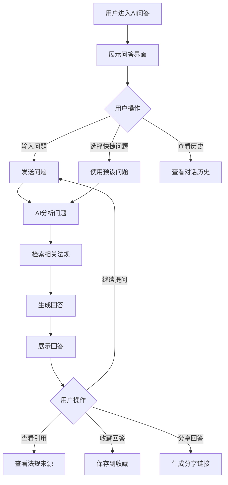
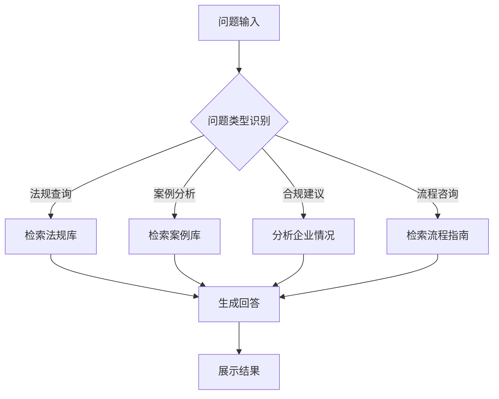

# AI 问答

## 1. 功能描述

AI问答功能提供智能法律咨询服务，用户可以通过自然语言向AI法律顾问提问，获得专业的法律问题解答、法规解读、合规建议等服务。

### 1.1 业务功能流程图



### 1.2 子功能流程图



## 2. 问答界面

### 2.1 界面布局

**左侧边栏**
- 新建对话按钮
- 历史对话列表
- 快捷入口

**中间主区域**
- 对话展示区
- 输入框区域
- 功能按钮区

**右侧边栏（可选）**
- 相关法规推荐
- 常见问题
- 使用指南

### 2.2 对话展示

**消息类型**

| 消息类型 | 展示方式 | 说明 |
|---------|---------|------|
| 用户消息 | 右侧蓝色气泡 | 用户提出的问题 |
| AI消息 | 左侧白色气泡 | AI生成的回答 |
| 系统消息 | 居中灰色文本 | 提示信息 |
| 引用卡片 | 内嵌卡片 | 引用的法规条文 |

**AI消息内容**
- 回答正文
- 引用来源（可点击展开）
- 相关推荐问题
- 操作按钮（复制、收藏、分享）

### 2.3 输入区域

**输入框**
- 多行文本输入
- 支持换行
- 最大输入长度2000字符
- 显示剩余字数

**功能按钮**
- 发送按钮
- 语音输入按钮（可选）
- 附件上传按钮（上传相关文件）
- 快捷问题按钮

## 3. 快捷问题

### 3.1 预设问题分类

**企业设立类**
- 注册公司需要什么材料？
- 注册资本需要实缴吗？
- 如何选择公司类型？

**劳动用工类**
- 劳动合同必须包含哪些条款？
- 试用期最长可以约定多久？
- 解除劳动合同需要支付经济补偿吗？

**知识产权类**
- 如何申请专利？
- 商标注册流程是什么？
- 软件著作权怎么保护？

**税务合规类**
- 小微企业有哪些税收优惠？
- 研发费用加计扣除怎么算？
- 增值税发票怎么开具？

**合同管理类**
- 合同必须书面形式吗？
- 违约金怎么约定才有效？
- 合同纠纷怎么解决？

### 3.2 快捷问题展示

- 以标签云形式展示
- 点击后自动填入输入框
- 支持分类筛选

## 4. AI回答生成

### 4.1 回答结构

**标准回答格式**

```
1. 直接回答（简明扼要）
2. 详细解释（法律依据、适用条件）
3. 操作指引（具体步骤）
4. 注意事项（风险提示）
5. 相关法规（引用条文）
6. 延伸阅读（相关问题推荐）
```

### 4.2 引用来源展示

**法规引用卡片**
- 法规名称
- 具体条款
- 条文内容摘要
- 点击查看完整条文

**案例引用**
- 案例名称
- 案例编号
- 裁判要点
- 点击查看详情

## 5. 对话管理

### 5.1 新建对话

- 点击"新建对话"按钮
- 清空当前对话历史
- 开始新的问答会话

### 5.2 历史对话

**列表展示**
- 对话标题（自动提取或用户自定义）
- 最后更新时间
- 消息数量
- 删除按钮

**对话操作**
- 点击继续对话
- 重命名对话
- 删除对话
- 导出对话记录

### 5.3 对话导出

- 导出格式：PDF、Word、Markdown
- 导出内容：完整对话记录
- 包含时间戳和引用来源

## 6. 数据模型

### 6.1 对话数据模型

```typescript
interface Conversation {
  id: string;                    // 对话ID
  title: string;                 // 对话标题
  userId: string;                // 用户ID
  messages: Message[];           // 消息列表
  createTime: string;            // 创建时间
  updateTime: string;            // 更新时间
  category?: string;             // 对话分类
}

interface Message {
  id: string;                    // 消息ID
  type: 'user' | 'ai' | 'system'; // 消息类型
  content: string;               // 消息内容
  timestamp: string;             // 发送时间
  references?: Reference[];      // 引用来源
  attachments?: Attachment[];    // 附件列表
}

interface Reference {
  id: string;                    // 引用ID
  type: 'regulation' | 'case' | 'article'; // 引用类型
  title: string;                 // 标题
  content: string;               // 内容摘要
  url?: string;                  // 详情链接
}
```

### 6.2 快捷问题模型

```typescript
interface QuickQuestion {
  id: string;                    // 问题ID
  category: string;              // 分类
  question: string;              // 问题内容
  hot?: boolean;                 // 是否热门
  order: number;                 // 排序
}
```

## 7. 业务规则

### 7.1 问答规则

| 规则编号 | 规则名称 | 规则描述 |
|---------|---------|---------|
| BR-001 | 问题长度 | 问题最少5个字符，最多2000个字符 |
| BR-002 | 敏感词过滤 | 问题内容需经过敏感词过滤 |
| BR-003 | 回答时效 | 正常情况下3秒内返回回答 |
| BR-004 | 引用准确性 | 引用的法规条文必须准确无误 |
| BR-005 | 免责声明 | 回答需包含"仅供参考，不构成法律意见"提示 |

### 7.2 对话规则

| 规则编号 | 规则名称 | 规则描述 |
|---------|---------|---------|
| BR-006 | 历史保留 | 对话历史保留90天 |
| BR-007 | 消息数量 | 单个对话最多100条消息 |
| BR-008 | 自动标题 | 根据第一个问题自动生成对话标题 |

## 8. 异常场景处理

| 异常场景 | 场景说明 | 系统行为 | 提醒方式 | 操作选项 |
|---------|---------|---------|---------|---------|
| 问题太简短 | 问题少于5个字符 | 提示问题过短 | 提示信息 | 补充问题内容 |
| 包含敏感词 | 问题包含敏感内容 | 拒绝回答并提示 | 警告提示 | 修改问题 |
| AI生成失败 | 服务异常 | 提示稍后重试 | 错误提示 | 重试、联系客服 |
| 网络中断 | 网络连接异常 | 保存草稿 | 错误提示 | 恢复后重试 |
| 回答超时 | 超过10秒未返回 | 提示正在努力思考 | 加载提示 | 继续等待、取消 |

## 9. 权限控制

| 功能 | 游客 | 普通用户 | 企业用户 | 管理员 |
|-----|------|---------|---------|--------|
| 提问 | ✓（限制次数） | ✓ | ✓ | ✓ |
| 查看历史 | ✗ | ✓ | ✓ | ✓ |
| 收藏回答 | ✗ | ✓ | ✓ | ✓ |
| 导出对话 | ✗ | ✓ | ✓ | ✓ |
| 语音输入 | ✗ | ✓ | ✓ | ✓ |

## 10. 使用限制

### 10.1 次数限制

| 用户类型 | 每日提问次数 | 单次对话消息数 |
|---------|-------------|---------------|
| 游客 | 5次 | 10条 |
| 普通用户 | 20次 | 50条 |
| 企业用户 | 100次 | 100条 |
| VIP用户 | 无限制 | 无限制 |

### 10.2 内容限制

- 禁止询问违法违规内容
- 禁止询问个人隐私信息
- 禁止恶意刷屏

## 11. 反馈机制

### 11.1 回答评价

- 点赞/点踩按钮
- 评价原因选择
- 其他建议输入

### 11.2 问题反馈

- 回答不准确反馈
- 引用错误反馈
- 功能建议反馈
