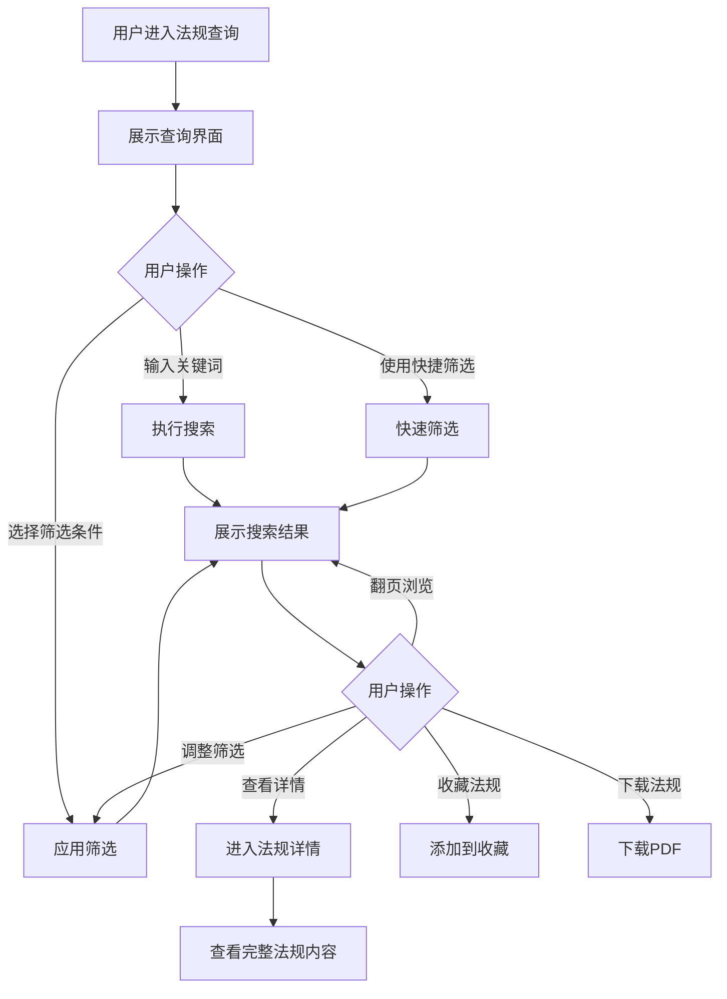

# 法规查询

## 1. 功能描述

法规查询功能提供全面的法律法规检索服务，支持用户通过关键词、分类、效力层级、发布时间等多维度条件检索法规，并提供法规详情查看、收藏、下载等功能。

### 1.1 业务功能流程图



## 2. 列表展示

### 2.1 搜索区域

**搜索输入框**
- 占位符文本："搜索法规名称、文号、关键词..."
- 支持自动补全
- 支持搜索历史

**快捷筛选标签**
- 全部法规
- 最新发布
- 即将施行
- 常用法规
- 我的收藏

### 2.2 筛选功能

**筛选条件面板**

| 筛选类别 | 选项内容 | 选择方式 |
|---------|---------|---------|
| 效力层级 | 法律、行政法规、部门规章、地方性法规、司法解释、规范性文件 | 多选 |
| 业务领域 | 劳动法、公司法、财税法、知识产权、合同法、网络安全等 | 多选 |
| 适用场景 | 用工合规、税务合规、数据合规、合同履约、公司治理等 | 多选 |
| 法规状态 | 现行有效、已修订、已废止、尚未施行 | 单选 |
| 发布机关 | 全国人大、国务院、各部委、地方政府等 | 多选 |
| 发布时间 | 全部、最近一月、最近三月、最近一年、自定义范围 | 单选 |

### 2.3 列表字段

| 字段名称 | 字段说明 | 是否可编辑 | 字段类型 | 说明 |
|---------|---------|-----------|---------|------|
| 法规标题 | 法规名称 | 否 | 文本 | 主标题，带高亮 |
| 效力层级 | 法规级别 | 否 | 标签 | 不同颜色区分 |
| 业务领域 | 所属领域 | 否 | 标签 | 可多标签 |
| 适用场景 | 适用场景 | 否 | 标签 | 场景标签 |
| 发布机关 | 发布机构 | 否 | 文本 | 带机构图标 |
| 发布日期 | 发布时间 | 否 | 日期 | YYYY-MM-DD |
| 施行日期 | 生效时间 | 否 | 日期 | 带倒计时提醒 |
| 法规状态 | 当前状态 | 否 | 状态标签 | 有效/修订/废止 |
| 浏览量 | 查看次数 | 否 | 数字 | 带趋势 |
| 下载量 | 下载次数 | 否 | 数字 | 统计值 |
| 匹配度 | 相关程度 | 否 | 进度条 | 百分比 |
| 操作 | 功能按钮 | - | - | 查看、收藏、下载 |

### 2.4 排序功能

- 综合排序（默认）
- 发布时间降序
- 施行时间降序
- 浏览量降序
- 匹配度降序

## 3. 法规详情

### 3.1 详情页面结构

**头部信息**
- 法规标题（大字号）
- 效力层级标签
- 法规状态标签
- 收藏按钮
- 下载按钮
- 分享按钮

**基本信息卡片**
- 发布机关
- 发布日期
- 施行日期
- 文号
- 时效性
- 修订记录

**法规内容**
- 目录导航（可点击跳转）
- 正文内容（结构化展示）
- 条款编号
- 高亮显示

**相关推荐**
- 相关法规
- 配套规定
- 解读文章

### 3.2 内容展示

**结构化展示**
- 章节标题
- 条款内容
- 引用链接（内部跳转）
- 注释说明

**交互功能**
- 目录导航
- 全文搜索
- 字体大小调整
- 夜间模式

## 4. 智能推荐

### 4.1 推荐逻辑

**基于企业画像**
- 根据企业行业推荐相关领域法规
- 根据企业规模推荐适用法规

**基于浏览历史**
- 推荐相似法规
- 推荐关联法规

**热点推荐**
- 最新发布法规
- 热门浏览法规
- 即将施行法规

### 4.2 推荐展示

- 卡片形式展示
- 显示推荐理由
- 快速收藏按钮

## 5. 数据模型

### 5.1 法规数据模型

```typescript
interface RegulationItem {
  id: string;                    // 法规ID
  title: string;                 // 法规标题
  level: string;                 // 效力层级
  field: string;                 // 业务领域
  scenario: string;              // 适用场景
  publishOrg: string;            // 发布机关
  publishDate: string;           // 发布日期
  effectiveDate: string;         // 施行日期
  status: 'effective' | 'revised' | 'abolished'; // 法规状态
  docNumber?: string;            // 文号
  tags: string[];                // 标签
  summary: string;               // 摘要
  content: string;               // 正文内容
  viewCount: number;             // 浏览量
  downloadCount: number;         // 下载量
  isNew?: boolean;               // 是否最新
  matchScore?: number;           // 匹配度
}
```

### 5.2 筛选条件模型

```typescript
interface FilterCriteria {
  scenario: string;              // 适用场景
  level: string[];               // 效力层级
  status: 'effective' | 'revised' | 'abolished' | 'all'; // 法规状态
  timeRange: string;             // 发布时间范围
  keyword: string;               // 关键词
  field?: string[];              // 业务领域
  publishOrg?: string[];         // 发布机关
}
```

## 6. 业务规则

### 6.1 搜索规则

| 规则编号 | 规则名称 | 规则描述 |
|---------|---------|---------|
| BR-001 | 关键词长度 | 最少2个字符，最多100个字符 |
| BR-002 | 结果排序 | 默认按相关度和发布时间综合排序 |
| BR-003 | 高亮显示 | 搜索结果中匹配关键词高亮 |
| BR-004 | 分页规则 | 默认每页20条，支持切换 |

### 6.2 数据展示规则

| 规则编号 | 规则名称 | 规则描述 |
|---------|---------|---------|
| BR-005 | 状态标识 | 不同状态用不同颜色标签 |
| BR-006 | 时效提醒 | 即将施行的法规显示倒计时 |
| BR-007 | 修订标识 | 已修订法规显示修订标记 |

## 7. 异常场景处理

| 异常场景 | 场景说明 | 系统行为 | 提醒方式 | 操作选项 |
|---------|---------|---------|---------|---------|
| 无搜索结果 | 关键词无匹配 | 显示空状态 | 信息提示 | 修改条件、查看推荐 |
| 法规内容加载失败 | 内容获取异常 | 显示错误提示 | 错误提示 | 刷新、反馈 |
| 下载失败 | 文件生成异常 | 提示下载失败 | 错误提示 | 重试、联系客服 |

## 8. 权限控制

| 功能 | 游客 | 普通用户 | 企业用户 | 管理员 |
|-----|------|---------|---------|--------|
| 法规搜索 | ✓ | ✓ | ✓ | ✓ |
| 查看详情 | ✓ | ✓ | ✓ | ✓ |
| 收藏法规 | ✗ | ✓ | ✓ | ✓ |
| 下载法规 | ✗ | ✓ | ✓ | ✓ |
| 导出列表 | ✗ | ✓ | ✓ | ✓ |

## 9. 导入导出功能

### 9.1 导出功能

**搜索结果导出**
- 格式：Excel、PDF
- 内容：列表字段
- 支持选择字段

**单篇法规导出**
- 格式：PDF、Word
- 内容：完整法规
- 带目录和格式

### 9.2 批量操作

- 批量收藏
- 批量下载
- 批量导出
