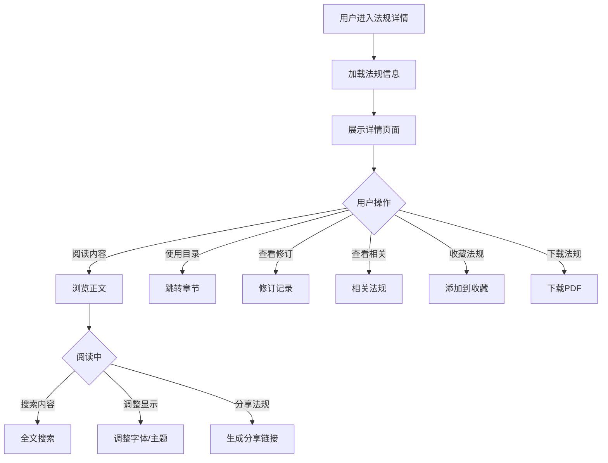

# 法规详情

## 1. 功能描述

法规详情功能提供单篇法律法规的完整内容展示，包括法规的基本信息、正文内容、修订记录、相关法规等，支持多种阅读模式和交互功能。

### 1.1 业务功能流程图



## 2. 页面结构

### 2.1 头部区域

**法规标题**
- 大字号显示法规全称
- 下方显示文号

**标签区域**
- 效力层级标签（不同颜色）
- 法规状态标签
- 热门标签（可选）

**操作按钮**
- 收藏按钮（带收藏状态）
- 下载按钮
- 分享按钮
- 打印按钮

### 2.2 基本信息卡片

| 信息项 | 内容 |
|-------|------|
| 发布机关 | 发布该法规的机构名称 |
| 发布日期 | 法规发布的时间 |
| 施行日期 | 法规生效的时间 |
| 文号 | 法规的正式文号 |
| 时效性 | 现行有效/已修订/已废止 |
| 修订记录 | 历次修订的时间和内容 |
| 浏览量 | 被查看的次数 |
| 下载量 | 被下载的次数 |

### 2.3 内容区域

**目录导航（左侧）**
- 可折叠的章节目录
- 点击跳转到对应章节
- 当前阅读位置高亮

**正文内容（中间）**
- 结构化展示
- 章节标题
- 条款编号
- 条文内容

**相关推荐（右侧）**
- 相关法规
- 配套规定
- 解读文章

## 3. 内容展示

### 3.1 结构化展示

**层级结构**
```
法规标题
├── 第一章 总则
│   ├── 第一条
│   ├── 第二条
│   └── ...
├── 第二章 ...
│   ├── 第X条
│   └── ...
└── 附则
    └── ...
```

**条款展示**
- 条款编号加粗
- 条款内容正常显示
- 引用条款可点击跳转
- 专业术语可查看解释

### 3.2 特殊标记

**修订标记**
- 新增内容：绿色标记
- 删除内容：红色删除线
- 修改内容：黄色高亮

**重要条款标记**
- 核心条款：星标
- 常用条款：火焰图标
- 与企业相关：企业图标

## 4. 交互功能

### 4.1 目录导航

**功能说明**
- 点击目录项跳转到对应章节
- 滚动时自动高亮当前章节
- 支持展开/折叠章节

**快捷导航**
- 返回顶部按钮
- 上一章/下一章按钮
- 快速跳转输入框

### 4.2 全文搜索

**搜索框**
- 页面内搜索
- 实时高亮匹配结果
- 显示匹配数量
- 上一个/下一个切换

### 4.3 阅读设置

**字体设置**
- 字体大小调整（小/中/大/特大）
- 字体样式选择（宋体/黑体）

**主题设置**
- 日间模式（白底黑字）
- 夜间模式（黑底白字）
- 护眼模式（黄底棕字）

**布局设置**
- 目录显示/隐藏
- 相关推荐显示/隐藏
- 全屏阅读模式

## 5. 修订记录

### 5.1 修订历史展示

**时间轴形式**
- 历次修订时间
- 修订内容摘要
- 点击查看详细修订

**对比功能**
- 选择两个版本对比
- 差异高亮显示
- 并排对比模式

### 5.2 修订内容标识

- 新增：绿色背景
- 删除：红色删除线
- 修改：黄色高亮

## 6. 相关法规

### 6.1 相关推荐

**关联类型**
- 上位法（该法规的上级法规）
- 下位法（该法规的下级法规）
- 配套规定（实施细则、解释等）
- 相关法规（同领域其他法规）

**展示形式**
- 列表形式
- 显示标题和发布日期
- 点击查看详情

### 6.2 解读文章

- 官方解读
- 专家解读
- 实务指南

## 7. 数据模型

### 7.1 法规详情模型

```typescript
interface RegulationDetail {
  id: string;                    // 法规ID
  title: string;                 // 法规标题
  level: string;                 // 效力层级
  field: string;                 // 业务领域
  publishOrg: string;            // 发布机关
  publishDate: string;           // 发布日期
  effectiveDate: string;         // 施行日期
  docNumber: string;             // 文号
  status: 'effective' | 'revised' | 'abolished'; // 状态
  tags: string[];                // 标签
  summary: string;               // 摘要
  content: RegulationContent;    // 正文内容
  revisionHistory: Revision[];   // 修订历史
  relatedRegulations: Related[]; // 相关法规
  viewCount: number;             // 浏览量
  downloadCount: number;         // 下载量
}

interface RegulationContent {
  chapters: Chapter[];           // 章节列表
}

interface Chapter {
  id: string;                    // 章节ID
  title: string;                 // 章节标题
  number: string;                // 章节编号
  articles: Article[];           // 条款列表
}

interface Article {
  id: string;                    // 条款ID
  number: string;                // 条款编号
  content: string;               // 条款内容
  isCore?: boolean;              // 是否核心条款
  isNew?: boolean;               // 是否新增
  isDeleted?: boolean;           // 是否删除
  isModified?: boolean;          // 是否修改
}

interface Revision {
  id: string;                    // 修订ID
  date: string;                  // 修订日期
  content: string;               // 修订内容
  description: string;           // 修订说明
}

interface Related {
  id: string;                    // 相关法规ID
  title: string;                 // 标题
  type: 'superior' | 'subordinate' | 'supporting' | 'related'; // 关联类型
  publishDate: string;           // 发布日期
}
```

## 8. 业务规则

### 8.1 内容展示规则

| 规则编号 | 规则名称 | 规则描述 |
|---------|---------|---------|
| BR-001 | 层级显示 | 按章节层级缩进显示 |
| BR-002 | 条款编号 | 条款编号连续，不跳号 |
| BR-003 | 引用链接 | 引用其他条款时显示为可点击链接 |
| BR-004 | 修订标识 | 修订内容需明确标识 |

### 8.2 阅读体验规则

| 规则编号 | 规则名称 | 规则描述 |
|---------|---------|---------|
| BR-005 | 阅读进度 | 记录用户阅读位置 |
| BR-006 | 设置保存 | 用户的阅读设置自动保存 |
| BR-007 | 历史记录 | 记录用户浏览过的法规 |

## 9. 异常场景处理

| 异常场景 | 场景说明 | 系统行为 | 提醒方式 | 操作选项 |
|---------|---------|---------|---------|---------|
| 法规不存在 | 访问的法规ID无效 | 显示404页面 | 错误提示 | 返回列表、搜索 |
| 内容加载失败 | 正文内容获取失败 | 显示错误提示 | 错误提示 | 刷新、反馈 |
| 修订记录缺失 | 修订历史数据不完整 | 显示已有记录 | 信息提示 | 查看原文 |

## 10. 权限控制

| 功能 | 游客 | 普通用户 | 企业用户 | 管理员 |
|-----|------|---------|---------|--------|
| 查看详情 | ✓ | ✓ | ✓ | ✓ |
| 收藏法规 | ✗ | ✓ | ✓ | ✓ |
| 下载法规 | ✗ | ✓ | ✓ | ✓ |
| 打印法规 | ✓ | ✓ | ✓ | ✓ |
| 分享法规 | ✓ | ✓ | ✓ | ✓ |

## 11. 导入导出功能

### 11.1 下载功能

**PDF下载**
- 保留原文格式
- 包含目录导航
- 可设置下载范围（全文/单章）

**Word下载**
- 可编辑格式
- 保留层级结构
- 适合二次编辑

### 11.2 打印功能

- 打印预览
- 打印设置（页眉页脚、页码）
- 打印范围选择
