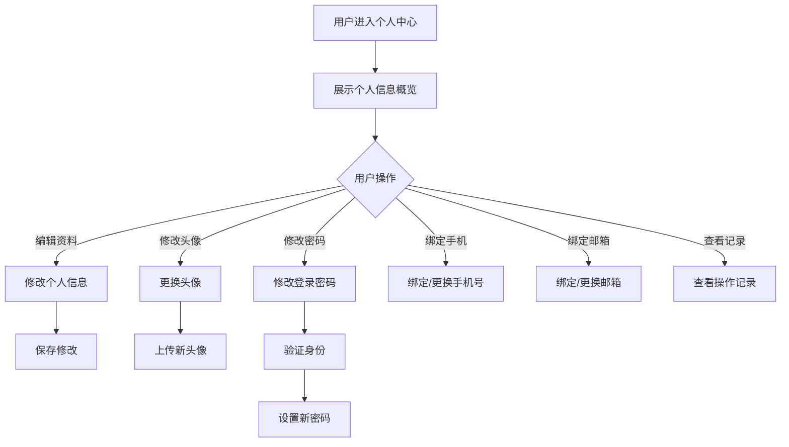

# 个人中心

## 1. 功能描述

个人中心功能提供用户管理个人信息、查看操作记录、修改密码、管理账号安全等功能，是用户的个人信息管理中心。

### 1.1 业务功能流程图



## 2. 个人信息概览

### 2.1 头像区域

- 用户头像（点击可更换）
- 用户名
- 用户角色标签

### 2.2 基本信息卡片

| 信息项 | 内容 | 操作 |
|-------|------|------|
| 用户名 | 登录账号 | 不可修改 |
| 真实姓名 | 用户姓名 | 可修改 |
| 手机号 | 绑定手机 | 可更换 |
| 邮箱 | 绑定邮箱 | 可更换 |
| 所属企业 | 关联企业 | 查看详情 |
| 注册时间 | 注册日期 | 不可修改 |

### 2.3 账号安全等级

**安全等级评估**
- 高：已绑定手机+邮箱+设置强密码
- 中：已绑定手机+设置密码
- 低：仅设置密码

**安全建议**
- 建议绑定手机号
- 建议绑定邮箱
- 建议设置强密码
- 建议开启登录保护

## 3. 编辑个人信息

### 3.1 可编辑字段

| 字段名称 | 是否必填 | 字段类型 | 说明 |
|---------|---------|---------|------|
| 真实姓名 | 是 | 文本 | 用户真实姓名 |
| 性别 | 否 | 单选 | 男/女/保密 |
| 生日 | 否 | 日期 | 出生日期 |
| 所在地区 | 否 | 级联选择 | 省市区 |
| 详细地址 | 否 | 文本 | 详细住址 |
| 个人简介 | 否 | 多行文本 | 个人介绍 |

### 3.2 保存规则

- 真实姓名不能为空
- 数据格式校验
- 保存成功提示

## 4. 修改头像

### 4.1 头像上传

**上传方式**
- 点击上传
- 拖拽上传
- 拍照上传（移动端）

**图片要求**
- 格式：JPG、PNG
- 大小：不超过2MB
- 尺寸：建议200x200像素

### 4.2 头像裁剪

- 支持裁剪区域选择
- 支持缩放调整
- 实时预览效果

## 5. 修改密码

### 5.1 修改流程

**步骤1：身份验证**
- 输入原密码
- 或短信验证码
- 或邮箱验证码

**步骤2：设置新密码**
- 输入新密码
- 确认新密码
- 密码强度提示

**步骤3：修改成功**
- 提示修改成功
- 建议重新登录

### 5.2 密码规则

- 长度8-20位
- 必须包含字母和数字
- 不能与原密码相同
- 建议包含特殊字符

## 6. 绑定手机号

### 6.1 绑定流程

**未绑定状态**
1. 输入手机号
2. 获取验证码
3. 输入验证码
4. 绑定成功

**已绑定状态**
1. 验证原手机号（验证码）
2. 输入新手机号
3. 获取验证码
4. 输入验证码
5. 更换成功

### 6.2 验证规则

- 手机号格式校验
- 验证码5分钟有效
- 每天最多发送5次验证码

## 7. 绑定邮箱

### 7.1 绑定流程

**未绑定状态**
1. 输入邮箱地址
2. 发送验证邮件
3. 点击邮件链接验证
4. 绑定成功

**已绑定状态**
1. 验证原邮箱（邮件验证）
2. 输入新邮箱
3. 发送验证邮件
4. 点击邮件链接验证
5. 更换成功

## 8. 操作记录

### 8.1 记录类型

| 记录类型 | 说明 |
|---------|------|
| 登录记录 | 登录时间、IP、设备 |
| 修改记录 | 个人信息修改记录 |
| 安全记录 | 密码修改、绑定变更 |
| 操作记录 | 系统操作记录 |

### 8.2 记录展示

- 时间倒序排列
- 支持分页查看
- 支持筛选类型
- 支持导出记录

## 9. 数据模型

### 9.1 个人资料模型

```typescript
interface UserProfile {
  id: string;                    // 用户ID
  username: string;              // 用户名
  realName: string;              // 真实姓名
  gender?: 'male' | 'female' | 'secret'; // 性别
  birthday?: string;             // 生日
  avatar?: string;               // 头像URL
  phone: string;                 // 手机号
  email?: string;                // 邮箱
  region?: string;               // 所在地区
  address?: string;              // 详细地址
  bio?: string;                  // 个人简介
  companyId?: string;            // 所属企业ID
  companyName?: string;          // 企业名称
}

interface UserOperationLog {
  id: string;                    // 记录ID
  userId: string;                // 用户ID
  type: string;                  // 操作类型
  description: string;           // 操作描述
  ip: string;                    // 操作IP
  device?: string;               // 操作设备
  timestamp: string;             // 操作时间
}
```

## 10. 业务规则

### 10.1 信息修改规则

| 规则编号 | 规则名称 | 规则描述 |
|---------|---------|---------|
| BR-001 | 真实姓名 | 真实姓名不能为空 |
| BR-002 | 手机号唯一 | 手机号不能与其他用户重复 |
| BR-003 | 邮箱唯一 | 邮箱不能与其他用户重复 |
| BR-004 | 验证要求 | 修改手机号/邮箱需要验证 |

### 10.2 安全规则

| 规则编号 | 规则名称 | 规则描述 |
|---------|---------|---------|
| BR-005 | 密码修改 | 修改密码需要身份验证 |
| BR-006 | 操作记录 | 敏感操作记录日志 |
| BR-007 | 异地登录 | 异地登录发送提醒 |

## 11. 异常场景处理

| 异常场景 | 场景说明 | 系统行为 | 提醒方式 | 操作选项 |
|---------|---------|---------|---------|---------|
| 手机号已绑定 | 手机号已被其他账号绑定 | 提示更换手机号 | 错误提示 | 更换手机号 |
| 验证码错误 | 输入的验证码不正确 | 提示重新输入 | 错误提示 | 重新输入 |
| 原密码错误 | 修改密码时原密码错误 | 提示密码错误 | 错误提示 | 重新输入 |
| 头像上传失败 | 图片格式或大小不符 | 提示上传要求 | 错误提示 | 重新选择 |

## 12. 权限控制

| 功能 | 游客 | 普通用户 | 企业用户 | 管理员 |
|-----|------|---------|---------|--------|
| 查看个人资料 | ✗ | ✓ | ✓ | ✓ |
| 编辑个人资料 | ✗ | ✓ | ✓ | ✓ |
| 修改头像 | ✗ | ✓ | ✓ | ✓ |
| 修改密码 | ✗ | ✓ | ✓ | ✓ |
| 绑定手机 | ✗ | ✓ | ✓ | ✓ |
| 绑定邮箱 | ✗ | ✓ | ✓ | ✓ |
| 查看操作记录 | ✗ | ✓ | ✓ | ✓ |
