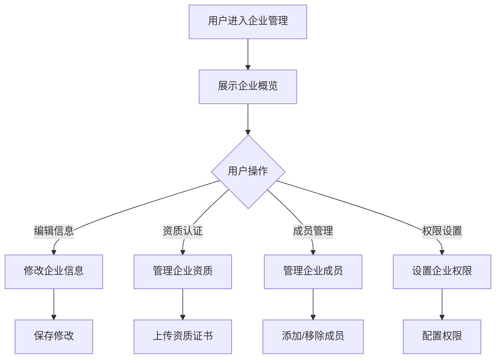

# 企业管理

## 1. 功能描述

企业管理功能提供企业用户管理企业信息的入口，包括企业基本信息维护、资质认证、企业成员管理、企业权限设置等，是企业用户的组织管理中心。

### 1.1 业务功能流程图



## 2. 企业概览

### 2.1 企业信息卡片

**基本信息**
- 企业Logo
- 企业名称
- 统一社会信用代码
- 企业类型
- 所属行业
- 企业规模

**认证状态**
- 实名认证状态
- 资质认证状态
- 认证有效期

**统计信息**
- 企业成员数
- 申报项目数
- 收藏数量
- 业务对接数

### 2.2 快捷入口

- 编辑企业信息
- 上传资质证书
- 管理企业成员
- 查看申报记录

## 3. 企业基本信息

### 3.1 信息展示

| 信息项 | 内容 | 可编辑 |
|-------|------|--------|
| 企业Logo | 企业标识 | 是 |
| 企业名称 | 营业执照名称 | 否 |
| 统一社会信用代码 | 信用代码 | 否 |
| 企业类型 | 有限责任公司/股份有限公司等 | 否 |
| 所属行业 | 主营业务行业 | 是 |
| 企业规模 | 大型/中型/小型/微型 | 是 |
| 成立日期 | 注册成立日期 | 否 |
| 注册资本 | 注册资金 | 否 |
| 注册地址 | 工商注册地址 | 是 |
| 办公地址 | 实际办公地址 | 是 |
| 企业官网 | 官方网站 | 是 |
| 企业简介 | 企业介绍 | 是 |

### 3.2 编辑企业信息

**可编辑字段**

| 字段名称 | 是否必填 | 字段类型 | 说明 |
|---------|---------|---------|------|
| 企业Logo | 否 | 图片上传 | 企业标识 |
| 所属行业 | 是 | 下拉选择 | 主营业务行业 |
| 企业规模 | 是 | 下拉选择 | 按员工人数划分 |
| 注册地址 | 是 | 地址选择 | 详细注册地址 |
| 办公地址 | 是 | 地址选择 | 详细办公地址 |
| 企业官网 | 否 | URL | 官方网站地址 |
| 企业简介 | 是 | 多行文本 | 企业详细介绍 |
| 主营业务 | 是 | 多行文本 | 主要业务描述 |
| 联系方式 | 是 | 文本 | 企业联系电话 |
| 企业邮箱 | 是 | 邮箱 | 企业邮箱 |

### 3.3 编辑规则

- 企业名称、信用代码等核心信息不可修改
- 修改后需审核（部分字段）
- 保存成功提示

## 4. 资质认证

### 4.1 资质列表

**系统预设资质**

| 资质名称 | 说明 | 认证状态 |
|---------|------|---------|
| 实名认证 | 企业实名认证 | 已认证/未认证 |
| 高新技术企业 | 高新技术企业认定 | 已认证/未认证 |
| 专精特新企业 | 专精特新认定 | 已认证/未认证 |
| 科技型中小企业 | 科技型中小企业认定 | 已认证/未认证 |
| ISO9001认证 | 质量管理体系认证 | 已认证/未认证 |
| 其他资质 | 自定义资质 | 已认证/未认证 |

### 4.2 资质认证流程

**上传资质**
1. 选择资质类型
2. 上传证书扫描件
3. 填写证书信息
4. 提交审核
5. 等待审核结果

**审核状态**
- 待审核
- 审核通过
- 审核驳回

### 4.3 资质展示

- 已认证资质显示认证标识
- 显示认证有效期
- 支持下载证书
- 支持删除资质（已过期）

## 5. 企业成员管理

### 5.1 成员列表

**列表字段**

| 字段名称 | 字段说明 | 字段类型 |
|---------|---------|---------|
| 成员头像 | 用户头像 | 图片 |
| 成员姓名 | 真实姓名 | 文本 |
| 登录账号 | 用户名 | 文本 |
| 成员角色 | 企业内角色 | 标签 |
| 所属部门 | 部门信息 | 文本 |
| 手机号 | 联系电话 | 文本 |
| 加入时间 | 加入日期 | 日期时间 |
| 成员状态 | 账号状态 | 状态标签 |
| 操作 | 功能按钮 | - |

### 5.2 成员角色

| 角色 | 说明 | 权限 |
|-----|------|------|
| 企业管理员 | 企业最高权限 | 所有权限 |
| 部门管理员 | 部门管理权限 | 部门内管理 |
| 普通成员 | 普通员工 | 基础权限 |
| 财务专员 | 财务相关权限 | 财务操作 |
| 申报专员 | 申报相关权限 | 申报操作 |

### 5.3 成员操作

**添加成员**
- 输入手机号/邮箱
- 发送邀请
- 被邀请人接受后加入

**移除成员**
- 确认移除
- 选择数据处理方式
- 移除成功

**修改角色**
- 选择新角色
- 确认修改
- 权限立即生效

## 6. 权限设置

### 6.1 权限配置

**功能权限**

| 功能模块 | 企业管理员 | 部门管理员 | 普通成员 |
|---------|-----------|-----------|---------|
| 企业信息管理 | ✓ | ✗ | ✗ |
| 资质管理 | ✓ | ✗ | ✗ |
| 成员管理 | ✓ | 部门内 | ✗ |
| 权限设置 | ✓ | ✗ | ✗ |
| 政策申报 | ✓ | ✓ | ✓ |
| 收藏管理 | ✓ | ✓ | ✓ |
| 业务对接 | ✓ | ✓ | ✓ |
| 融资诊断 | ✓ | ✓ | ✗ |

**数据权限**
- 全部数据
- 部门数据
- 个人数据

### 6.2 权限分配

- 按角色分配默认权限
- 支持自定义权限
- 权限变更实时生效

## 7. 数据模型

### 7.1 企业数据模型

```typescript
interface Enterprise {
  id: string;                    // 企业ID
  name: string;                  // 企业名称
  creditCode: string;            // 统一社会信用代码
  logo?: string;                 // 企业Logo
  type: string;                  // 企业类型
  industry: string;              // 所属行业
  scale: string;                 // 企业规模
  establishDate: string;         // 成立日期
  registeredCapital: string;     // 注册资本
  registerAddress: string;       // 注册地址
  officeAddress: string;         // 办公地址
  website?: string;              // 企业官网
  description: string;           // 企业简介
  mainBusiness: string;          // 主营业务
  contactPhone: string;          // 联系电话
  contactEmail: string;          // 企业邮箱
  status: string;                // 企业状态
  certifications: Certification[]; // 资质认证
  members: Member[];             // 企业成员
  createTime: string;            // 创建时间
  updateTime: string;            // 更新时间
}

interface Certification {
  id: string;                    // 资质ID
  type: string;                  // 资质类型
  name: string;                  // 资质名称
  certificateNo?: string;        // 证书编号
  imageUrl: string;              // 证书图片
  issueDate?: string;            // 发证日期
  expiryDate?: string;           // 有效期至
  status: 'pending' | 'approved' | 'rejected'; // 审核状态
}

interface Member {
  id: string;                    // 成员ID
  userId: string;                // 用户ID
  name: string;                  // 成员姓名
  username: string;              // 登录账号
  role: MemberRole;              // 成员角色
  department?: string;           // 所属部门
  phone: string;                 // 手机号
  joinTime: string;              // 加入时间
  status: string;                // 成员状态
}

type MemberRole = 'admin' | 'dept_admin' | 'member' | 'finance' | 'application';
```

## 8. 业务规则

### 8.1 企业信息规则

| 规则编号 | 规则名称 | 规则描述 |
|---------|---------|---------|
| BR-001 | 信息唯一 | 信用代码唯一 |
| BR-002 | 核心信息锁定 | 企业名称、信用代码不可修改 |
| BR-003 | 信息审核 | 部分信息修改后需审核 |

### 8.2 成员管理规则

| 规则编号 | 规则名称 | 规则描述 |
|---------|---------|---------|
| BR-004 | 成员上限 | 根据企业规模限制成员数 |
| BR-005 | 角色唯一 | 至少保留一名管理员 |
| BR-006 | 邀请机制 | 新成员需接受邀请 |

### 8.3 资质规则

| 规则编号 | 规则名称 | 规则描述 |
|---------|---------|---------|
| BR-007 | 资质审核 | 上传资质需平台审核 |
| BR-008 | 有效期提醒 | 即将过期时提醒更新 |
| BR-009 | 资质展示 | 已认证资质显示标识 |

## 9. 异常场景处理

| 异常场景 | 场景说明 | 系统行为 | 提醒方式 | 操作选项 |
|---------|---------|---------|---------|---------|
| 成员数超限 | 达到成员上限 | 提示升级或移除成员 | 警告提示 | 升级套餐、移除成员 |
| 唯一管理员 | 试图移除唯一管理员 | 提示不能移除 | 错误提示 | 先指定新管理员 |
| 资质审核驳回 | 上传的资质未通过 | 提示驳回原因 | 信息提示 | 重新上传 |
| 信息审核中 | 修改的信息正在审核 | 提示审核中 | 信息提示 | 等待审核 |

## 10. 权限控制

| 功能 | 企业管理员 | 部门管理员 | 普通成员 |
|-----|-----------|-----------|---------|
| 查看企业信息 | ✓ | ✓ | ✓ |
| 编辑企业信息 | ✓ | ✗ | ✗ |
| 管理资质 | ✓ | ✗ | ✗ |
| 管理成员 | ✓ | 部门内 | ✗ |
| 设置权限 | ✓ | ✗ | ✗ |
| 查看统计 | ✓ | 部门内 | 个人 |
