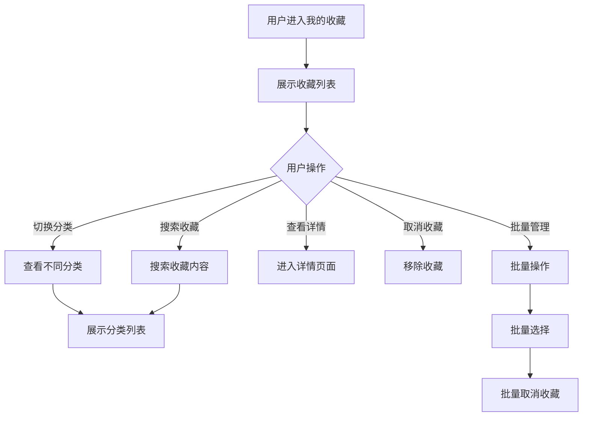

# 我的收藏

## 1. 功能描述

我的收藏功能提供用户管理收藏内容的入口，包括收藏的政策、法规、服务、文章等，支持分类查看、搜索、取消收藏等操作。

### 1.1 业务功能流程图



## 2. 收藏分类

### 2.1 分类TAB

| 分类名称 | 说明 | 图标 |
|---------|------|------|
| 全部 | 所有收藏内容 | 🌟 |
| 政策 | 收藏的政策信息 | 📋 |
| 法规 | 收藏的法律法规 | ⚖️ |
| 服务 | 收藏的企业服务 | 🛠️ |
| 文章 | 收藏的文章资讯 | 📄 |
| 其他 | 其他收藏内容 | 📌 |

### 2.2 分类统计

- 每个分类显示收藏数量
- 点击切换分类
- 支持全部查看

## 3. 收藏列表

### 3.1 政策收藏

**列表字段**

| 字段名称 | 字段说明 | 字段类型 |
|---------|---------|---------|
| 政策标题 | 政策名称 | 文本 |
| 政策类型 | 分类标签 | 标签 |
| 发文单位 | 发布机构 | 文本 |
| 收藏时间 | 收藏日期 | 日期时间 |
| 操作 | 功能按钮 | - |

### 3.2 法规收藏

**列表字段**

| 字段名称 | 字段说明 | 字段类型 |
|---------|---------|---------|
| 法规标题 | 法规名称 | 文本 |
| 效力层级 | 法规级别 | 标签 |
| 发布机关 | 发布机构 | 文本 |
| 收藏时间 | 收藏日期 | 日期时间 |
| 操作 | 功能按钮 | - |

### 3.3 服务收藏

**列表字段**

| 字段名称 | 字段说明 | 字段类型 |
|---------|---------|---------|
| 服务名称 | 服务标题 | 文本 |
| 服务商 | 提供企业 | 文本 |
| 服务类型 | 分类标签 | 标签 |
| 收藏时间 | 收藏日期 | 日期时间 |
| 操作 | 功能按钮 | - |

### 3.4 文章收藏

**列表字段**

| 字段名称 | 字段说明 | 字段类型 |
|---------|---------|---------|
| 文章标题 | 文章名称 | 文本 |
| 文章来源 | 发布来源 | 文本 |
| 发布时间 | 发布日期 | 日期时间 |
| 收藏时间 | 收藏日期 | 日期时间 |
| 操作 | 功能按钮 | - |

## 4. 搜索功能

### 4.1 搜索框

- 占位符："搜索收藏内容..."
- 支持标题搜索
- 支持内容搜索
- 在当前分类下搜索

### 4.2 搜索结果

- 高亮显示匹配关键词
- 显示所属分类
- 支持筛选排序

## 5. 收藏操作

### 5.1 单条操作

| 操作 | 说明 |
|-----|------|
| 查看详情 | 进入内容详情页 |
| 取消收藏 | 移除该收藏 |
| 分享 | 分享收藏内容 |

### 5.2 批量操作

**批量选择**
- 点击选择框
- 全选/取消全选

**批量操作**
- 批量取消收藏
- 批量移动分类（如支持）

### 5.3 取消收藏

- 点击取消收藏按钮
- 弹出确认对话框
- 确认后移除收藏
- 显示取消成功提示

## 6. 排序功能

### 6.1 排序选项

- 收藏时间降序（默认）
- 收藏时间升序
- 发布时间降序
- 标题字母顺序

## 7. 空状态

### 7.1 空状态展示

- 空状态图标
- 提示文字："暂无收藏内容"
- 引导按钮："去浏览"

### 7.2 分类空状态

- 提示当前分类无收藏
- 建议查看其他分类

## 8. 数据模型

### 8.1 收藏数据模型

```typescript
interface Favorite {
  id: string;                    // 收藏ID
  userId: string;                // 用户ID
  type: FavoriteType;            // 收藏类型
  contentId: string;             // 内容ID
  title: string;                 // 内容标题
  summary?: string;              // 内容摘要
  source?: string;               // 内容来源
  tags?: string[];               // 标签
  url: string;                   // 详情链接
  createTime: string;            // 收藏时间
}

type FavoriteType = 'policy' | 'regulation' | 'service' | 'article' | 'other';

interface FavoriteCategory {
  id: string;                    // 分类ID
  name: string;                  // 分类名称
  icon: string;                  // 分类图标
  count: number;                 // 收藏数量
}
```

## 9. 业务规则

### 9.1 收藏规则

| 规则编号 | 规则名称 | 规则描述 |
|---------|---------|---------|
| BR-001 | 重复收藏 | 同一内容不能重复收藏 |
| BR-002 | 收藏上限 | 最多收藏1000条 |
| BR-003 | 失效处理 | 原内容删除后标记为失效 |

### 9.2 展示规则

| 规则编号 | 规则名称 | 规则描述 |
|---------|---------|---------|
| BR-004 | 默认排序 | 默认按收藏时间倒序 |
| BR-005 | 分页规则 | 每页20条 |
| BR-006 | 搜索范围 | 在当前选中分类下搜索 |

## 10. 异常场景处理

| 异常场景 | 场景说明 | 系统行为 | 提醒方式 | 操作选项 |
|---------|---------|---------|---------|---------|
| 内容失效 | 原内容已删除 | 标记为失效 | 信息提示 | 删除收藏 |
| 取消失败 | 网络异常 | 提示稍后重试 | 错误提示 | 重试 |
| 收藏上限 | 达到收藏上限 | 提示清理收藏 | 警告提示 | 管理收藏 |

## 11. 权限控制

| 功能 | 游客 | 普通用户 | 企业用户 | 管理员 |
|-----|------|---------|---------|--------|
| 查看收藏 | ✗ | ✓ | ✓ | ✓ |
| 搜索收藏 | ✗ | ✓ | ✓ | ✓ |
| 取消收藏 | ✗ | ✓ | ✓ | ✓ |
| 批量管理 | ✗ | ✓ | ✓ | ✓ |
