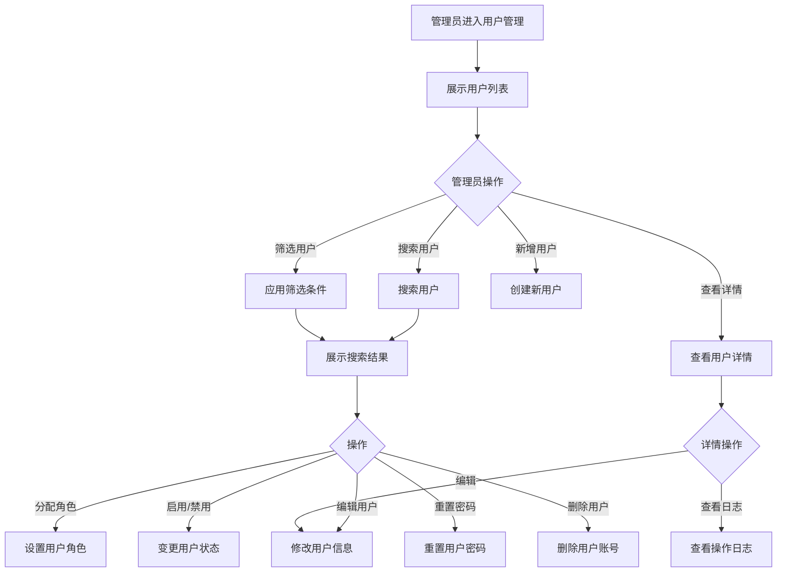

# 用户管理

## 1. 功能描述

用户管理功能提供系统用户的统一管理，包括用户列表查看、用户信息维护、权限分配、状态管理等，支持管理员对平台用户进行全生命周期管理。

### 1.1 业务功能流程图



## 2. 列表展示

### 2.1 列表字段

| 字段名称 | 字段说明 | 字段类型 | 说明 |
|---------|---------|---------|------|
| 用户ID | 系统用户ID | 文本 | 唯一标识 |
| 用户名 | 登录账号 | 文本 | 登录用 |
| 真实姓名 | 用户姓名 | 文本 | 真实姓名 |
| 手机号 | 联系电话 | 文本 | 11位手机号 |
| 邮箱 | 电子邮箱 | 文本 | 邮箱地址 |
| 所属企业 | 关联企业 | 文本 | 企业名称 |
| 用户角色 | 系统角色 | 标签 | 管理员/普通用户/企业用户 |
| 用户状态 | 账号状态 | 状态标签 | 启用/禁用/锁定 |
| 注册时间 | 注册日期 | 日期时间 | 精确到分钟 |
| 最后登录 | 最后登录时间 | 日期时间 | 相对时间 |
| 操作 | 功能按钮 | - | 查看/编辑/禁用/删除 |

### 2.2 筛选功能

| 筛选类别 | 选项内容 |
|---------|---------|
| 用户角色 | 全部、管理员、普通用户、企业用户 |
| 用户状态 | 全部、启用、禁用、锁定 |
| 注册时间 | 全部、今天、近7天、近30天、自定义范围 |
| 所属企业 | 全部、有企业、无企业 |

### 2.3 搜索功能

- 支持用户名搜索
- 支持手机号搜索
- 支持真实姓名搜索
- 支持模糊搜索

## 3. 新增用户

### 3.1 创建表单

**基本信息**

| 字段名称 | 是否必填 | 字段类型 | 说明 |
|---------|---------|---------|------|
| 用户名 | 是 | 文本 | 4-20位字母数字 |
| 密码 | 是 | 密码 | 8-20位，含字母数字 |
| 确认密码 | 是 | 密码 | 与密码一致 |
| 真实姓名 | 是 | 文本 | 用户真实姓名 |
| 手机号 | 是 | 手机号 | 11位手机号 |
| 邮箱 | 否 | 邮箱 | 邮箱地址 |

**角色信息**

| 字段名称 | 是否必填 | 字段类型 | 说明 |
|---------|---------|---------|------|
| 用户角色 | 是 | 单选 | 管理员/普通用户/企业用户 |
| 所属企业 | 条件必填 | 下拉选择 | 企业用户必填 |

### 3.2 创建规则

- 用户名不能重复
- 手机号不能重复
- 邮箱不能重复（如有）
- 密码强度校验

## 4. 用户详情

### 4.1 基本信息卡片

- 用户ID
- 用户名
- 真实姓名
- 手机号
- 邮箱
- 头像

### 4.2 账号信息

- 用户角色
- 所属企业
- 用户状态
- 注册时间
- 注册IP
- 最后登录时间
- 最后登录IP

### 4.3 统计信息

- 登录次数
- 操作次数
- 发布内容数
- 收藏数量

### 4.4 操作记录

- 最近登录记录
- 最近操作记录
- 状态变更记录

## 5. 编辑用户

### 5.1 可编辑字段

| 字段名称 | 是否可编辑 | 说明 |
|---------|-----------|------|
| 真实姓名 | 是 | 修改用户姓名 |
| 手机号 | 是 | 修改手机号，需验证 |
| 邮箱 | 是 | 修改邮箱，需验证 |
| 用户角色 | 是 | 变更用户角色 |
| 所属企业 | 是 | 变更关联企业 |
| 用户状态 | 是 | 启用/禁用/锁定 |

### 5.2 修改规则

- 手机号修改需短信验证
- 邮箱修改需邮件验证
- 角色变更需确认
- 禁用用户需填写原因

## 6. 权限管理

### 6.1 角色定义

| 角色 | 说明 | 权限范围 |
|-----|------|---------|
| 超级管理员 | 系统最高权限 | 所有功能 |
| 管理员 | 日常管理权限 | 用户管理、内容管理 |
| 企业用户 | 企业账号 | 企业相关功能 |
| 普通用户 | 个人用户 | 基础功能 |

### 6.2 权限分配

**功能权限**
- 模块访问权限
- 操作权限（增删改查）
- 数据权限（范围限制）

**数据权限**
- 全部数据
- 部门数据
- 个人数据

## 7. 数据模型

### 7.1 用户数据模型

```typescript
interface User {
  id: string;                    // 用户ID
  username: string;              // 用户名
  password: string;              // 密码（加密存储）
  realName: string;              // 真实姓名
  phone: string;                 // 手机号
  email?: string;                // 邮箱
  avatar?: string;               // 头像URL
  role: UserRole;                // 用户角色
  companyId?: string;            // 所属企业ID
  status: UserStatus;            // 用户状态
  registerTime: string;          // 注册时间
  registerIp: string;            // 注册IP
  lastLoginTime?: string;        // 最后登录时间
  lastLoginIp?: string;          // 最后登录IP
  loginCount: number;            // 登录次数
  createBy?: string;             // 创建人
  updateTime: string;            // 更新时间
}

type UserRole = 'super_admin' | 'admin' | 'enterprise' | 'user';
type UserStatus = 'active' | 'inactive' | 'locked';

interface UserLog {
  id: string;                    // 日志ID
  userId: string;                // 用户ID
  action: string;                // 操作类型
  description: string;           // 操作描述
  ip: string;                    // 操作IP
  timestamp: string;             // 操作时间
}
```

## 8. 业务规则

### 8.1 用户管理规则

| 规则编号 | 规则名称 | 规则描述 |
|---------|---------|---------|
| BR-001 | 用户名唯一 | 用户名不能重复 |
| BR-002 | 手机号唯一 | 手机号不能重复 |
| BR-003 | 密码强度 | 密码必须8-20位，包含字母和数字 |
| BR-004 | 状态变更 | 禁用用户需填写原因 |
| BR-005 | 删除限制 | 超级管理员不能删除 |

### 8.2 安全规则

| 规则编号 | 规则名称 | 规则描述 |
|---------|---------|---------|
| BR-006 | 密码加密 | 密码必须加密存储 |
| BR-007 | 登录锁定 | 连续5次登录失败锁定账号 |
| BR-008 | 操作日志 | 关键操作必须记录日志 |

## 9. 异常场景处理

| 异常场景 | 场景说明 | 系统行为 | 提醒方式 | 操作选项 |
|---------|---------|---------|---------|---------|
| 用户名重复 | 用户名已存在 | 提示更换用户名 | 错误提示 | 修改用户名 |
| 手机号重复 | 手机号已注册 | 提示更换手机号 | 错误提示 | 修改手机号 |
| 密码太弱 | 密码强度不足 | 提示密码要求 | 错误提示 | 修改密码 |
| 删除失败 | 用户有关联数据 | 提示不能删除 | 错误提示 | 先解除关联 |

## 10. 权限控制

| 功能 | 超级管理员 | 管理员 | 企业用户 | 普通用户 |
|-----|-----------|-------|---------|---------|
| 查看用户列表 | ✓ | ✓ | ✗ | ✗ |
| 新增用户 | ✓ | ✓ | ✗ | ✗ |
| 编辑用户 | ✓ | ✓ | ✗ | ✗ |
| 删除用户 | ✓ | ✗ | ✗ | ✗ |
| 分配角色 | ✓ | ✗ | ✗ | ✗ |
| 重置密码 | ✓ | ✓ | ✗ | ✗ |
| 查看日志 | ✓ | ✓ | ✗ | ✗ |
