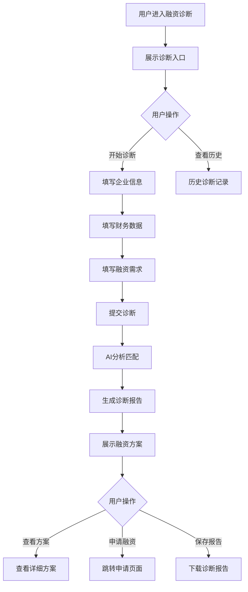

# 融资诊断

## 1. 功能描述

融资诊断功能为企业提供融资需求分析和方案推荐服务，通过收集企业基本信息、财务数据、融资需求等，智能分析匹配合适的融资产品和渠道。

### 1.1 业务功能流程图



## 2. 诊断流程

### 2.1 步骤条展示

**诊断步骤**
1. 企业基本信息
2. 财务数据
3. 融资需求
4. 生成报告

### 2.2 步骤1：企业基本信息

**表单字段**

| 字段名称 | 是否必填 | 字段类型 | 说明 |
|---------|---------|---------|------|
| 企业名称 | 是 | 只读文本 | 自动填充 |
| 统一社会信用代码 | 是 | 只读文本 | 自动填充 |
| 所属行业 | 是 | 下拉选择 | 从预设行业选择 |
| 企业规模 | 是 | 下拉选择 | 大型/中型/小型/微型 |
| 成立时间 | 是 | 日期选择 | 企业成立日期 |
| 注册地址 | 是 | 地址选择 | 企业注册地址 |
| 员工人数 | 是 | 数字输入 | 当前员工总数 |
| 主营业务 | 是 | 多行文本 | 主要业务描述 |
| 企业资质 | 否 | 多选 | 高新技术企业、专精特新等 |

### 2.3 步骤2：财务数据

**表单字段**

| 字段名称 | 是否必填 | 字段类型 | 说明 |
|---------|---------|---------|------|
| 上年度营业收入 | 是 | 金额输入 | 单位：万元 |
| 上年度净利润 | 是 | 金额输入 | 单位：万元 |
| 总资产 | 是 | 金额输入 | 单位：万元 |
| 总负债 | 是 | 金额输入 | 单位：万元 |
| 资产负债率 | 否 | 百分比 | 自动计算 |
| 近12个月纳税额 | 是 | 金额输入 | 单位：万元 |
| 银行流水月均 | 是 | 金额输入 | 单位：万元 |
| 现有贷款情况 | 否 | 多行文本 | 如有，请说明 |
| 财务报表 | 否 | 文件上传 | 上传财务报表 |

### 2.4 步骤3：融资需求

**表单字段**

| 字段名称 | 是否必填 | 字段类型 | 说明 |
|---------|---------|---------|------|
| 融资金额 | 是 | 金额输入 | 期望融资金额 |
| 融资用途 | 是 | 多选 | 流动资金、设备采购、项目建设等 |
| 融资期限 | 是 | 下拉选择 | 3个月/6个月/1年/2年/3年及以上 |
| 可接受利率 | 是 | 百分比 | 年化利率上限 |
| 还款方式偏好 | 是 | 单选 | 等额本息/先息后本/到期还本付息 |
| 担保方式 | 是 | 多选 | 信用/抵押/质押/保证 |
| 可提供的担保 | 否 | 多行文本 | 具体担保物或担保人信息 |
| 期望放款时间 | 是 | 下拉选择 | 1周内/1个月内/3个月内 |
| 其他需求 | 否 | 多行文本 | 其他特殊需求 |

## 3. 诊断报告

### 3.1 报告概览

**企业画像**
- 企业基本信息摘要
- 财务健康度评分
- 融资适配度评分

**融资建议**
- 推荐融资类型
- 预计可贷额度
- 建议利率区间

### 3.2 融资方案推荐

**方案卡片**

| 信息项 | 说明 |
|-------|------|
| 产品名称 | 融资产品名称 |
| 提供机构 | 银行或金融机构 |
| 贷款额度 | 可贷金额范围 |
| 贷款利率 | 年化利率范围 |
| 贷款期限 | 可选期限 |
| 还款方式 | 支持的还款方式 |
| 担保要求 | 担保方式要求 |
| 匹配度 | 与企业的匹配程度 |

**方案详情**
- 产品详细介绍
- 申请条件
- 所需材料
- 办理流程
- 优势特点

### 3.3 智能分析

**企业分析**
- 行业分析
- 财务分析
- 信用评估
- 风险分析

**融资分析**
- 融资可行性
- 额度测算
- 利率预估
- 渠道匹配

## 4. 数据模型

### 4.1 诊断数据模型

```typescript
interface FinancingDiagnosis {
  id: string;                    // 诊断ID
  userId: string;                // 用户ID
  companyInfo: CompanyInfo;      // 企业信息
  financialData: FinancialData;  // 财务数据
  financingNeeds: FinancingNeeds; // 融资需求
  diagnosisResult: DiagnosisResult; // 诊断结果
  createTime: string;            // 创建时间
  status: 'completed' | 'expired'; // 状态
}

interface CompanyInfo {
  companyName: string;           // 企业名称
  creditCode: string;            // 统一社会信用代码
  industry: string;              // 所属行业
  scale: string;                 // 企业规模
  establishDate: string;         // 成立时间
  address: string;               // 注册地址
  employeeCount: number;         // 员工人数
  mainBusiness: string;          // 主营业务
  qualifications?: string[];     // 企业资质
}

interface FinancialData {
  annualRevenue: number;         // 年营业收入
  annualProfit: number;          // 年净利润
  totalAssets: number;           // 总资产
  totalLiabilities: number;      // 总负债
  debtRatio?: number;            // 资产负债率
  annualTax: number;             // 年纳税额
  monthlyBankFlow: number;       // 月均银行流水
  existingLoans?: string;        // 现有贷款
  financialReport?: string;      // 财务报表
}

interface FinancingNeeds {
  amount: number;                // 融资金额
  purpose: string[];             // 融资用途
  term: string;                  // 融资期限
  maxRate: number;               // 可接受利率
  repaymentMethod: string;       // 还款方式
  guaranteeMethods: string[];    // 担保方式
  guaranteeDetails?: string;     // 担保详情
  expectedTime: string;          // 期望放款时间
  otherNeeds?: string;           // 其他需求
}

interface DiagnosisResult {
  healthScore: number;           // 财务健康度评分
  matchScore: number;            // 融资适配度评分
  recommendedProducts: FinancingProduct[]; // 推荐产品
  analysisReport: AnalysisReport; // 分析报告
}

interface FinancingProduct {
  id: string;                    // 产品ID
  name: string;                  // 产品名称
  provider: string;              // 提供机构
  amountRange: string;           // 额度范围
  rateRange: string;             // 利率范围
  termRange: string;             // 期限范围
  repaymentMethods: string[];    // 还款方式
  guaranteeRequirements: string[]; // 担保要求
  matchScore: number;            // 匹配度
  features: string[];            // 产品特点
}
```

## 5. 业务规则

### 5.1 诊断规则

| 规则编号 | 规则名称 | 规则描述 |
|---------|---------|---------|
| BR-001 | 数据完整性 | 必填项必须完整填写 |
| BR-002 | 数据校验 | 财务数据需符合逻辑关系 |
| BR-003 | 诊断有效期 | 诊断报告有效期30天 |
| BR-004 | 诊断次数 | 每月最多进行3次诊断 |

### 5.2 推荐规则

| 规则编号 | 规则名称 | 规则描述 |
|---------|---------|---------|
| BR-005 | 匹配算法 | 基于企业画像和需求匹配产品 |
| BR-006 | 排序规则 | 按匹配度和利率综合排序 |
| BR-007 | 产品过滤 | 过滤不符合条件的产品 |

## 6. 异常场景处理

| 异常场景 | 场景说明 | 系统行为 | 提醒方式 | 操作选项 |
|---------|---------|---------|---------|---------|
| 数据异常 | 财务数据逻辑错误 | 提示数据问题 | 错误提示 | 修改数据 |
| 无匹配产品 | 无合适融资产品 | 推荐相近产品 | 信息提示 | 调整需求 |
| 诊断失败 | 系统分析异常 | 保存数据，提示重试 | 错误提示 | 重新诊断 |

## 7. 权限控制

| 功能 | 游客 | 普通用户 | 企业用户 | 管理员 |
|-----|------|---------|---------|--------|
| 开始诊断 | ✗ | ✗ | ✓ | ✓ |
| 查看报告 | ✗ | ✓ | ✓ | ✓ |
| 保存报告 | ✗ | ✓ | ✓ | ✓ |
| 申请融资 | ✗ | ✗ | ✓ | ✓ |
| 查看历史 | ✗ | ✓ | ✓ | ✓ |

## 8. 导入导出功能

### 8.1 报告导出

**导出格式**
- PDF格式
- Word格式

**导出内容**
- 完整诊断报告
- 企业信息
- 融资方案
- 分析建议
