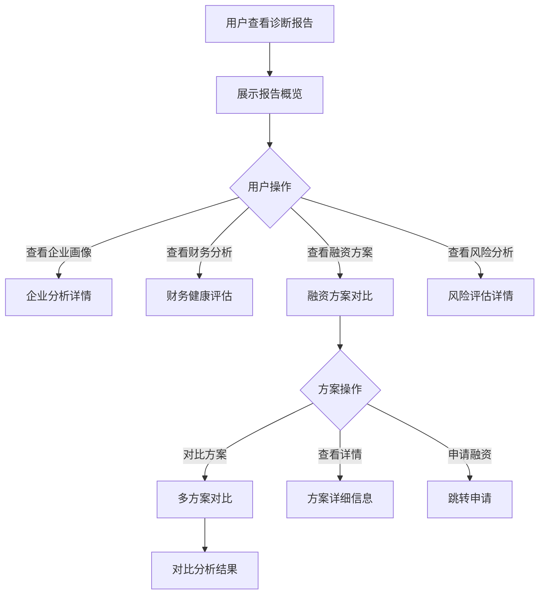

# 诊断分析报告

## 1. 功能描述

诊断分析报告功能展示融资诊断的详细分析结果，包括企业画像分析、财务健康评估、融资能力评估、风险分析、融资方案对比等内容，为企业提供全面的融资决策参考。

### 1.1 业务功能流程图



## 2. 报告概览

### 2.1 报告头部

**基本信息**
- 报告标题：融资诊断分析报告
- 企业名称
- 报告生成时间
- 报告有效期

**操作按钮**
- 下载报告（PDF）
- 分享报告
- 重新诊断
- 打印报告

### 2.2 核心指标卡片

| 指标名称 | 指标值 | 说明 |
|---------|-------|------|
| 财务健康度 | 85分 | 基于财务数据的综合评分 |
| 融资适配度 | 78分 | 与融资产品的匹配程度 |
| 预计可贷额度 | 500万元 | 基于企业资质估算 |
| 建议利率区间 | 4.5%-6.5% | 参考利率范围 |

### 2.3 快速导航

- 企业画像分析
- 财务健康评估
- 融资能力分析
- 风险预警提示
- 融资方案推荐
- 专家建议

## 3. 企业画像分析

### 3.1 基本信息

**企业档案**
- 企业名称、成立时间
- 所属行业、企业规模
- 注册地址、员工人数
- 主营业务、企业资质

**行业分析**
- 行业概况
- 行业发展趋势
- 行业融资特点
- 同规模企业融资情况

### 3.2 企业优势

**资质优势**
- 高新技术企业认定
- 专精特新企业认定
- 其他资质认证

**经营优势**
- 稳定的营业收入
- 良好的纳税记录
- 持续的经营能力

### 3.3 可视化展示

**雷达图**
- 企业规模
- 盈利能力
- 成长能力
- 偿债能力
- 运营能力
- 行业地位

## 4. 财务健康评估

### 4.1 财务指标分析

**盈利能力指标**

| 指标名称 | 指标值 | 行业平均 | 评价 |
|---------|-------|---------|------|
| 营业收入增长率 | 15% | 10% | 优秀 |
| 净利润率 | 12% | 8% | 良好 |
| 毛利率 | 35% | 30% | 良好 |
| ROE | 18% | 12% | 优秀 |

**偿债能力指标**

| 指标名称 | 指标值 | 安全范围 | 评价 |
|---------|-------|---------|------|
| 资产负债率 | 45% | <60% | 良好 |
| 流动比率 | 1.8 | >1.5 | 良好 |
| 速动比率 | 1.2 | >1.0 | 良好 |

**运营能力指标**

| 指标名称 | 指标值 | 行业平均 | 评价 |
|---------|-------|---------|------|
| 应收账款周转率 | 6次 | 5次 | 良好 |
| 存货周转率 | 8次 | 6次 | 良好 |

### 4.2 财务趋势分析

**趋势图表**
- 近3年营业收入趋势
- 近3年利润趋势
- 资产负债变化趋势

**分析结论**
- 财务状况总体评价
- 主要财务亮点
- 需要关注的问题

## 5. 融资能力分析

### 5.1 融资条件评估

**基本条件符合度**

| 评估项 | 企业情况 | 符合度 |
|-------|---------|-------|
| 经营年限 | 5年以上 | ✓ 符合 |
| 营业收入 | 1000万元以上 | ✓ 符合 |
| 纳税记录 | 正常纳税 | ✓ 符合 |
| 信用记录 | 无不良记录 | ✓ 符合 |
| 行业限制 | 非限制行业 | ✓ 符合 |

**增信因素**
- 高新技术企业资质（+20分）
- 稳定的银行流水（+15分）
- 良好的纳税记录（+10分）
- 固定资产抵押物（+15分）

### 5.2 融资额度测算

**测算依据**
- 基于营业收入：年收入的30-50%
- 基于纳税额：年纳税额的5-10倍
- 基于银行流水：月均流水的10-20倍
- 基于抵押物：抵押物评估价值的50-70%

**额度区间**
- 保守额度：300万元
- 建议额度：500万元
- 最高额度：800万元

## 6. 风险分析

### 6.1 风险识别

**经营风险**
- 行业周期性风险
- 市场竞争风险
- 客户集中度风险

**财务风险**
- 应收账款回收风险
- 存货跌价风险
- 汇率波动风险（如有外贸）

**融资风险**
- 利率上行风险
- 还款压力风险
- 担保链风险

### 6.2 风险评级

| 风险类型 | 风险等级 | 说明 |
|---------|---------|------|
| 经营风险 | 低 | 行业稳定，经营正常 |
| 财务风险 | 中低 | 财务结构合理，需关注应收 |
| 融资风险 | 低 | 融资规模适中，可控 |

### 6.3 风险应对建议

- 分散客户结构，降低集中度
- 加强应收账款管理
- 合理安排还款计划
- 预留流动资金缓冲

## 7. 融资方案推荐

### 7.1 推荐方案列表

**方案一：银行流动资金贷款**

| 项目 | 内容 |
|-----|------|
| 产品名称 | 小微企业流动资金贷款 |
| 提供机构 | XX银行 |
| 贷款额度 | 300-500万元 |
| 贷款利率 | 4.35%-5.5% |
| 贷款期限 | 1-3年 |
| 还款方式 | 按月付息，到期还本 |
| 担保方式 | 信用+保证 |
| 匹配度 | 92% |

**方案二：科技型企业贷款**

| 项目 | 内容 |
|-----|------|
| 产品名称 | 高新技术企业专项贷款 |
| 提供机构 | XX银行科技支行 |
| 贷款额度 | 500-800万元 |
| 贷款利率 | 3.85%-4.5% |
| 贷款期限 | 1-3年 |
| 还款方式 | 灵活还款 |
| 担保方式 | 信用（政府风险补偿） |
| 匹配度 | 88% |

**方案三：供应链金融**

| 项目 | 内容 |
|-----|------|
| 产品名称 | 应收账款融资 |
| 提供机构 | XX保理公司 |
| 贷款额度 | 200-400万元 |
| 融资成本 | 年化6%-8% |
| 融资期限 | 3-12个月 |
| 还款方式 | 应收账款回款时自动还款 |
| 担保方式 | 应收账款质押 |
| 匹配度 | 85% |

### 7.2 方案对比分析

**对比维度**
- 额度对比
- 利率对比
- 期限对比
- 担保要求对比
- 办理难度对比
- 综合成本对比

**对比表格**

| 对比项 | 方案一 | 方案二 | 方案三 |
|-------|-------|-------|-------|
| 额度 | ★★★ | ★★★★ | ★★ |
| 利率 | ★★★ | ★★★★★ | ★★ |
| 期限 | ★★★ | ★★★ | ★★ |
| 便利性 | ★★★★ | ★★★ | ★★★★ |
| 综合推荐 | ★★★★ | ★★★★★ | ★★★ |

## 8. 专家建议

### 8.1 融资策略建议

**短期策略**
- 优先考虑科技型企业贷款
- 利用高新技术企业资质优势
- 争取政府贴息支持

**中期策略**
- 建立多元化融资渠道
- 优化财务结构
- 提升信用评级

**长期策略**
- 建立银企战略合作关系
- 完善公司治理结构
- 规划资本市场融资

### 8.2 注意事项

- 合理控制负债率
- 避免短贷长用
- 关注利率变化
- 保持良好信用记录

## 9. 数据模型

### 9.1 分析报告模型

```typescript
interface DiagnosisReport {
  id: string;                    // 报告ID
  diagnosisId: string;           // 诊断ID
  companyProfile: CompanyProfile; // 企业画像
  financialAssessment: FinancialAssessment; // 财务评估
  financingAbility: FinancingAbility; // 融资能力
  riskAnalysis: RiskAnalysis;    // 风险分析
  recommendedPlans: FinancingPlan[]; // 推荐方案
  expertAdvice: ExpertAdvice;    // 专家建议
  generateTime: string;          // 生成时间
  validUntil: string;            // 有效期至
}

interface CompanyProfile {
  basicInfo: CompanyInfo;        // 基本信息
  industryAnalysis: IndustryAnalysis; // 行业分析
  advantages: string[];          // 企业优势
  radarChart: RadarData;         // 雷达图数据
}

interface FinancialAssessment {
  profitability: Indicator[];    // 盈利能力指标
  solvency: Indicator[];         // 偿债能力指标
  operation: Indicator[];        // 运营能力指标
  trendAnalysis: TrendData;      // 趋势分析
  overallRating: string;         // 总体评价
}

interface FinancingAbility {
  basicConditions: Condition[];  // 基本条件
  enhancementFactors: Factor[];  // 增信因素
  amountCalculation: AmountCalc; // 额度测算
}

interface RiskAnalysis {
  risks: Risk[];                 // 风险列表
  overallRiskLevel: string;      // 总体风险等级
  suggestions: string[];         // 应对建议
}

interface FinancingPlan {
  id: string;                    // 方案ID
  productName: string;           // 产品名称
  provider: string;              // 提供机构
  amount: string;                // 额度
  rate: string;                  // 利率
  term: string;                  // 期限
  repayment: string;             // 还款方式
  guarantee: string;             // 担保方式
  matchScore: number;            // 匹配度
  features: string[];            // 特点
}

interface ExpertAdvice {
  shortTerm: string[];           // 短期建议
  mediumTerm: string[];          // 中期建议
  longTerm: string[];            // 长期建议
  warnings: string[];            // 注意事项
}
```

## 10. 业务规则

### 10.1 报告规则

| 规则编号 | 规则名称 | 规则描述 |
|---------|---------|---------|
| BR-001 | 报告有效期 | 报告有效期30天 |
| BR-002 | 数据更新 | 基于最新诊断数据生成 |
| BR-003 | 方案数量 | 至少推荐3个方案 |
| BR-004 | 对比维度 | 必须包含额度、利率、期限对比 |

### 10.2 展示规则

| 规则编号 | 规则名称 | 规则描述 |
|---------|---------|---------|
| BR-005 | 可视化 | 关键数据必须可视化展示 |
| BR-006 | 评分标准 | 评分标准统一透明 |
| BR-007 | 风险提示 | 必须包含风险提示 |

## 11. 异常场景处理

| 异常场景 | 场景说明 | 系统行为 | 提醒方式 | 操作选项 |
|---------|---------|---------|---------|---------|
| 数据缺失 | 部分数据无法获取 | 标注数据缺失 | 信息提示 | 补充数据 |
| 报告过期 | 超过有效期 | 提示重新诊断 | 警告提示 | 重新诊断 |
| 生成失败 | 报告生成异常 | 提示稍后重试 | 错误提示 | 重新生成 |

## 12. 权限控制

| 功能 | 游客 | 普通用户 | 企业用户 | 管理员 |
|-----|------|---------|---------|--------|
| 查看报告 | ✗ | ✓ | ✓ | ✓ |
| 下载报告 | ✗ | ✓ | ✓ | ✓ |
| 分享报告 | ✗ | ✓ | ✓ | ✓ |
| 打印报告 | ✗ | ✓ | ✓ | ✓ |
| 重新诊断 | ✗ | ✗ | ✓ | ✓ |
